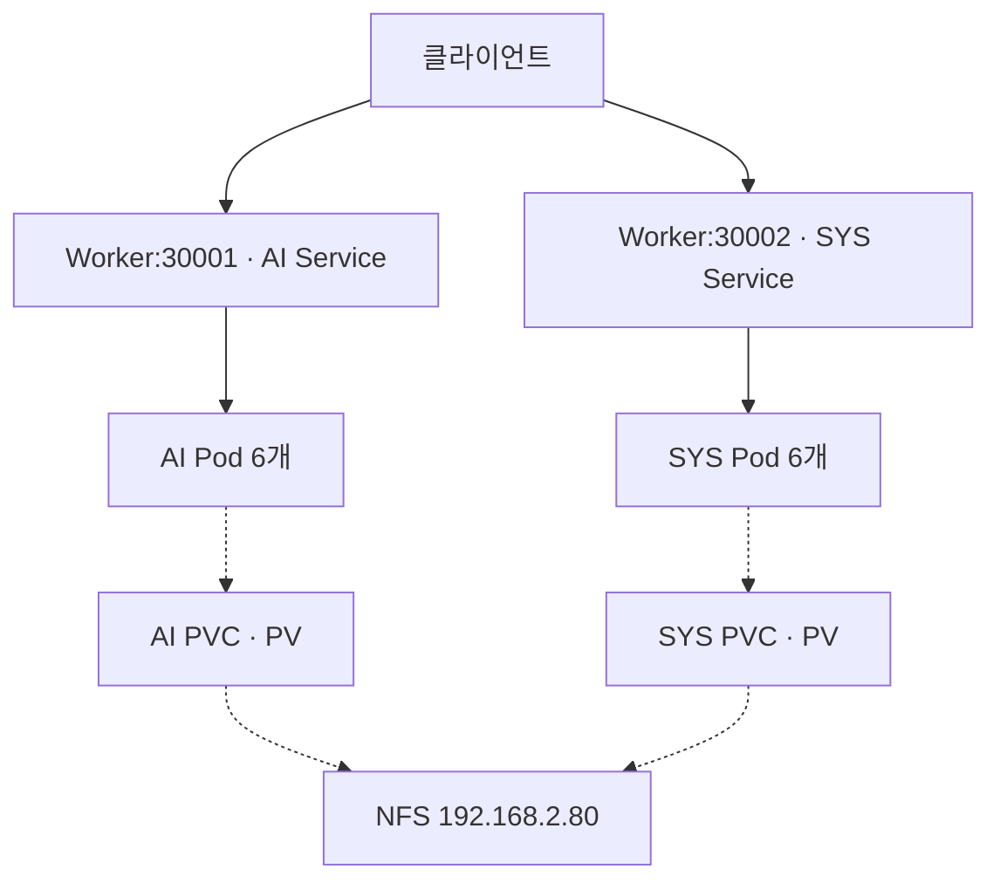

# Docker & Kubernetes 기반 프라이빗 클라우드 — 핵심 정리와 개념 보강

> **KAIST 웹 서비스 프로젝트 | 2026-09-24 정리**  
> Docker 이미지 제작부터 Deployment, Service, NFS/PV/PVC, 외부 접근까지 하나의 흐름으로 복습하는 문서.

## 읽기 전에

이 문서는 `YGJ1203/Cloud-IaC-Study`의 **「Docker & K8s 기반 프라이빗 클라우드 환경 구축 프로젝트」 폴더에 커밋된 Markdown 3개**를 모두 읽고 통합했다. 일반 Docker·Kubernetes 수업 노트 전체를 합친 문서는 아니다.

| 기준 | 내용 |
|---|---|
| 원본 기록 | `09-21 프로젝트.md`, `09-22 프로젝트.md`, `09-23 프로젝트.md` |
| 확인한 브랜치 | `main` |
| 기준 커밋 | [`4d8389d`](https://github.com/YGJ1203/Cloud-IaC-Study/commit/4d8389d6e4858737f68afd55e12a77e4d66ed018), 2026-09-23, 「Docker & K8s 기반 프로젝트 3차 커밋」 |
| 최신 구성 기준 | 9월 23일 기록: **AI·SYS 각각 6개 Pod, NFS 공유 스토리지, NodePort 접근** |
| 완료 판단 | 원본에 기록된 실습 결과 기준. 실제 VM/클러스터에 접속해 재검증한 결과는 아님 |
| 추가 예제 | 이해와 후속 실습을 위한 재구성. 실제 적용 완료 항목과 구분해 표시 |

**빠르게 복습하려면:** 1장의 진행 현황 → 3장의 연결 규칙 → 5장의 스토리지 → 10장의 점검 순서 → 12장의 Q&A 순서로 읽는다.

---

## 1. 지금까지 무엇을 만들었나?

**Nginx 웹 서비스를 여러 Pod로 실행하고, 각 학과의 웹 파일을 NFS에서 공유하며, NodePort로 외부 접근하는 구조**까지 구현했다. AI 서비스를 먼저 완성한 뒤 같은 패턴을 SYS에 적용했다. [R3]

### 1.1 날짜별 진행과 설계 변화

| 날짜 | 핵심 작업 | 기록상 결과 | 다음 단계와의 연결 |
|---|---|---|---|
| 9/21 | Namespace 4개, 학과별 이미지 4개 제작 | `kaist-ai/com/sys/ft` 구성과 이미지 빌드 복습 완료 | Kubernetes에 배포할 재료 준비 |
| 9/22 | `kaist` Namespace에서 AI 배포, Service, HAProxy, Ingress, 이미지 교체 | HAProxy `192.168.2.80:80`으로 커스텀 홈페이지 출력, Pod 재생성·RollingUpdate 확인 | 한 서비스의 외부 요청 경로 검증 |
| 9/23 | Namespace를 학과별로 분리하고 NFS/PV/PVC 연결 | AI·SYS 각각 6개 Pod 및 NodePort 접근 검증 | 동일 구성으로 COM·FT 확장 예정 |

9/22의 **“이미지에 정적 HTML을 넣으면 PV/PVC가 필수는 아니다”**는 설명은 맞다. 9/23에는 공유 스토리지 실습을 위해 **NFS에 웹 파일을 두고 Pod에 마운트하는 설계**를 채택했다. 두 기록은 서로 다른 단계의 선택을 설명한다. [R1–R3]

### 1.2 최신 구성표

| 항목 | AI | SYS | COM | FT |
|---|---|---|---|---|
| 역할 | AI 대학 메인 | AI 시스템학과 | AI 컴퓨팅학과 | AI 미래학과 |
| Namespace | `kaist-ai` | `kaist-sys` | `kaist-com` | `kaist-ft` |
| NFS 경로 | `/www/vol/ai` | `/www/vol/sys` | `/www/vol/com` | `/www/vol/ft` |
| PV | `kaist-ai-pv` | `kaist-sys-pv` | `kaist-com-pv` | `kaist-ft-pv` |
| PVC | `kaist-ai-pvc` | `kaist-sys-pvc` | `kaist-com-pvc` | `kaist-ft-pvc` |
| Deployment | `kaist-ai-deploy` | `kaist-sys-deploy` | `kaist-com-deploy` | `kaist-ft-deploy` |
| Service 이름 | `kaist-service` | `kaist-service` | `kaist-service` | `kaist-service` |
| NodePort | `30001` | `30002` | `30003` | `30004` |
| Pod 수 | **6, 완료 기록** | **6, 완료 기록** | 6, 계획 | 6, 계획 |
| 진행 상태 | NFS·마운트·접속 검증 완료 | NFS·마운트·접속 검증 완료 | 후속 구축 예정 | 후속 구축 예정 |

공통 스토리지 설정은 `2Gi`, `ReadWriteMany`, `Filesystem`, `storageClassName: manual`, `Retain`이다. COM·FT의 PV/PVC·Deployment·Service 이름은 기존 명명 규칙을 확장한 **후속 예시**이며, 생성 완료를 뜻하지 않는다. [R3]

**최신 기록의 Pod 합계는 12개이며, 24개는 COM·FT 확장 후의 목표다.** 9/22의 단일 Namespace Ingress 성공 기록만으로 9/23의 분리된 전체 서비스까지 통합됐다고 판단하지 않는다.

---

## 2. 전체 구조를 이해하기

### 2.1 서버 역할

| 주소 | 기록에서 확인한 역할 |
|---|---|
| `192.168.2.60` | Master, 이미지 준비 및 초기 NodePort 테스트 주소 |
| `192.168.2.61` | node1, 웹 Pod 실행 및 NodePort 접근 |
| `192.168.2.62` | node2, 웹 Pod 실행 및 NodePort 접근 |
| `192.168.2.63` | node3, 웹 Pod 실행 및 NodePort 접근 |
| `192.168.2.80` | 9/22 HAProxy 서버, 9/23 NFS 서버 |

9/23 기준의 서비스·스토리지 관계는 다음과 같다. 실선은 웹 요청의 논리 경로, 점선은 파일 마운트 관계다.



Service나 PV/PVC가 각각 별도의 서버 프로세스인 것은 아니다. Service는 Pod 접근을 정의하는 Kubernetes 자원이고, PV/PVC는 외부 저장소를 연결하기 위한 자원이다.

### 2.2 관리 관계와 요청 경로

| 구분 | 관계 | 의미 |
|---|---|---|
| Pod 관리 | Deployment → ReplicaSet → Pod | 원하는 개수와 배포 상태 유지 |
| HTTP 요청 | 클라이언트 → NodePort/Service → Pod의 Nginx | 웹 응답 전달 |
| 파일 연결 | Pod의 Volume → PVC → PV → NFS 경로 | Nginx가 읽을 파일 제공 |
| 이전 외부 접근 | HAProxy → Ingress Controller → 서비스의 Pod | 9/22에 검증한 구성 |

**Deployment와 ReplicaSet은 HTTP 요청이 통과하는 중간 장비가 아니다.** Ingress도 경로 규칙을 담은 자원이며, 실제 프록시 동작은 Ingress Controller가 수행한다. Controller가 Service의 Endpoint를 직접 이용하는 구현도 있으므로, “Service를 거친다”는 표현은 논리적 연결을 뜻한다. [K2, K7]

---

## 3. Kubernetes YAML에서 꼭 맞아야 하는 연결

### 3.1 자원 종류와 범위

| 자원 | `apiVersion` | 범위 | 이 프로젝트에서의 역할 |
|---|---|---|---|
| Namespace | `v1` | 클러스터 | 학과별 자원 구분 |
| PersistentVolume | `v1` | 클러스터 | NFS 서버·경로 정의 |
| PersistentVolumeClaim | `v1` | Namespace | 필요한 PV 요청 |
| Deployment | `apps/v1` | Namespace | 웹 Pod의 복제본·업데이트 관리 |
| Service | `v1` | Namespace | Pod를 안정적으로 접근 |
| Ingress | `networking.k8s.io/v1` | Namespace | HTTP Host/Path 규칙 |

`v1`의 마지막 글자는 숫자 **1**이다. `vi`로 적으면 API 버전 오류가 발생한다. [R1]

### 3.2 Deployment와 Service의 selector 문법은 다르다

**Deployment의 관리 대상:**

```yaml
selector:
  matchLabels:
    app: kaist-ai
```

**Deployment가 만들 Pod의 Label:**

```yaml
template:
  metadata:
    labels:
      app: kaist-ai
```

**Service가 찾을 Pod의 Label:**

```yaml
selector:
  app: kaist-ai
```

| 연결 | 일치해야 하는 것 |
|---|---|
| Deployment → Pod | `spec.selector.matchLabels`와 `spec.template.metadata.labels` |
| Service → Pod | Service의 `spec.selector`와 Pod의 Label, 그리고 Namespace |
| Pod → PVC | `claimName`과 PVC 이름, 그리고 Namespace |
| PVC → PV | `volumeName`과 PV 이름, 클래스·모드·용량 등 바인딩 조건 |
| VolumeMount → Volume | 두 항목의 `name` |

Service는 **Deployment 이름이 아니라 Pod Label**을 선택한다. 이미 생성된 Deployment의 `spec.selector`는 변경할 수 없으므로, 이름만 바꿔 기존 Deployment에 덮어씌우는 방식으로 확장하면 안 된다. [R1, R3, K2]

### 3.3 Namespace가 해주는 일

`kaist-ai/kaist-service`와 `kaist-sys/kaist-service`는 서로 다른 Service다. 같은 이름을 사용할 수 있지만, 한 Namespace의 Service selector가 다른 Namespace의 Pod를 자동으로 선택하지는 않는다.

Namespace 분리만으로 네트워크 통신 차단까지 완성되지는 않는다. Kubernetes API 접근 권한은 RBAC, Pod 사이 통신 제한은 NetworkPolicy 등 별도 정책으로 다룬다. NetworkPolicy를 적용하려면 사용하는 네트워크 플러그인의 지원도 필요하다. 이는 후속 보강 항목이다. [K13]

---

## 4. Docker 이미지 — Kubernetes가 실행할 재료

### 4.1 기록에 사용한 이미지 제작 방식

빌드 디렉터리에 `Dockerfile`과 `html/index.html`을 준비했다.

```dockerfile
FROM nginx:latest
COPY html/ /usr/share/nginx/html/
EXPOSE 80
```

```bash
# 해당 서비스의 Dockerfile이 있는 디렉터리에서 실행
docker build -t kaist-ai:v1 .
docker run -d --name kaist-ai-test -p 8080:80 kaist-ai:v1
curl http://localhost:8080
```

| 항목 | 의미 |
|---|---|
| `FROM` | 기본 실행 환경 |
| `COPY` | 빌드 컨텍스트의 파일을 이미지에 포함 |
| `EXPOSE 80` | 이미지가 사용하는 포트에 대한 메타데이터. 호스트 포트 공개 기능은 아님 |
| `-t kaist-ai:v1` | 이미지 이름과 태그 |
| 마지막 `.` | 현재 디렉터리를 빌드 컨텍스트로 지정 |
| `-p 8080:80` | 호스트 8080번을 컨테이너 80번으로 연결 |

`nginx:latest`는 당시 원본 설정이다. 재현 가능한 빌드를 위해서는 검증한 Nginx 버전 또는 digest를 고정하는 방식을 추가로 고려한다. [R1, K4, D3]

이미지 이름만 잘못 적었고 내용은 맞다면 다시 빌드할 필요 없이 태그를 붙일 수 있다.

```bash
docker tag kasit-ft:v1 kaist-ft:v1
docker image inspect kaist-ft:v1
```

### 4.2 Master의 이미지가 Worker에 자동 복사되지는 않는다

9/22에는 Registry 대신 `save → scp → load`로 학습용 이미지를 배포했다. [R2]

```bash
# Master: 이미지 아카이브 생성
docker save -o /root/kaist-images.tar \
  kaist-ai:v1 kaist-com:v1 kaist-sys:v1 kaist-ft:v1

# Master: 각 Worker로 전송
scp /root/kaist-images.tar root@192.168.2.61:/root/
scp /root/kaist-images.tar root@192.168.2.62:/root/
scp /root/kaist-images.tar root@192.168.2.63:/root/

# 각 Worker: 이미지 등록
docker load -i /root/kaist-images.tar
docker image ls
```

`docker save/load`는 이미지와 태그를 옮길 때 사용한다. 컨테이너 파일시스템을 내보내는 `docker export`와 구분한다. [D1]

**런타임 확인을 먼저 한다.** Docker에 로드한 이미지가 Kubernetes에 보이려면 kubelet이 그 Docker Engine을 사용하는 구성이어야 한다. containerd를 사용하는 클러스터에는 Docker 이미지 저장소가 자동 공유되지 않는다. 현대 Kubernetes에서 Docker Engine을 연결할 때는 `cri-dockerd` 같은 CRI 어댑터가 필요하다. [K5]

```bash
kubectl get nodes -o wide
kubectl get nodes -o custom-columns=NAME:.metadata.name,RUNTIME:.status.nodeInfo.containerRuntimeVersion
```

Registry를 도입하면 모든 배치 대상 Node가 동일한 이미지 주소로 가져올 수 있어 수동 전송을 줄일 수 있다. 해당 Registry 구축 완료는 이 3개 기록에서 확인되지 않는다.

### 4.3 `imagePullPolicy`를 정확히 이해하기

| 정책 | 실제 의미 |
|---|---|
| `IfNotPresent` | Node의 해당 런타임에 이미지가 없을 때 가져옴 |
| `Always` | 실행 시 Registry에서 이미지를 확인. 동일한 캐시 레이어는 재사용 가능 |
| `Never` | Registry에 요청하지 않음. 로컬에 없으면 실행 실패 |

9/22에는 `kaist-ai:v1`과 `IfNotPresent`를 명시했다. 로컬 이미지를 배포한 실습 의도에 맞는다. 같은 `v1` 태그를 다른 내용으로 다시 만들면 Node마다 서로 다른 이미지가 남을 수 있으므로, 변경 시 `v2`처럼 새 태그를 배포하고 Deployment도 함께 변경한다. **태그만 같은 채로 `apply`하면 이미지 변경을 Kubernetes가 알아서 감지하지 않는다.** [R2, K4]

---

## 5. NFS · PV · PVC — 이번 프로젝트의 핵심

### 5.1 각 구성요소의 역할

| 구성요소 | 쉬운 설명 | AI 서비스의 값 |
|---|---|---|
| NFS 서버 | 실제 파일이 저장되는 곳 | `192.168.2.80` |
| NFS 공유 경로 | 웹 파일을 담은 디렉터리 | `/www/vol/ai` |
| PV | Kubernetes에 등록한 저장소 정보 | `kaist-ai-pv` |
| PVC | Namespace에서 그 저장소를 요청 | `kaist-ai/kaist-ai-pvc` |
| Pod Volume | PVC를 Pod에 연결 | `kaist-ai-vol` |
| Mount 경로 | 컨테이너에서 파일을 볼 위치 | `/usr/share/nginx/html` |

Pod가 없어져도 NFS 서버에 저장된 파일은 남는다. PV/PVC가 파일을 별도로 복제하거나 백업하는 것은 아니다. [R3]

### 5.2 NFS 서버와 Worker에서 확인할 것

9/23 원본의 `/etc/exports` 설정:

```text
/www/vol/ai 192.168.2.0/24(rw)
/www/vol/sys 192.168.2.0/24(rw)
```

```bash
# NFS 서버 192.168.2.80에서
exportfs -ra
exportfs -v
ls -l /www/vol/ai/index.html /www/vol/sys/index.html

# Worker에서 공유 목록 확인
showmount -e 192.168.2.80
```

추가 점검 사항:

- CentOS/RHEL 계열에서는 서버와 마운트할 Node에 필요한 `nfs-utils` 설치 여부를 확인한다.
- NFS 서버의 서비스·export 허용 범위·방화벽과 실제 NFS 버전을 확인한다.
- 파일 읽기 권한뿐 아니라 상위 디렉터리를 통과할 실행 권한도 필요하다.
- `showmount` 성공만으로 Pod 마운트를 증명할 수는 없다. NFSv4 전용 구성에서는 해당 조회가 제한될 수도 있다.

설정을 명시적으로 정리한다면 기존 `rw`에 `sync,root_squash` 등을 함께 표기할 수 있다. `root_squash`는 원격 root 권한을 제한한다. 쓰기 실패 시에는 UID/GID·디렉터리 권한을 먼저 확인한다. [L1]

### 5.3 RWX여도 PV ↔ PVC는 1:1이다

AI에서는 **PVC 1개가 PV 1개를 바인딩하고, AI Pod 6개가 그 PVC를 공유**한다.

- `ReadWriteMany(RWX)`는 여러 Node에서 읽기·쓰기를 지원하는 접근 모드다.
- 한 PV를 여러 PVC가 동시에 바인딩한다는 뜻은 아니다.
- SYS는 별도 PV/PVC와 `/www/vol/sys`를 사용한다.
- Pod는 자기 Namespace의 PVC를 참조한다. [R3, K1]

웹 Pod가 콘텐츠를 읽기만 한다면 `volumeMounts.readOnly: true`를 추가할 수 있다. PV의 RWX 선언과 Pod의 읽기 전용 마운트 설정은 서로 다른 역할이다.

### 5.4 `manual`, `2Gi`, `Retain`에서 생기는 오해

| 설정 | 정확한 해석 |
|---|---|
| `storageClassName: manual` | 이 예제에서 수동 생성 PV와 PVC의 클래스를 맞추는 문자열. 이 값만으로 StorageClass 객체나 NFS 디렉터리가 생성되지는 않음 |
| `capacity.storage: 2Gi` | PV가 선언한 용량. 이 정적 NFS YAML만으로 서버에 2Gi 디스크나 디렉터리 쿼터가 생성되지는 않음 |
| PVC `requests.storage: 2Gi` | 바인딩할 저장소에 요구하는 최소 용량 |
| `volumeName: kaist-ai-pv` | 특정 PV를 지정. 이미 다른 PVC에 묶였거나 조건이 맞지 않으면 바인딩되지 않음 |
| `Retain` | PVC 해제 후 저장소를 자동 정리하지 않고 관리자가 회수·재사용을 판단 |

현재처럼 이미 준비한 PV를 지정하는 **정적 프로비저닝**은, PVC 요청에 따라 provisioner가 PV를 만드는 **동적 프로비저닝**과 구분한다. `manual`이라는 이름 자체가 특별한 Kubernetes 예약어는 아니다. [K1, K10]

`Retain`은 백업 정책이 아니다. Pod가 쓰기 권한으로 파일을 삭제하거나 NFS 서버의 디스크가 손상되면 이 정책만으로 복구할 수 없다.

### 5.5 NFS 마운트는 이미지 안의 HTML을 가린다

| 구성 | Nginx가 읽는 파일 |
|---|---|
| 이미지에 HTML 포함, 해당 위치에 볼륨 없음 | 이미지의 `/usr/share/nginx/html/index.html` |
| 같은 위치에 NFS 볼륨 마운트 | NFS의 `/www/vol/ai/index.html` |

예를 들어 이미지에 AI 홈페이지가 들어 있어도 `/usr/share/nginx/html`에 NFS를 마운트하면 **실제 서비스되는 콘텐츠는 NFS 쪽 파일**이다. 이미지의 기존 파일이 NFS로 자동 복사되거나 합쳐지는 것도 아니다. [R3, D2]

따라서 빈 NFS 디렉터리를 마운트했을 때는 이미지에 넣어둔 홈페이지가 보이지 않을 수 있다. 페이지 수정이 반영되지 않으면 **“지금 파일을 이미지에서 읽는가, NFS에서 읽는가?”**부터 확인한다.

이 설계에서는 Nginx 실행 환경과 웹 콘텐츠를 분리했으므로, 후속 개선으로 공통 웹 서버 이미지 하나와 학과별 NFS 경로를 사용할 수도 있다. 현재 실제 이미지 변경 여부는 9/23 기록만으로 확정할 수 없다.

---

## 6. AI 서비스 전체 YAML — 복습용 재구성

아래는 기록의 이름·주소·포트를 바탕으로 재구성한 예제다. **`readinessProbe`, `readOnly`, CPU/메모리 설정은 이번 문서의 추가 제안**이며, 적용 완료 기록이 아니다.

9/23 문서에는 전체 Deployment YAML이 없으므로, 예제의 이미지 `kaist-ai:v1`은 9/22에 확인한 값을 사용했다. 실제 적용 전 기존 이미지·컨테이너명·selector를 비교한다. 자원 수치는 소규모 정적 웹 실습용 시작 예시이며 측정 결과가 아니다.

```yaml
# 예시 파일명: kaist-ai-all.yml
apiVersion: v1
kind: Namespace
metadata:
  name: kaist-ai
---
apiVersion: v1
kind: PersistentVolume
metadata:
  name: kaist-ai-pv
spec:
  capacity:
    storage: 2Gi
  volumeMode: Filesystem
  accessModes:
    - ReadWriteMany
  storageClassName: manual
  persistentVolumeReclaimPolicy: Retain
  nfs:
    server: 192.168.2.80
    path: /www/vol/ai
---
apiVersion: v1
kind: PersistentVolumeClaim
metadata:
  name: kaist-ai-pvc
  namespace: kaist-ai
spec:
  volumeName: kaist-ai-pv
  storageClassName: manual
  volumeMode: Filesystem
  accessModes:
    - ReadWriteMany
  resources:
    requests:
      storage: 2Gi
---
apiVersion: apps/v1
kind: Deployment
metadata:
  name: kaist-ai-deploy
  namespace: kaist-ai
spec:
  replicas: 6
  selector:
    matchLabels:
      app: kaist-ai
  template:
    metadata:
      labels:
        app: kaist-ai
    spec:
      containers:
        - name: kaist-web-server
          image: kaist-ai:v1
          imagePullPolicy: IfNotPresent
          ports:
            - name: http
              containerPort: 80
          resources:
            requests:
              cpu: 100m
              memory: 64Mi
            limits:
              cpu: 500m
              memory: 128Mi
          readinessProbe:
            httpGet:
              path: /
              port: http
            initialDelaySeconds: 3
            periodSeconds: 5
          volumeMounts:
            - name: kaist-ai-vol
              mountPath: /usr/share/nginx/html
              readOnly: true
      volumes:
        - name: kaist-ai-vol
          persistentVolumeClaim:
            claimName: kaist-ai-pvc
---
apiVersion: v1
kind: Service
metadata:
  name: kaist-service
  namespace: kaist-ai
spec:
  type: NodePort
  selector:
    app: kaist-ai
  ports:
    - name: http
      protocol: TCP
      port: 80
      targetPort: 80
      nodePort: 30001
```

### 추가 설정의 의미

| 추가 항목 | 목적 | 확인할 점 |
|---|---|---|
| `readinessProbe` | 웹 응답 준비 여부를 확인해 Service의 요청 대상에 반영 | 실패하면 정상 요청 대상으로 취급되지 않음. 컨테이너 재시작 기능은 아님 |
| `readOnly: true` | 웹 Pod에서 공유 콘텐츠를 읽기 전용으로 사용 | 콘텐츠 수정은 NFS 서버의 관리 경로에서 수행 |
| `requests` | 스케줄러가 배치할 때 참고하는 CPU·메모리 요구량 | 모든 Pod와 시스템 구성요소를 수용할 Node 여유 필요 |
| `limits` | 실행 중 자원 사용 상한 설정 | CPU는 제한될 수 있고 메모리 초과 시 OOM 종료 가능 |

`livenessProbe`는 비정상 컨테이너를 재시작하기 위한 검사다. NFS 같은 외부 의존성 실패를 무조건 컨테이너 재시작으로 해결하려 하면 재시작이 반복될 수 있으므로, readiness와 목적을 구분해 추가한다. [K6, K11]

### 검토와 적용 순서

1. NFS 경로와 실제 HTML 준비.
2. 배치 대상 Node의 이미지·NFS 클라이언트 확인.
3. Namespace → PV → PVC 생성 및 `Bound` 확인.
4. Deployment → Service 구성.
5. Pod Ready → Endpoint → NodePort 응답 확인.

아래 명령은 예제를 별도 YAML로 저장한 뒤 **사용자 클러스터에서 검토할 때** 사용한다. 서버 dry-run은 API 서버 연결과 대상 Namespace가 필요하며, 실제 NFS 마운트나 이미지 실행까지 시험하지는 않는다.

```bash
kubectl get deployment kaist-ai-deploy -n kaist-ai -o yaml
kubectl diff -f kaist-ai-all.yml
kubectl apply --dry-run=server -f kaist-ai-all.yml
```

---

## 7. SYS · COM · FT로 확장할 때 바꿀 값

AI 구성 복사 후 다음 값을 한 세트로 바꾼다. 한글 홈페이지 파일도 각 NFS 디렉터리에 맞게 준비한다.

| 수정 대상 | AI 기준 | SYS | COM | FT |
|---|---|---|---|---|
| Namespace / Label의 값 | `kaist-ai` | `kaist-sys` | `kaist-com` | `kaist-ft` |
| Deployment | `kaist-ai-deploy` | `kaist-sys-deploy` | `kaist-com-deploy` | `kaist-ft-deploy` |
| PV / PVC 접두어 | `kaist-ai` | `kaist-sys` | `kaist-com` | `kaist-ft` |
| `volumeName` | `kaist-ai-pv` | `kaist-sys-pv` | `kaist-com-pv` | `kaist-ft-pv` |
| `claimName` | `kaist-ai-pvc` | `kaist-sys-pvc` | `kaist-com-pvc` | `kaist-ft-pvc` |
| Volume / Mount 이름 | `kaist-ai-vol` | `kaist-sys-vol` | `kaist-com-vol` | `kaist-ft-vol` |
| NFS 경로 끝부분 | `/ai` | `/sys` | `/com` | `/ft` |
| 이미지 예시 | `kaist-ai:v1` | `kaist-sys:v1` | `kaist-com:v1` | `kaist-ft:v1` |
| `nodePort` | `30001` | `30002` | `30003` | `30004` |

Service 이름 `kaist-service`와 NFS 서버 주소 `192.168.2.80`, Pod 내부 마운트 위치는 공통으로 사용할 수 있다. 공통 Nginx 이미지로 통일했다면 위 이미지 열은 그 설계에 맞춰 조정한다.

**확장할 때 흔한 실수:** Namespace와 Label만 바꾸고 `claimName`, `volumeName`, NFS 경로 또는 NodePort를 AI 값으로 남겨두는 것. `kubectl get ... -o yaml`과 다음 점검표로 실제 연결을 확인한다.

---

## 8. Service · NodePort · HAProxy · Ingress의 역할

### 8.1 세 종류의 포트

| 항목 | AI 예시 | 설명 |
|---|---|---|
| `containerPort` | `80` | 컨테이너가 사용하는 포트에 대한 선언. 실제 Nginx도 해당 포트로 실행돼야 함 |
| Service `targetPort` | `80` | 요청을 보낼 Pod의 포트 |
| Service `port` | `80` | Service가 제공하는 포트 |
| Service `nodePort` | `30001` | Node 주소로 접근할 때 사용하는 외부 포트 |

AI 요청은 **`192.168.2.61:30001` → AI Service → 선택된 AI Pod의 80번 포트**로 전달된다.

NodePort는 Service에 ClusterIP 기능도 제공한다. 기본 포트 범위는 `30000–32767`이며 클러스터 설정으로 달라질 수 있다. **Namespace가 달라도 다른 Service에 같은 NodePort를 중복 할당할 수 없다.** [K3]

기본 외부 트래픽 정책인 `Cluster`에서는 진입한 Node와 실제 응답 Pod가 있는 Node가 달라도 된다. `externalTrafficPolicy: Local`이면 로컬 Endpoint 유무가 중요해지므로 “어떤 Node로 접속해도 항상 같다”고 일반화하지 않는다. [K12]

### 8.2 포트의 시점을 구분하기

| 포트·주소 | 용도 | 기록 시점 |
|---|---|---|
| `192.168.2.60:30080` | 단일 `kaist` Namespace의 초기 웹 NodePort 테스트 | 9/22 |
| Worker `:31512` | Ingress Controller의 HTTP NodePort | 9/22 |
| Worker `:30447` | Ingress Controller의 HTTPS NodePort로 확인된 값 | 9/22, HTTPS 서비스 완료 증거는 아님 |
| `192.168.2.80:80` | HAProxy 프런트엔드 | 9/22 |
| Worker `:30001` | 분리한 AI 웹 서비스 | 9/23 |
| Worker `:30002` | 분리한 SYS 웹 서비스 | 9/23 |
| Worker `:30003`, `:30004` | COM·FT 확장 예정 포트 | 9/23 계획 |

**`31512`는 Ingress Controller의 입구이고, `30001`은 AI 웹 서비스의 입구다.** HAProxy의 backend를 어느 쪽으로 연결하는지에 따라 구조가 달라진다.

### 8.3 이후 외부 접근을 통합하는 두 가지 방식

| 방식 | 요청 경로 | 설계할 것 |
|---|---|---|
| 학과별 NodePort에 직접 연결 | HAProxy → 학과별 NodePort → 웹 Pod | HAProxy에서 학과를 구분할 포트 또는 Host 규칙 |
| Ingress Controller에 연결 | HAProxy → Controller NodePort → Ingress 규칙에 맞는 웹 Pod | Namespace별 Ingress와 Host/Path, 해당 Service |

9/22에는 두 번째 방식으로 AI 단일 서비스 접속을 검증했다. 9/23에는 학과별 NodePort가 검증됐으며, **분리한 서비스들을 어떤 규칙으로 HAProxy에 통합할지는 후속 설계·검증이 필요하다.**

HAProxy의 TCP 연결 검사만 성공했다고 올바른 홈페이지 콘텐츠까지 검증한 것은 아니다. 최종 URL의 응답 본문도 확인한다.

### 8.4 Namespace를 나눈 상태에서 Ingress를 쓸 때

일반적인 Ingress의 Service backend는 **Ingress와 같은 Namespace의 Service**를 참조한다. 따라서 `kaist-ai`에 만든 Ingress 하나에 다른 Namespace의 Service 이름만 적어 연결할 수는 없다. [K7]

후속 설계 예시는 학과별 Namespace에 Ingress를 만들고, 각각 다른 Host를 주는 방식이다. 다음 이름은 **이 문서에서 제안한 테스트용 이름**이며 실제 구성 완료된 DNS가 아니다.

| Namespace | Host 예시 | Namespace 내부 backend |
|---|---|---|
| `kaist-ai` | `ai.kaist.test` | `kaist-service:80` |
| `kaist-sys` | `sys.kaist.test` | `kaist-service:80` |
| `kaist-com` | `com.kaist.test` | `kaist-service:80` |
| `kaist-ft` | `ft.kaist.test` | `kaist-service:80` |

Controller의 여러 Namespace 감시 설정과 IngressClass를 확인한 뒤 Host별 규칙을 연결한다. 각 Host는 HAProxy 주소로 해석되도록 DNS/hosts 설정이 필요하다. DNS 설정 전에는 다음처럼 Host 헤더로 규칙을 시험할 수 있다.

```bash
# 해당 Host 규칙과 HAProxy 연결을 구성한 뒤 실행
curl -i -H 'Host: ai.kaist.test' http://192.168.2.80/
```

`/ai`, `/sys`처럼 Path로 나누는 방법도 가능하지만, **Prefix 매칭 자체가 `/ai`를 자동 제거하지는 않는다.** 웹 파일 경로와 CSS·JS·이미지의 URL이 그 접두어를 처리해야 하며, 필요하면 선택한 Controller의 rewrite 설정을 별도로 검토한다. [K7]

> **현재 문서와 실습 기록의 버전 차이:** 기록의 community `ingress-nginx`는 2026-03-24에 공식 은퇴했다. 9/22 구성은 실습 이력으로 이해하고, 신규 운영 구성은 유지보수되는 Controller 또는 Gateway API 구현을 기준으로 검토한다. Ingress API와 Nginx 웹 서버 자체의 종료를 뜻하지는 않는다. [K8]

---

## 9. Self-Healing · Scaling · RollingUpdate 보강

| 기능 | 이 프로젝트에서 이해할 내용 | 검증 기준 |
|---|---|---|
| Self-Healing | Pod를 삭제하면 ReplicaSet이 부족한 복제본을 생성 | 새 Pod 생성, Ready 수 회복, 웹 응답 |
| Scaling | 원하는 복제본 수를 변경 | 요구한 수만큼 Ready, 서비스 Endpoint 반영 |
| RollingUpdate | Pod Template의 이미지 등 변경 시 순차 교체 | 새 ReplicaSet·새 이미지·rollout 완료 |

9/22에는 Pod 삭제 후 새 Pod/IP 생성과 커스텀 이미지 교체를 확인했다. **Pod 삭제 복구 성공과 Worker 전체 장애에 대한 무중단 보장은 다른 검증 항목**이다. Node 장애에서는 감지·재스케줄링 시간, 남은 자원, 이미지와 스토리지 접근성도 영향을 준다. [R2]

### 9.1 복제본 수가 노드별 균등 배치를 보장하지는 않는다

AI Pod 6개가 node1~3에 2개씩 배치된 것은 원본에서 확인한 결과다. `replicas: 6`의 의미는 **총 6개 유지**이다. [R3]

배치 분산을 명시적으로 유도하려면 다음 조각을 Deployment의 `spec.template.spec` 아래에 넣을 수 있다. **추가 제안이며 적용 기록은 없다.**

```yaml
topologySpreadConstraints:
  - maxSkew: 1
    topologyKey: kubernetes.io/hostname
    whenUnsatisfiable: ScheduleAnyway
    labelSelector:
      matchLabels:
        app: kaist-ai
```

`ScheduleAnyway`는 분산을 선호하되 다른 조건 때문에 불균형한 배치를 허용한다. `DoNotSchedule`은 제약을 강제하지만 자원·Node 조건에 따라 Pending이 생길 수 있다. 이 설정을 추가한다고 기존 Pod가 즉시 자동 재배치되는 것도 아니다. [K9]

### 9.2 이미지 롤백과 NFS 콘텐츠 복구는 별개다

Deployment를 이전 이미지로 되돌려도 NFS의 `index.html`은 이전 내용으로 돌아가지 않는다. NFS 마운트 구성에서는 **이미지 버전 관리와 웹 콘텐츠 백업·버전 관리**를 각각 준비해야 한다.

HAProxy와 NFS가 같은 `192.168.2.80` 서버에 있으므로, 기록상 이 서버는 외부 진입과 공유 파일 제공이 함께 의존하는 지점이다. Pod를 늘려도 이 서버 장애까지 해결되지는 않는다. 후속 검증에서는 이 의존성을 별도로 다룬다.

---

## 10. 실습 점검 루틴 — 아래에서 위로 확인하기

**Node → 저장소 → Pod → Service Endpoint → NodePort → HAProxy/Ingress → 브라우저** 순서로 확인하면 문제 구간을 좁히기 쉽다.

### 10.1 Node와 자원 상태

```bash
kubectl get nodes -o wide
kubectl get ns
kubectl get pv

kubectl get pvc -n kaist-ai
kubectl get pvc -n kaist-sys
kubectl get deploy,rs,pods,svc -n kaist-ai -o wide
kubectl get deploy,rs,pods,svc -n kaist-sys -o wide
```

9/23 구성의 목표는 AI·SYS의 PVC가 `Bound`이고, 각 Deployment가 6개 Ready Pod를 유지하는 것이다. `Running`만 보고 웹 서비스 준비 완료로 판단하지 않는다.

### 10.2 실제 마운트한 웹 파일

```bash
# 관리용 터미널에서: Deployment에 속한 Pod 하나의 파일 확인
kubectl exec -n kaist-ai deploy/kaist-ai-deploy -- \
  cat /usr/share/nginx/html/index.html

kubectl exec -n kaist-sys deploy/kaist-sys-deploy -- \
  cat /usr/share/nginx/html/index.html
```

이 명령은 대표 Pod 하나를 확인한다. 모든 복제본을 검증하려면 `kubectl get pods`로 목록을 확인하고 각 Pod에서 검사한다.

### 10.3 Label과 EndpointSlice

```bash
kubectl get pods -n kaist-ai --show-labels
kubectl describe svc kaist-service -n kaist-ai
kubectl get endpointslices -n kaist-ai \
  -l kubernetes.io/service-name=kaist-service -o yaml
```

Pod의 Label, Service selector, Endpoint 주소·포트 및 `conditions.ready`를 확인한다. 원본의 `kubectl get ep`도 실습 환경 확인에 사용됐지만, 새 문서에서는 EndpointSlice를 우선 확인하도록 정리했다. [R2, K3]

### 10.4 Worker별 외부 응답

```bash
# AI: 세 Worker에서 페이지 본문 확인
curl --connect-timeout 3 --max-time 10 http://192.168.2.61:30001/
curl --connect-timeout 3 --max-time 10 http://192.168.2.62:30001/
curl --connect-timeout 3 --max-time 10 http://192.168.2.63:30001/

# SYS: 세 Worker에서 페이지 본문 확인
curl --connect-timeout 3 --max-time 10 http://192.168.2.61:30002/
curl --connect-timeout 3 --max-time 10 http://192.168.2.62:30002/
curl --connect-timeout 3 --max-time 10 http://192.168.2.63:30002/
```

HTTP 200뿐 아니라 **AI 포트에는 AI 페이지, SYS 포트에는 SYS 페이지**가 나오는지도 확인한다. 같은 HTML이 배포된 여러 Pod는 응답이 동일하므로 이 결과만으로 모든 Pod에 트래픽이 균등 분산됐다고 증명할 수는 없다.

### 10.5 HAProxy / Ingress를 사용하는 구성의 추가 점검

```bash
# 관리용 터미널
kubectl get ingressclass
kubectl get ingress -A
kubectl get pods,svc -n ingress-nginx -o wide

# HAProxy 서버
haproxy -c -f /etc/haproxy/haproxy.cfg
systemctl status haproxy --no-pager
journalctl -u haproxy -n 30 --no-pager

# 9/22 포트가 현재도 유지되는지 확인한 뒤 사용
curl -I http://192.168.2.61:31512/
curl -I http://192.168.2.80/
```

Host 규칙을 추가했다면 해당 Host 헤더를 포함해 테스트한다. 이전의 Host 없는 `/` 규칙과 새 규칙의 충돌 여부도 확인한다.

### 10.6 자가 복구·확장 실습

학습용 클러스터에서 대상 Pod를 확인한 뒤 **한 개만** 삭제해 새 Pod 생성과 웹 응답을 관찰한다.

```bash
kubectl get pods -n kaist-ai -l app=kaist-ai -o wide
# 위 목록에서 확인한 이름을 직접 입력
kubectl delete pod -n kaist-ai <확인한_POD_NAME>
kubectl get pods -n kaist-ai -w
```

`<확인한_POD_NAME>`은 실제 이름으로 바꾸는 자리 표시자다. 관찰 종료는 `Ctrl+C`이며 Pod를 종료시키지 않는다.

자원 여유가 있다면 복제본 변경도 검증한다.

```bash
kubectl scale deployment/kaist-ai-deploy -n kaist-ai --replicas=8
kubectl rollout status deployment/kaist-ai-deploy -n kaist-ai

# 기본 실습 수로 복귀
kubectl scale deployment/kaist-ai-deploy -n kaist-ai --replicas=6
kubectl rollout status deployment/kaist-ai-deploy -n kaist-ai
```

`kubectl scale`로 바꾼 값과 저장된 YAML의 `replicas`가 다르면, 이후 `apply`에서 YAML 값이 다시 적용될 수 있다. 원하는 최종 상태를 파일에도 반영한다. [K2]

---

## 11. 트러블슈팅 — 증상에서 확인 위치로 연결하기

| 증상 | 원인 후보·해석 | 먼저 확인할 것 |
|---|---|---|
| `no matches ... version "vi"` | `apiVersion` 오타 | `v1`인지 확인 |
| `docker buildx build requires 1 argument` | 빌드 컨텍스트 누락 | `docker build -t 이름:태그 .` |
| `kasit-ft` 이미지 | 이름 오타 | 이미지 내용이 맞으면 올바른 태그 부여 |
| `unknown field spec.selector.app` | Deployment selector 계층 오류 | `selector.matchLabels.app` |
| Deployment selector 변경 거부 | 생성 후 변경 불가 필드 | 기존 selector와 신규 자원 이름 확인 |
| PVC `Pending`, PV `Released` | 이전 Claim 해제 후 재사용 준비 안 됨 | PV `claimRef`, PVC Events |
| PVC `Pending`, PV `Available` | 클래스·용량·접근 모드·지정 PV 불일치 등 | 양쪽 `describe`와 `volumeName` |
| Pod `Pending` | PVC 미바인딩, 자원 부족, 배치 제약 등 | Pod Events의 스케줄링 이유 |
| `ContainerCreating` / `FailedMount` | NFS 패키지·주소·export·권한·통신 등 | 해당 Node에서 NFS 접근, kubelet 로그 |
| `ImagePullBackOff` | 이미지명·태그·Registry·인증·런타임 저장소 문제 | Pod Events와 배치 Node의 실제 이미지 |
| Service에 사용 가능한 Endpoint 없음 | Label/Namespace 불일치 또는 Pod NotReady | Service selector, Pod Label, readiness |
| Nginx 403/404 또는 기대한 페이지 없음 | NFS의 파일·권한·경로 또는 라우팅 문제 | 실제 마운트된 HTML과 Nginx 로그 |
| NodePort 연결 실패 | 포트·방화벽·서비스 프록시·Endpoint 문제 | Service 값과 Worker별 접근 결과 |
| Ingress 404 | Host/Path/Class 미일치 또는 애플리케이션의 404 | 요청 Host·Path, Controller·웹 로그 |
| HAProxy `backend has no server available` | Backend 주소·포트·헬스체크 실패 | NodePort 직접 접속과 HAProxy 로그 |

### 11.1 `Released`와 `Available`은 다르다

`Retain` PV는 기존 PVC를 삭제했다고 곧바로 다른 PVC가 쓸 수 있는 상태가 되지 않는다. 이전 Claim 정보와 데이터가 남아 있다. 같은 이름으로 PVC를 다시 만들어도 새 UID를 갖는다. [K1]

```bash
kubectl describe pv kaist-ai-pv
kubectl describe pvc kaist-ai-pvc -n kaist-ai
kubectl get pv kaist-ai-pv -o yaml
```

9/23 실습에서는 PV/PVC 정리 후 다시 생성해 복구했다. 데이터가 있는 환경에서는 **사용 중인 Pod와 바인딩, 보존할 데이터, 원래 NFS 경로를 확인하고 백업한 뒤** 재사용 절차를 결정한다. 무작정 PVC를 반복 삭제하는 방식은 원인 진단을 대신하지 못한다.

### 11.2 당시 관찰과 일반적인 원인을 구분하기

- 9/22 Ingress 생성 전 `404`는 Controller까지 도달했으나 맞는 규칙이 없던 상황이었다. 모든 404를 같은 원인으로 단정하지 않는다.
- 당시 Node `192.168.2.61:80`의 접속 실패는 Node의 80번으로 웹 서비스를 공개하지 않은 구성과 일치했다. Controller의 실제 입구는 `31512`였다.
- HAProxy의 사용하지 않는 `127.0.0.1:4331` static backend가 DOWN 경고를 만들었다. 연결된 ACL과 backend를 확인해 정리했다.
- `pidfile already specified`는 당시 설정과 systemd 옵션의 중복 경고였다. 서비스는 실행 중이었으며, HTTP 경로 장애와 구분했다. [R2]

문제가 발생하면 다음 두 명령으로 이벤트와 애플리케이션 로그를 함께 본다.

```bash
kubectl get events -n kaist-ai --sort-by=.metadata.creationTimestamp
kubectl logs -n kaist-ai deploy/kaist-ai-deploy --tail=100
```

---

## 12. 복습·발표용 Q&A

**Q1. Docker와 Kubernetes는 각각 무엇을 담당했나?**  
Docker로 Nginx와 웹 파일을 담은 이미지를 만들었다. Kubernetes에서는 Deployment로 Pod를 유지하고 Service·스토리지를 연결했다.

**Q2. 정적 웹인데 왜 NFS를 사용했나?**  
이미지만으로도 서비스할 수 있지만, 여러 Node의 Pod가 같은 파일을 공유하고 Pod 교체 후에도 유지하는 스토리지 구조를 실습하기 위해 추가했다.

**Q3. PV와 PVC의 차이는?**  
PV는 준비한 저장소의 정보이고, PVC는 Namespace에서 그 저장소를 요청하는 자원이다. 실제 파일은 NFS에 있다.

**Q4. Pod 6개면 PVC도 6개인가?**  
아니다. 이 프로젝트에서는 같은 Namespace의 Pod 6개가 RWX PVC 하나를 공유한다.

**Q5. Service 이름이 모두 `kaist-service`여도 되는가?**  
Namespace가 다르므로 가능하다. 하지만 NodePort는 다른 번호가 필요하다.

**Q6. Pod IP가 바뀌어도 어떻게 접근하는가?**  
Service가 Label로 대상 Pod를 찾고, Endpoint 정보가 새 Pod를 반영한다. 클라이언트는 안정적인 Service 또는 외부 진입점을 사용한다.

**Q7. NFS를 마운트한 뒤 이미지의 HTML을 수정했는데 왜 안 바뀌는가?**  
해당 경로에서 Nginx가 NFS 파일을 읽기 때문이다. 콘텐츠를 제공하는 실제 위치를 확인해야 한다.

**Q8. `replicas: 6`이면 Node 3대에 2개씩 배치되는가?**  
항상 보장되지는 않는다. 원본에서는 그렇게 배치됐으며, 분산을 제어하려면 별도 스케줄링 조건을 검토한다.

**Q9. Ingress와 HAProxy가 둘 다 필요한가?**  
설계에 따라 다르다. 9/22에는 HAProxy가 Node의 Controller 포트로 분산하고, Controller가 Ingress 규칙에 따라 AI 서비스로 전달했다. HAProxy가 학과별 NodePort로 직접 전달하는 구성도 가능하다.

**Q10. 이번 결과에서 확인한 것과 아직 확인하지 않은 것은?**  
AI·SYS의 NFS 바인딩·마운트·NodePort 응답을 확인했다. COM·FT 확장, 분리된 서비스의 HAProxy 통합, Node·NFS 장애 대응과 HTTPS 등은 이 3개 기록만으로 완료를 주장할 수 없다.

### 발표용 설명

> 기존 KAIST 웹 페이지를 컨테이너 환경으로 옮기고, Kubernetes에서 학과별 Namespace와 Deployment·Service를 구성했습니다. 최신 단계에서는 NFS 서버의 학과별 디렉터리를 PV/PVC로 연결해 여러 Pod가 같은 웹 콘텐츠를 공유하도록 했습니다. AI와 SYS는 각각 6개 Pod와 NodePort 30001·30002로 접근을 검증했습니다. 다음 단계는 COM·FT에 같은 구성을 적용하고, 외부 접근 경로와 장애 상황을 통합 검증하는 것입니다.

---

## 13. 다음 실습 체크리스트

체크된 항목은 **원본 기록상 완료**, 빈 항목은 후속 확인·보강 대상이다.

- [x] 학과별 Namespace 4개 생성 기록 확인.
- [x] 커스텀 Docker 이미지 4개 제작 기록 확인.
- [x] 9/22 AI 단일 서비스의 HAProxy·Ingress 경유 응답 확인.
- [x] 9/22 Pod 재생성 및 커스텀 이미지 RollingUpdate 확인.
- [x] 9/23 AI·SYS의 PV/PVC `Bound`, Pod 마운트, NodePort 응답 확인.
- [ ] COM·FT의 NFS 파일·PV/PVC·Deployment·Service 구성.
- [ ] 4개 서비스의 페이지 구분 및 Worker별 접속 검증.
- [ ] 최신 Namespace 구성에 맞는 HAProxy 직접 연결 또는 Ingress 경로 확정.
- [ ] readiness·자원 설정·읽기 전용 마운트 검토 및 검증.
- [ ] 이미지 배포 방식과 버전 관리 통일.
- [ ] Pod 삭제, Node 장애, NFS 장애의 결과를 각각 기록.
- [ ] NFS 콘텐츠 백업과 복구 절차 확인.
- [ ] 필요한 경우 HTTPS·접근 권한·네트워크 정책 추가.

완료 증거를 남길 때는 **명령어 + 주요 출력 + 기대 결과 + 실제 결과**를 함께 기록한다. 예를 들어 “NFS 완료”보다 “PVC Bound, Pod 내부 HTML 확인, Worker 3대의 NodePort에서 AI 페이지 확인”이 구현한 내용을 더 명확하게 보여준다.

---

## 14. 원본과 보강 출처

원본 링크는 이번에 읽은 커밋으로 고정했다. 공식 문서는 보강 개념 확인용이며, 실제 실습 환경에 새로운 기능이 설치·적용됐다는 의미는 아니다.

### GitHub 원본

- **[R1]** [09-21 프로젝트.md](https://github.com/YGJ1203/Cloud-IaC-Study/blob/4d8389d6e4858737f68afd55e12a77e4d66ed018/10-Projects%F0%9F%93%96/Docker%20&%20K8s%20%EA%B8%B0%EB%B0%98%20%ED%94%84%EB%9D%BC%EC%9D%B4%EB%B9%97%20%ED%81%B4%EB%9D%BC%EC%9A%B0%EB%93%9C%20%ED%99%98%EA%B2%BD%20%EA%B5%AC%EC%B6%95%20%ED%94%84%EB%A1%9C%EC%A0%9D%ED%8A%B8/09-21%20%ED%94%84%EB%A1%9C%EC%A0%9D%ED%8A%B8.md): Namespace·Docker 이미지·초기 배포 설계.
- **[R2]** [09-22 프로젝트.md](https://github.com/YGJ1203/Cloud-IaC-Study/blob/4d8389d6e4858737f68afd55e12a77e4d66ed018/10-Projects%F0%9F%93%96/Docker%20&%20K8s%20%EA%B8%B0%EB%B0%98%20%ED%94%84%EB%9D%BC%EC%9D%B4%EB%B9%97%20%ED%81%B4%EB%9D%BC%EC%9A%B0%EB%93%9C%20%ED%99%98%EA%B2%BD%20%EA%B5%AC%EC%B6%95%20%ED%94%84%EB%A1%9C%EC%A0%9D%ED%8A%B8/09-22%20%ED%94%84%EB%A1%9C%EC%A0%9D%ED%8A%B8.md): 단일 Namespace 배포·HAProxy/Ingress·이미지 전달·RollingUpdate.
- **[R3]** [09-23 프로젝트.md](https://github.com/YGJ1203/Cloud-IaC-Study/blob/4d8389d6e4858737f68afd55e12a77e4d66ed018/10-Projects%F0%9F%93%96/Docker%20&%20K8s%20%EA%B8%B0%EB%B0%98%20%ED%94%84%EB%9D%BC%EC%9D%B4%EB%B9%97%20%ED%81%B4%EB%9D%BC%EC%9A%B0%EB%93%9C%20%ED%99%98%EA%B2%BD%20%EA%B5%AC%EC%B6%95%20%ED%94%84%EB%A1%9C%EC%A0%9D%ED%8A%B8/09-23%20%ED%94%84%EB%A1%9C%EC%A0%9D%ED%8A%B8.md): NFS/PV/PVC·학과별 Namespace·AI/SYS 완료·COM/FT 계획.

### 공식 문서

- **[K1]** [Kubernetes — Persistent Volumes](https://kubernetes.io/docs/concepts/storage/persistent-volumes/): PV/PVC 바인딩, 접근 모드, Retain과 재사용.
- **[K2]** [Kubernetes — Deployments](https://kubernetes.io/docs/concepts/workloads/controllers/deployment/): ReplicaSet, Pod Template, selector, 업데이트·스케일.
- **[K3]** [Kubernetes — Service](https://kubernetes.io/docs/concepts/services-networking/service/): selector, NodePort, EndpointSlice.
- **[K4]** [Kubernetes — Images](https://kubernetes.io/docs/concepts/containers/images/): pull 정책, 태그·digest, 로컬 이미지.
- **[K5]** [Kubernetes — Container Runtimes](https://kubernetes.io/docs/setup/production-environment/container-runtimes/): CRI와 Docker Engine 연결.
- **[K6]** [Kubernetes — Liveness, Readiness and Startup Probes](https://kubernetes.io/docs/tasks/configure-pod-container/configure-liveness-readiness-startup-probes/): 검사 목적과 실패 시 동작.
- **[K7]** [Kubernetes — Ingress](https://kubernetes.io/docs/concepts/services-networking/ingress/), [Ingress API](https://kubernetes.io/docs/reference/kubernetes-api/networking/ingress-v1/): Controller, Host/Path, 동일 Namespace의 backend.
- **[K8]** [Kubernetes — v1.36 Sneak Peek, Ingress NGINX retirement](https://kubernetes.io/blog/2026/03/30/kubernetes-v1-36-sneak-peek/): 2026-03-24 은퇴 확인. [공식 은퇴 안내](https://kubernetes.io/blog/2025/11/11/ingress-nginx-retirement/).
- **[K9]** [Kubernetes — Pod Topology Spread Constraints](https://kubernetes.io/docs/concepts/scheduling-eviction/topology-spread-constraints/): 노드별 분산 조건.
- **[K10]** [Kubernetes — Storage Classes](https://kubernetes.io/docs/concepts/storage/storage-classes/): 클래스와 동적 프로비저닝.
- **[K11]** [Kubernetes — Resource Management](https://kubernetes.io/docs/concepts/configuration/manage-resources-containers/): requests와 limits.
- **[K12]** [Kubernetes — Using Source IP](https://kubernetes.io/docs/tutorials/services/source-ip/): 외부 트래픽 정책의 Cluster·Local 차이.
- **[K13]** [Kubernetes — Network Policies](https://kubernetes.io/docs/concepts/services-networking/network-policies/), [RBAC](https://kubernetes.io/docs/reference/access-authn-authz/rbac/): 통신 제한과 API 접근 권한의 구분.
- **[D1]** [Docker — image save](https://docs.docker.com/reference/cli/docker/image/save/), [image load](https://docs.docker.com/reference/cli/docker/image/load/), [container export](https://docs.docker.com/reference/cli/docker/container/export/): 이미지 전송과 파일시스템 export 구분.
- **[D2]** [Docker — Bind mounts](https://docs.docker.com/engine/storage/bind-mounts/): 기존 경로 위 마운트 시 파일이 가려지는 원리.
- **[D3]** [Docker — Dockerfile reference](https://docs.docker.com/reference/dockerfile/): FROM·COPY·EXPOSE의 의미.
- **[L1]** [Red Hat Enterprise Linux 9 — Deploying an NFS server](https://docs.redhat.com/en/documentation/red_hat_enterprise_linux/9/html/configuring_and_using_network_file_services/deploying-an-nfs-server_configuring-and-using-network-file-services): NFS export와 접근 권한.

---

**핵심 기억:** 이미지는 실행 환경, Deployment는 Pod 관리, Service는 접근 지점, NFS는 실제 파일, PV/PVC는 그 파일을 Pod에 연결하는 약속이다.
