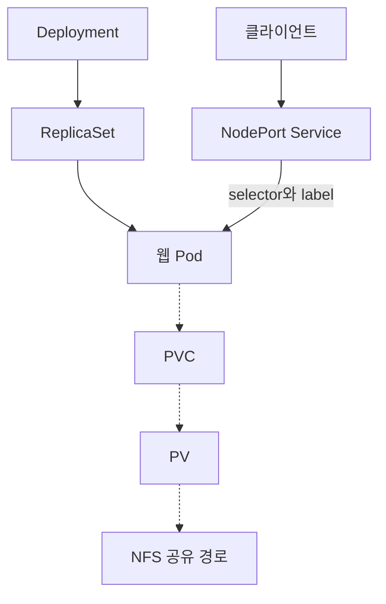

# Cloud-IaC-Study 핵심 총망라

> **Network · Linux · Storage · Service · Docker · Kubernetes · AWS · IaC · Git/GitHub**  
> **기준일:** 2026-10-05, 한국 시간  
> **목적:** 지금까지의 학습 기록을 연결하고, 실무 점검·면접 답변·시험 복습에 필요한 핵심을 한 파일에서 찾는다.

## 목차

1. [읽는 방법과 확인 범위](#scope)
2. [먼저 기억할 핵심 20문장](#essential)
3. [Network — 패킷과 경로](#network)
4. [Linux — 파일·권한·프로세스·운영](#linux)
5. [Storage — 디스크·LVM·RAID·백업·NFS](#storage)
6. [서버 서비스 — DNS·DHCP·Web·DB·Mail·방화벽](#services)
7. [Docker — 실행 환경을 재현한다](#docker)
8. [Kubernetes — 원하는 상태와 리소스 관계](#kubernetes)
9. [프로젝트 — 실제 기록과 최종 구성](#projects)
10. [AWS — 기존 인프라 지식을 클라우드로 연결](#aws)
11. [IaC·CloudFormation — 인프라를 코드로 관리](#iac)
12. [Git/GitHub — 변경 이력과 협업](#git)
13. [통합 트러블슈팅 — 증상에서 증거로](#troubleshooting)
14. [면접·시험 핵심 Q&A 60](#qa)
15. [포트·명령어·헷갈리는 구분](#cheatsheet)
16. [복습 루틴과 프로젝트 설명법](#review)
17. [후속 학습과 최신 운영 기준](#next)
18. [공식 참고자료](#references)
19. [전체 원문 파일 색인](#inventory)

<a id="scope"></a>
## 1. 읽는 방법과 확인 범위

### 1.1 이 문서의 근거

| 항목 | 확인 내용 |
|---|---|
| 저장소 | [YGJ1203/Cloud-IaC-Study](https://github.com/YGJ1203/Cloud-IaC-Study) |
| 브랜치 | `main` |
| 고정한 기준 커밋 | [`76a7c1c713f196cdd5ddd0302fddc3202160b624`](https://github.com/YGJ1203/Cloud-IaC-Study/commit/76a7c1c713f196cdd5ddd0302fddc3202160b624), 「분기별 총정리 커밋」 |
| 커밋 시각 | 2026-10-05 17:25:09 KST |
| 커밋 이력 | 기준 커밋에서 도달 가능한 **136개**; 초기 커밋부터 2026-10-05까지 |
| 기준 시점 파일 | **114개, 모두 Markdown**; README·복습본·중복 파일 포함 |
| 동일 내용 통합 | Git blob SHA 기준 **110개 고유 본문**을 확보; 동일한 4개 파일쌍은 한 주제로 통합 |
| 학습 범위 | Network Day01~23, Linux Day24~38, Docker Day39~43, Swarm·K8s Day44~48, 프로젝트, AWS Day49~51 및 주간 정리 |
| 추가 근거 | 이전 총정리와 관련 대화의 작업 맥락; 최신 기술 구분은 공식 문서로 보강 |

**현재 파일의 본문·설정·장애 기록과 커밋 이력을 바탕으로 한 학습 통합본**이다. 삭제된 모든 파일의 과거 버전과 136개 커밋의 모든 diff를 줄 단위로 감사한 보고서는 아니다. 별도 저장소·다른 브랜치·미푸시 로컬 작업은 포함하지 않았다. 원문 색인의 링크는 모두 기준 커밋에 고정했다.

프로젝트의 “성공”은 해당 날짜의 기록에 적힌 결과다. 이 문서 작성 과정에서 실제 VMware, Kubernetes 클러스터 또는 AWS 계정에 접속해 서비스를 다시 시험한 것은 아니다. 과거 설정값이 다를 때는 날짜와 사용 목적을 함께 적었다.

### 1.2 무엇부터 읽을까?

| 목적 | 읽을 부분 | 끝나면 할 일 |
|---|---|---|
| 10분 전체 복습 | 2장 → 15.3절 | 각 문장을 자기 말로 설명 |
| 개념이 헷갈림 | 3~8장, 10~12장 | 역할·연결 대상·검증 명령을 묶어 말하기 |
| 면접 준비 | 9장 → 14장 → 16.3절 | 답변을 30~60초로 소리 내어 설명 |
| 장애 대응 연습 | 13장 | 증상 하나를 골라 첫 세 가지 점검을 적기 |
| 원문 자세히 보기 | 19장 | 필요한 Day·프로젝트 문서만 열기 |

우선순위는 **P1: 가장 먼저**, **P2: 다음으로**, **보강: 실무 확장**으로 표시한다. 시험 종류가 지정되지 않았으므로 특정 시험의 출제를 보장하는 목록이 아니라, 저장소 학습 범위에서 여러 실무·면접·기초 시험에 반복되는 공통 핵심이다.

<a id="essential"></a>
## 2. 먼저 기억할 핵심 20문장 — P1

1. **IP는 최종 목적지와 경로를, MAC은 현재 링크에서 전달할 상대를 식별한다.**
2. 다른 서브넷으로 보낼 때 PC는 보통 **기본 게이트웨이의 MAC**을 찾는다.
3. 라우팅은 **가장 구체적인 목적지 Prefix**를 우선한다. 반환 경로도 필요하다.
4. **VLAN은 L2 영역 분리, Trunk는 여러 VLAN 운반, Routing은 서로 다른 IP 네트워크 연결**이다.
5. **STP는 L2 루프 방지, EtherChannel은 링크 묶기, HSRP는 기본 게이트웨이 이중화**다.
6. **ACL은 허용·차단, NAT/PAT는 주소·포트 변환**이다. 서로의 기능을 대신하지 않는다.
7. `ping` 성공만으로 HTTP·DNS·DB 서비스 정상까지 증명할 수 없다.
8. Linux 서비스는 **프로세스·Listen 주소/포트·권한·방화벽·응답**을 함께 확인한다.
9. 디렉터리의 `x`는 진입·경로 탐색이다. 파일의 `x`와 의미가 다르다.
10. **LVM은 용량 관리, RAID는 디스크 구성과 장애 대응, 백업은 데이터 복구**다.
11. **DNS 레코드, Web VirtualHost, NAT 설정은 각각 다른 연결 단계**다.
12. Docker는 **Image → Container**, 데이터는 Volume/외부 저장소로 수명을 분리한다.
13. `-p 8080:80`은 **호스트 8080 → 컨테이너 80**이다. `EXPOSE 80`은 포트를 공개하지 않는다.
14. **Dockerfile은 이미지 제작, Compose는 여러 서비스 실행 구성**이다.
15. Kubernetes의 관리 관계는 **Deployment → ReplicaSet → Pod**다.
16. Service는 이름이 같아서가 아니라 **selector와 Pod label이 맞아서** 대상을 찾는다.
17. `Running`과 `Ready`는 다르다. `requests`는 배치 판단, `limits`는 사용 제한에 연결된다.
18. 저장소 연결은 **Pod → PVC → PV → 실제 NFS/디스크**다. `Bound`만으로 파일 읽기 성공을 보장하지 않는다.
19. AWS Public Subnet은 **IGW로 향하는 경로**가 핵심이다. 개별 EC2의 IPv4 인터넷 통신에는 공인 주소와 보안·OS 설정도 필요하다.
20. **Git commit은 로컬 이력 저장, push는 원격 반영**이다. IaC도 파일 저장과 실제 인프라 적용을 구분한다.

<a id="network"></a>
## 3. Network — 패킷과 경로

### 3.1 OSI·TCP/IP를 장애 위치와 연결 — P1

| OSI 계층 | 핵심 역할 | 대표 예 | 점검 질문 |
|---|---|---|---|
| 7 응용 | 애플리케이션 통신 규칙 | HTTP, DNS, SMTP | 요청 이름·경로·응답이 맞는가? |
| 6 표현 | 데이터 표현·인코딩 등 | 문자 표현, 암호화 개념 | 양쪽이 데이터를 해석할 수 있는가? |
| 5 세션 | 세션 관리 개념 | 대화·세션 유지 | 연결 상태와 인증 세션이 유지되는가? |
| 4 전송 | 포트, 종단 간 전송 | TCP, UDP | 해당 포트가 열리고 응답하는가? |
| 3 네트워크 | IP 주소와 라우팅 | IPv4/IPv6, ICMP | 목적지·반환 경로가 있는가? |
| 2 데이터링크 | 현재 링크의 프레임 전달 | Ethernet, MAC, VLAN | VLAN·MAC·Trunk가 맞는가? |
| 1 물리 | 비트 전달 | 케이블, 신호, 링크 | 연결·속도·오류·인터페이스 상태는? |

OSI는 설명 모델이다. 실제 TCP/IP 구현과 기능을 매번 1:1로 나눌 필요는 없다. TCP/IP의 응용 계층은 OSI 상위 계층의 여러 기능을 함께 다룬다.

**캡슐화:** 응용 데이터에 전송·IP·링크 정보를 붙인다. 라우터를 지날 때 Ethernet 헤더는 다음 링크에 맞게 바뀐다. 일반 라우팅에서는 목적지 IP가 유지되지만 TTL은 감소한다. NAT가 있으면 해당 IP·포트도 변환될 수 있다.

### 3.2 같은 서브넷과 다른 서브넷 — P1

| 목적지 | IPv4 Ethernet 환경에서 먼저 찾는 MAC | 필요한 것 |
|---|---|---|
| 같은 서브넷 | 목적지 단말의 MAC | ARP, 같은 L2/VLAN 연결 |
| 다른 서브넷 | 선택한 다음 홉, 보통 기본 게이트웨이의 MAC | Gateway, 라우팅, 반환 경로 |

PC `10.1.11.10/24`가 `10.1.21.20`으로 보낼 때, Ethernet 목적지 MAC은 보통 VLAN11 Gateway의 MAC이다. IP 목적지는 `10.1.21.20`이다. ARP 요청은 해당 L2 영역의 Broadcast이며, 라우터가 그대로 다른 VLAN으로 전달하지 않는다.

스위치는 **들어온 프레임의 출발지 MAC**을 학습하고 목적지 MAC으로 전달 포트를 고른다. 알 수 없는 목적지 MAC은 해당 VLAN의 다른 적절한 포트로 Flooding한다.

### 3.3 TCP·UDP·ICMP — P1

| 구분 | TCP | UDP | ICMP |
|---|---|---|---|
| 중심 | 연결·순서·재전송·흐름/혼잡 제어 | 연결 설정 없는 Datagram 전달 | IP 오류·제어·진단 |
| 포트 | 사용 | 사용 | TCP/UDP 포트 없음 |
| 대표 | SSH, HTTP/1.1·HTTP/2, SMTP | DHCP, 많은 DNS 질의 | ping, Time Exceeded |
| 해석 | TCP 연결 성공과 응용 성공은 별개 | 응용에서 신뢰성 등을 추가할 수 있음 | 응답 차단이 서비스 장애를 뜻하지 않을 수 있음 |

- TCP 연결: **SYN → SYN/ACK → ACK**.
- TCP 종료는 FIN·ACK 교환이 일반적이지만 패킷 수가 언제나 정확히 4개인 것은 아니다. RST 종료도 있다.
- DNS는 UDP뿐 아니라 TCP도 사용한다. HTTP/3는 QUIC 기반으로 UDP를 사용한다.
- `traceroute`/`tracert`는 TTL/Hop Limit과 ICMP 메시지를 이용해 경로를 추론한다. 구현에 따라 보내는 탐색 패킷은 다르다.
- 첫 ping 실패는 ARP 학습 등으로 생길 수 있지만, 반복 실패를 같은 이유로 단정하지 않는다.

### 3.4 IPv4·CIDR·Subnetting·VLSM — P1

IPv4는 32비트다. `/n`은 네트워크 Prefix 길이이며, 전체 주소 수는 `2^(32-n)`이다. 일반적인 IPv4 LAN에서는 Network/Broadcast를 제외해 호스트 수를 계산한다. `/31` Point-to-Point와 `/32`는 별도 의미가 있다.

| Prefix | Subnet Mask | 전체 주소 | 일반 LAN 호스트 수 | AWS 일반 Subnet 할당 가능 주소¹ |
|---|---|---:|---:|---:|
| /24 | 255.255.255.0 | 256 | 254 | 251 |
| /25 | 255.255.255.128 | 128 | 126 | 123 |
| /26 | 255.255.255.192 | 64 | 62 | 59 |
| /27 | 255.255.255.224 | 32 | 30 | 27 |
| /28 | 255.255.255.240 | 16 | 14 | 11 |

¹ AWS는 일반적인 IPv4 Subnet에서 앞 4개와 마지막 1개를 예약한다. 전통적인 LAN의 `-2` 계산을 그대로 적용하지 않는다. [S4]

**예: `192.168.10.130/26`**

| 항목 | 값 |
|---|---|
| 마지막 Octet 블록 크기 | 64 |
| 포함된 블록 | 128~191 |
| Network | 192.168.10.128 |
| 일반 LAN Host | 192.168.10.129~190 |
| Broadcast | 192.168.10.191 |

**VLSM:** 호스트 요구량이 큰 망부터 Prefix를 계산하고, 주소 경계에 맞춰 할당하며, 중복을 확인한다. 호스트 500개면 일반 IPv4 LAN의 `/23`이 510개를 제공한다.

**사설 IPv4:** `10.0.0.0/8`, `172.16.0.0/12`, `192.168.0.0/16`. `172.16~31`만 해당하며 `172` 전체가 사설은 아니다. 실습의 `192.168.2.x`를 공인 IP라고 표현하지 않는다. [S31]

### 3.5 라우팅 결정과 프로토콜 — P1/P2

**패킷 전달에서는 라우팅 테이블의 Longest Prefix Match가 먼저다.** 같은 목적지 Prefix의 경로 후보를 학습·선정할 때 AD와 해당 프로토콜의 Metric을 이해한다. 더 구체적인 `/24` 경로와 `/0` 경로를 단순히 AD로 비교하지 않는다.

| 방식 | 핵심 | 시험·면접 구분 |
|---|---|---|
| Static Route | 관리자가 경로 지정 | 작은 망·Stub·기본 경로; 자동 재계산에 한계 |
| Default Route | 다른 구체 경로가 없는 목적지 처리 | IPv4 `0.0.0.0/0` |
| RIP | Distance Vector, Hop Count | 최대 유효 15 Hop, 16은 도달 불가; v2는 CIDR/VLSM 지원 |
| EIGRP | Advanced Distance Vector, DUAL | 기본 Metric은 대역폭·지연; Successor/Feasible Successor |
| OSPF | Link State, SPF | Area, Router ID, Cost, Neighbor, LSDB |

Cisco에서 흔히 보는 기본 AD는 Connected 0, Static 1, 내부 EIGRP 90, OSPF 110, RIP 120이다. 플랫폼·설정에 따라 변경할 수 있는 값이다.

- OSPF `network`는 **로컬 인터페이스의 주소를 조건으로 선택**해 OSPF와 Area를 적용한다. 이웃 라우터의 주소를 적는 문장이 아니다.
- OSPF Process ID는 로컬 식별자다. 이웃과 숫자가 같아야 하는 조건은 아니다.
- OSPF 이웃 장애: Interface/Subnet, Area, Hello/Dead, 인증, Network Type, MTU, Passive 여부 등을 상태와 로그에 맞춰 확인한다.
- OSPF의 `passive-interface`는 Hello/인접 관계를 막으면서 해당 네트워크 광고에는 사용할 수 있다. 라우터끼리 이웃을 맺을 링크에 적용하면 문제가 생긴다.
- EIGRP의 Feasible Condition은 이웃의 Reported Distance가 해당 경로의 Feasible Distance보다 **엄격히 작아야** 한다. 단순히 두 번째로 빠른 경로면 자동 충족하는 것은 아니다.

```cisco
show ip interface brief
show ip route
show ip protocols
show ip ospf neighbor
show ip eigrp neighbors
show ip eigrp topology
```

출발지부터 목적지까지 한 홉씩 확인하고, 목적지의 응답이 돌아올 경로를 함께 점검한다.

### 3.6 VLAN·Trunk·Inter-VLAN·VTP — P1/P2

| 기능 | 역할 | 확인 |
|---|---|---|
| VLAN | L2 Broadcast Domain 분리 | `show vlan brief` |
| Access Port | 단말의 VLAN 배치 | `show interfaces ... switchport` |
| Trunk | 여러 VLAN을 링크 하나로 운반 | `show interfaces trunk` |
| IEEE 802.1Q | VLAN Tagging | 양쪽 VLAN 허용 목록·Native VLAN |
| Router-on-a-Stick | Router Subinterface로 VLAN 간 라우팅 | Subinterface·Tag·Gateway |
| SVI | L3 Switch의 VLAN Interface | `ip routing`, SVI 상태·경로 |
| VTP | VLAN 정보 배포 | Domain·Mode·Version·Revision |

- **802.1Q는 유선 VLAN Tagging**이다. 원문 일부의 `802.11 Trunk` 표기는 무선 LAN 표준과 혼동한 것으로 교정한다.
- VLAN 생성과 Access Port 할당은 별도다. Trunk 허용 목록에도 해당 VLAN이 있어야 한다.
- Native VLAN은 양쪽이 일치해야 한다. 일반적인 802.1Q Trunk에서 Untagged Traffic을 처리하는 VLAN이며 설정에 따른 차이가 있다.
- Voice VLAN과 Data VLAN을 구분한다. Cisco의 일반적인 Voice VLAN 설정은 `switchport voice vlan`이다.
- 장비마다 명령 지원이 다르다. 802.1Q만 지원하는 장비에서는 `switchport trunk encapsulation dot1q`가 불필요하거나 지원되지 않는다.
- VTP는 VLAN 정보 공유이며 IP 라우팅을 만드는 기능이 아니다. 새 장비 투입 시 Domain·Revision 등으로 기존 VLAN 정보에 미칠 영향을 확인한다.

### 3.7 STP·EtherChannel·HSRP — P1

| 기술 | 해결하는 문제 | 핵심 |
|---|---|---|
| STP/RSTP | 중복 L2 링크로 인한 루프 | Root Bridge, Port Role/State |
| EtherChannel | 여러 물리 링크를 논리 링크로 결합 | LACP/PAgP/Static, 양쪽 설정 일치 |
| HSRP | 기본 게이트웨이 장애 | Virtual IP, Active/Standby, Priority, Preempt, Track |

**STP:** Root Bridge는 낮은 Bridge ID가 우선이다. 다른 스위치는 Root까지의 경로 Cost와 Tie-breaker로 역할을 정한다. RSTP는 Discarding/Learning/Forwarding을 사용한다.

**PortFast:** 단말용 Edge Port를 빠르게 Forwarding으로 전환한다. STP 자체를 끄는 기능은 아니다. 스위치 간 링크에 무분별하게 적용하지 않는다. Edge Port에는 BPDU Guard 적용도 함께 검토한다.

**EtherChannel:** LACP는 Active/Passive를 쓰고 적어도 한쪽이 Active여야 협상한다. PAgP는 Desirable/Auto다. `on`은 협상 없는 Static 방식이므로 양쪽·멤버 설정을 맞춘다. 여러 링크를 묶어도 단일 흐름이 항상 전체 합산 대역폭을 사용하는 것은 아니다.

**HSRP:** 우선순위가 높은 장비가 Active 후보가 된다. `preempt`는 우선순위가 높아진 장비가 Active를 되찾는 동작에 필요하다. Track은 상위 링크 장애 등을 우선순위에 반영한다.

실습의 `120 - 30 = 90`은 기본 우선순위 100인 반대편보다 낮아져 역할 전환을 유도한 값이다. 외부 `e0/0` 장애로 Track이 내려가는 상황과 HSRP가 실행되는 내부 `e0/1` 자체가 내려가 `Init`가 되는 상황은 구분한다.

```cisco
show spanning-tree
show etherchannel summary
show interfaces trunk
show standby brief
show track
```

### 3.8 ACL·NAT/PAT·DHCP Relay·IPv6 — P1/P2

| 항목 | 핵심 | 자주 틀리는 점 |
|---|---|---|
| Standard ACL | 출발지 IPv4 중심으로 매칭 | 목적지·포트까지 구분한다고 생각함 |
| Extended ACL | 출발지·목적지·프로토콜·포트 등 | 적용 Interface와 In/Out를 놓침 |
| ACL 평가 | 위에서 아래, 첫 매칭, 마지막 Implicit Deny | 앞의 넓은 규칙이 뒤 규칙을 가림 |
| Wildcard Mask | 0은 비교, 1은 무시 | Subnet Mask와 그대로 같다고 생각함 |
| Static NAT | 고정 주소 매핑 | 서비스 실행·방화벽까지 해결한다고 생각함 |
| PAT/Overload | 주소와 포트로 여러 통신 구분 | 반환 경로·inside/outside 누락 |
| DHCP Relay | 다른 Subnet의 DHCP 서버로 중계 | Router가 Broadcast를 자동 전달한다고 생각함 |
| IPv6 | 128비트, ND/ICMPv6, Broadcast 없음 | ARP가 그대로 사용된다고 생각함 |

Standard ACL을 목적지 가까이, Extended ACL을 출발지 가까이 두는 것은 흔한 설계 기준이며 모든 요구사항의 절대 법칙은 아니다. NAT 대상 선택에 사용하는 ACL의 `permit`은 변환 대상 지정일 수 있으므로, Interface 차단 ACL과 같은 역할로 해석하지 않는다.

DHCP DORA는 **Discover → Offer → Request → ACK**다. 서버 UDP 67, 클라이언트 UDP 68이다. Relay 설정에서는 서버 주소·해당 VLAN Interface·DHCP Scope·반환 경로를 맞춘다.

IPv6의 기본 복습 범위는 Prefix, `::` 축약, Link-local `fe80::/10`, Global/Multicast 주소와 ND다. 무조건 IPv4 NAT 구조를 그대로 적용하는 것으로 이해하지 않는다.

```cisco
show access-lists
show ip interface
show ip nat translations
show ip nat statistics
show ip dhcp binding
```

### 3.9 Wireshark·패킷 분석 — P2

**Capture Filter**는 수집할 패킷을 제한하고, **Display Filter**는 이미 수집한 패킷을 화면에서 고른다. 문법도 다르다.

```text
arp
icmp
ip.addr == 10.1.101.200
tcp.port == 80
tcp.flags.syn == 1 && tcp.flags.ack == 0
dns.qry.name == "www.example.com"
tcp.analysis.retransmission
```

위 예제는 Display Filter다. 주소는 실제 실습 대상에 맞춘다. SYN만 반복되면 응답 경로·Listen·방화벽을, RST가 보이면 수신 호스트 또는 중간 장비의 거부를, TCP 연결 뒤 HTTP 오류가 보이면 응용 처리를 조사한다. 단일 패킷이나 단일 플래그로 전체 원인을 확정하지 않는다.

<a id="linux"></a>
## 4. Linux — 파일·권한·프로세스·운영

### 4.1 파일·경로·디렉터리 — P1

| 항목 | 핵심 |
|---|---|
| 절대/상대 경로 | `/`부터 / 현재 위치 기준 |
| `/etc` | 시스템·서비스 설정 |
| `/var` | 로그·가변 데이터·서비스 데이터 |
| `/usr` | 프로그램·라이브러리 등 |
| `/home`, `/root` | 일반 사용자 / root 홈 |
| `/dev`, `/proc`, `/sys` | 장치 파일 / 프로세스·커널 정보 / 커널·장치 정보 |
| inode | 파일 메타데이터와 데이터 위치 정보; 파일명은 디렉터리 항목에 있음 |
| Hard Link | 같은 inode를 가리키는 다른 이름; 일반적으로 같은 FS 안에서 사용 |
| Symbolic Link | 경로를 가리키는 별도 파일; 대상이 없어지면 Broken Link 가능 |

`touch`는 파일이 없으면 만들고, 있으면 시간 정보를 갱신한다. `cp`는 복사, `mv`는 이동/이름 변경이다. Linux는 대소문자를 구분한다.

### 4.2 권한·소유권·umask — P1

| 권한 | 일반 파일 | 디렉터리 |
|---|---|---|
| r = 4 | 내용 읽기 | 목록 읽기 |
| w = 2 | 내용 변경 | 항목 생성·삭제·이름 변경에 관여 |
| x = 1 | 실행 | 진입·경로 탐색 |

- `755` = 소유자 rwx, 그룹 r-x, 기타 r-x.
- `644` = 소유자 rw-, 그룹 r--, 기타 r--.
- 파일 삭제 가능 여부는 보통 **부모 디렉터리의 권한과 Sticky Bit 등**에 좌우된다. 파일 자체의 w만 보고 판단하지 않는다.
- `umask 022`라면 일반적인 생성 요청 기준으로 파일 644, 디렉터리 755가 된다. umask는 권한 비트 Mask이며 무조건 십진수 뺄셈으로 계산하지 않는다.
- SUID는 실행 파일의 Effective UID, SGID는 실행 권한/디렉터리 그룹 상속, Sticky Bit는 공유 디렉터리에서 삭제·이름 변경 제한과 연결해 기억한다.

```bash
id
ls -ld /var/www /var/www/html
namei -l /var/www/html/index.html
stat /var/www/html/index.html
getfacl /var/www/html/index.html
getenforce
```

`Permission denied`는 소유권·rwx·부모 경로·ACL·SELinux·NFS UID/GID를 나누어 확인한다. `chmod 777`이나 SELinux 전체 비활성화를 모든 문제의 기본 해결책으로 쓰지 않는다.

### 4.3 Shell·검색·리다이렉션 — P1/P2

| 문법/도구 | 역할 | 주의 |
|---|---|---|
| `>` / `>>` | 덮어쓰기 / 추가 | 기존 내용 보존 여부 |
| `2>` | stderr 전달 | stdout과 별도 |
| `2>&1` | stderr를 현재 stdout 대상으로 연결 | 리다이렉션 순서에 따라 결과가 달라짐 |
| Pipe `|` | stdout을 다음 명령의 stdin으로 | 파일 저장과 구분 |
| `&&` / `||` | 성공하면 다음 / 실패하면 다음 | 종료 코드 기반 |
| `'...'` / `"..."` | 거의 그대로 / 변수·명령 치환 가능 | 공백과 메타문자 처리 |
| `grep` / `rg` | 텍스트 검색 | Regex와 Shell Glob 구분 |
| `find` | 파일 속성·경로 조건 검색 | 이름 패턴 인용 |
| `sed` / `awk` | 행·문자 처리 / 필드 기반 처리 | 원본 수정 여부 |
| `sort` / `uniq` / `wc` | 정렬 / 인접 중복 / 개수 | uniq 전에 정렬 필요 여부 |

```bash
find /var/log -type f -name '*.log'
rg -n 'error|failed' /var/log/httpd
tail -n 100 /var/log/httpd/error_log
awk -F: '{print $1}' /etc/passwd
```

Shell 변수와 환경 변수는 다르다. `export`한 변수는 자식 프로세스에 전달된다. Shell의 변수 하나가 이미 실행 중인 다른 프로세스의 환경을 자동으로 바꾸지는 않는다.

### 4.4 프로세스·systemd·성능 — P1

| 구분 | 핵심 |
|---|---|
| PID / PPID | 프로세스 / 부모 프로세스 ID |
| Foreground / Background | 터미널 제어와 실행 방식 |
| `jobs`, `fg`, `bg` | 현재 Shell의 Job 관리 |
| SIGTERM(15) | 정상 정리 기회가 있는 종료 요청 |
| SIGKILL(9) | 프로세스가 처리·정리할 수 없는 강제 종료 |
| `start` / `enable` | 지금 시작 / 부팅 시 시작 설정 |
| `active` / `enabled` | 현재 상태 / 자동 시작 설정 상태 |

```bash
systemctl status httpd --no-pager
systemctl is-enabled httpd
journalctl -u httpd -n 100 --no-pager
ss -lntup
ps -ef
free -h
df -hT
df -i
```

**서비스 Unit 파일을 수정한 경우** `systemctl daemon-reload`로 systemd의 Unit 정의를 다시 읽게 한다. 애플리케이션 설정 변경에 사용하는 서비스 `reload/restart`와 목적이 다르다.

성능 문제는 CPU, RAM/Swap, Disk 용량·inode·I/O, Network, 애플리케이션을 분리한다. Load Average가 높다는 것만으로 CPU 사용률이 높다고 확정하지 않는다. Linux의 Load에는 실행 대기와 일부 I/O 대기 Task도 포함된다.

### 4.5 패키지·예약·네트워크 — P2

| 분야 | 핵심 |
|---|---|
| RPM / DNF | 패키지 파일·설치 정보 / Repository·의존성 관리 |
| dpkg / APT | Debian 계열의 대응 역할 |
| Repository 장애 | DNS → 경로/Proxy → 인증서·시간 → URL·배포판 지원 여부 |
| tar / gzip | 묶기 / 압축; `tar -czf`는 둘을 결합 |
| cron / at | 반복 일정 / 한 번 실행 |
| NetworkManager | Connection Profile을 통한 IP·Route·DNS 관리 |
| SSH / SFTP / SCP | 원격 로그인 / 파일 전송; 실제 구현·설정 차이 확인 |

cron 필드 순서는 **분 시 일 월 요일**이다. 터미널에서는 성공하지만 cron에서 실패하면 PATH, 실행 사용자, 작업 경로, 환경 변수, 권한, 로그를 확인한다.

```bash
dnf repolist
rpm -q httpd
crontab -l
nmcli connection show
ip -br addr
ip route
ip route get 192.168.2.80
```

`/etc/resolv.conf`가 NetworkManager 등으로 관리되면 직접 수정한 값이 덮어써질 수 있다. `/etc/hosts`는 로컬 이름 매핑이며 DNS 서버의 Zone 파일과 다르다.

<a id="storage"></a>
## 5. Storage — 디스크·LVM·RAID·백업·NFS

### 5.1 디스크 사용과 영구 마운트 — P1

**장치 식별 → 파티션 또는 Volume 구성 → 파일시스템 → Mount → 영구 설정 → 검증** 순서로 이해한다. `mkfs`는 파일시스템 생성이며 기존 데이터에 영향을 주므로 조회 명령과 구분한다.

```bash
lsblk -f
blkid
findmnt
df -hT
df -i
du -sh /var/www
findmnt --verify
```

| 비교 | 의미 |
|---|---|
| `df` | 파일시스템 전체의 사용·여유 공간 |
| `du` | 디렉터리 아래 파일의 사용량 |
| `df -i` | inode 여유; 바이트가 남아도 inode 부족 가능 |
| Mount | 디렉터리에 파일시스템 연결 |
| `/etc/fstab` | 자동 마운트 설정; 실제 UUID·타입·옵션 확인 |

파일을 삭제했는데 `df` 공간이 회복되지 않으면 열린 삭제 파일도 확인한다. `lsof +L1`이 진단에 도움이 된다.

기존 파일이 있는 디렉터리 위에 새 FS를 Mount하면 **기존 파일이 가려질 수 있다**. 곧바로 삭제됐다고 판단하지 않는다. fstab 수정 후 문법·Mount 검증과 필요한 재부팅 검증을 수행한다.

### 5.2 LVM — P1

| 자원 | 의미 | 대표 명령 |
|---|---|---|
| Physical Volume | LVM에 제공한 장치 | `pvs`, `pvcreate` |
| Volume Group | Physical Volume을 모은 Pool | `vgs`, `vgcreate` |
| Logical Volume | Pool에서 할당한 논리 장치 | `lvs`, `lvcreate` |
| Filesystem | LV 위에 구성한 저장 형식 | ext4, XFS |

**LVM의 PV는 Kubernetes PV와 다른 개념**이다. LVM의 목적은 유연한 용량 관리이며 일반적인 Linear LV는 디스크 하나가 고장 나도 데이터를 보호해주는 RAID가 아니다.

LV를 늘려도 파일시스템을 확장하는 단계가 필요하다. ext4와 XFS는 확장·축소 방식이 다르다. XFS는 일반적으로 온라인 확장이 가능하며 축소는 지원하지 않는다.

### 5.3 RAID — P1

동일 크기 디스크 N개, 디스크당 용량 S 기준의 대표 구성이다.

| RAID | 방식 | 최소 디스크 | 대표 가용 용량 | 장애 허용 핵심 |
|---|---|---:|---|---|
| 0 | Striping | 2 | N×S | 디스크 장애 허용 없음 |
| 1 | Mirroring | 2 | 2개 구성은 S | 두 디스크 중 한 개 장애 허용 |
| 5 | 분산 Single Parity | 3 | (N−1)×S | 한 개 장애 |
| 6 | 분산 Double Parity | 4 | (N−2)×S | 두 개 장애 |
| 10 | Mirror 쌍을 Stripe | 4 | (N/2)×S | 장애가 난 Mirror 쌍의 조합에 따라 다름 |

RAID10에서 “어떤 두 디스크가 고장 나도 안전하다”는 설명은 틀리다. 같은 Mirror 쌍의 두 디스크가 모두 고장 나면 해당 데이터가 손실될 수 있다. RAID 0+1과 RAID 1+0은 고장 후 남는 중복 구조가 다르다.

```bash
cat /proc/mdstat
mdadm --detail /dev/md0
pvs
vgs
lvs
```

RAID는 오삭제, 랜섬웨어, 애플리케이션 오류, 사이트 전체 장애에 대한 백업을 대신하지 않는다. Degraded/Resync/Rebuild와 영구 조립 설정도 검증 대상이다.

### 5.4 백업·RPO·RTO — P1/P2

| 방식 | 저장 대상 | 복구에 필요한 대표 조합 |
|---|---|---|
| Full | 전체 | 해당 Full |
| Incremental | 직전 백업 이후 변경 | Full + 이후 Incremental 전부 |
| Differential | 마지막 Full 이후 변경 | Full + 최신 Differential |

- **RPO:** 허용 가능한 데이터 손실 시간. 백업/복제 간격과 연결한다.
- **RTO:** 서비스를 복구하기까지 허용 가능한 시간.
- 복구 절차를 시험해야 백업의 실효성을 판단할 수 있다.
- GNU tar의 Listed Incremental Snapshot 파일은 다음 백업 기준에도 영향을 준다. 갱신되는 Snapshot을 그대로 반복 사용하며 Differential이라고 부르지 않는다.
- DB 백업은 파일 복사만으로 일관성이 확보되는지 별도 확인한다.

### 5.5 NFS·Samba·권한 — P1

| 항목 | 역할 | 주요 점검 |
|---|---|---|
| NFS | 네트워크 파일시스템 | Export·Node Mount·UID/GID·권한 |
| Samba/SMB | SMB 기반 파일 공유 | 공유 정의·사용자 인증·권한 |
| `/etc/exports` | NFS 경로·Client 허용·옵션 | 실제 경로, 공백·옵션 위치 |
| `root_squash` | Client root를 익명 사용자로 매핑 | 기본 보호 동작과 소유권 |

NFS 서버를 구축했다고 모든 클라이언트가 자동 Mount되는 것은 아니다. NFSv4는 기본적으로 TCP 2049를 사용한다. v3는 RPC 관련 서비스·포트도 고려해야 하므로 “2049 하나만 열면 모든 NFS가 된다”고 외우지 않는다. `showmount -e`만으로 NFSv4 전체 정상 여부를 확정하지 않는다. [S26] · [S27]

```bash
systemctl status nfs-server --no-pager
exportfs -v
findmnt -T /www/vol/web
ls -ld /www/vol /www/vol/web
```

**Stale file handle:** 클라이언트가 가진 핸들이 서버의 현재 파일/파일시스템을 더 이상 가리키지 못하는 상태다. 프로젝트에서는 `/www/vol`의 Backing FS 변경 뒤 발생했다. 먼저 서버 Mount·Export와 로그를 확인하고, 데이터와 사용 중인 클라이언트를 고려해 재마운트·Pod 재생성을 진행한다. 무조건 파일 권한 오류로 판단하지 않는다.

<a id="services"></a>
## 6. 서버 서비스 — DNS·DHCP·Web·DB·Mail·방화벽

### 6.1 DNS — P1

| 레코드 | 의미 | 구분 |
|---|---|---|
| A / AAAA | 이름 → IPv4 / IPv6 | 포트 매핑 기능은 아님 |
| CNAME | 이름 별칭 | IP를 직접 적는 레코드와 구분 |
| MX | 도메인의 Mail 수신 서버 | 우선순위 숫자가 낮을수록 우선 |
| NS | Zone의 권한 Name Server | Client Resolver 설정과 별도 |
| PTR | IP → 이름 | 역방향 Zone에서 관리 |
| SOA | Zone의 기본 관리 정보 | Serial·갱신/만료·Negative Cache 등 |

**Resolver의 재귀 질의와 권한 서버의 응답을 구분**한다. 캐시 TTL 때문에 변경이 즉시 모든 곳에 반영되지는 않는다. Secondary는 Zone Transfer를 통해 데이터를 받아 권한 응답을 제공한다. 변경 시 Serial과 Transfer 허용 대상을 확인한다.

```bash
named-checkconf
named-checkzone example.test /var/named/example.test.zone
dig @192.168.2.80 www.example.test A
dig @192.168.2.80 -x 192.168.2.80
```

위 Zone명·파일·주소는 설명 예제다. 실습 파일명과 서버로 바꾼다. `dig @DNS서버`는 실제 질의 대상을 명시한다. IP 접속은 되는데 이름 접속이 안 되면 DNS 응답·Client Resolver부터 분리해서 조사한다.

### 6.2 DHCP — P1/P2

DHCP Scope에는 대상 Subnet, 임대 범위, 제외 주소, Gateway, DNS 등이 맞아야 한다. 서비스명은 설치한 배포판의 실제 Unit으로 확인한다. `dhcp`라는 이름을 추측해 시작하지 않는다.

문법 검사·로그, 올바른 인터페이스, UDP 67/68, Relay, Scope와 실제 VLAN Subnet, 주소 충돌을 점검한다. DHCP 서버가 주는 Gateway/DNS 값의 오류는 주소 할당 자체가 성공해도 접속 문제를 만든다.

### 6.3 Apache·Nginx·Tomcat·DB — P1

| 구성요소 | 역할 | 대표 검증 |
|---|---|---|
| Apache/Nginx | HTTP 응답, 정적 파일, Proxy 등 | 설정 검사·Listen·HTTP 응답 |
| VirtualHost | Host/IP/Port별 Web 설정 선택 | 요청 Host·Port와 설정 |
| DocumentRoot | 콘텐츠 루트 | 실제 디렉터리·파일·권한 |
| Tomcat | Java Servlet/JSP 실행 | Java·Connector·App 로그 |
| MariaDB/MySQL | 관계형 데이터 관리 | DB Listen·계정 권한·질의 |
| Reverse Proxy | Client 요청을 Backend로 중계 | Frontend와 Backend 각각 접근 |

```bash
httpd -t
httpd -S
nginx -t
curl -I http://127.0.0.1/
curl -H 'Host: www.example.test' http://127.0.0.1/
```

- **DNS A 레코드**는 주소를 찾고, **Apache `ServerName`/VirtualHost**는 도착한 Web 요청의 설정을 선택한다.
- Port-based VirtualHost에는 해당 `Listen`도 필요하다.
- `.htaccess`는 Apache에서 해당 디렉터리의 `AllowOverride` 등 허용 설정을 확인한다.
- HTTPS는 443 허용 외에 인증서·개인키·TLS Listener/설정·이름 검증이 필요하다.
- 웹 서버가 DB에 접근할 때는 DB Network/Listen, 사용자@접속대상, 권한, 비밀번호, SELinux 등 실제 실패 단계로 구분한다.
- `AH00558` 같은 ServerName 경고와 서비스 시작 실패는 같은 사건이 아니다. 상태·오류 로그·실제 응답으로 영향도를 확인한다. [S38]

### 6.4 FTP·SSH·Mail — P2

| 서비스 | 핵심 | 자주 틀리는 구분 |
|---|---|---|
| FTP | Control과 Data 연결 분리 | 로그인 성공과 파일 전송 성공은 별개 |
| FTP Active | 서버가 Client Data Port로 연결 | Client NAT/방화벽 영향 |
| FTP Passive | Client가 서버 Data Port로 연결 | 서버 Passive 범위·NAT·방화벽 일치 |
| SFTP | SSH 기반 파일 전송 | FTP의 암호화 옵션이 아님 |
| SMTP | Mail 전송/전달 | Mail 읽기와 구분 |
| POP3 / IMAP | Mail 조회 방식 | 서버·Client 설정 일치 |

프로젝트/수업의 FTP Passive 범위 `50000~51000`은 **vsftpd 설정, 서버 방화벽, 필요한 NAT**에서 맞춰야 한다. 이 범위를 모든 FTP 서버의 표준 포트 범위라고 외우지 않는다.

Sendmail은 MTA, Dovecot은 POP3/IMAP 제공과 연결해 이해한다. Mail 검증은 이름 해석·MX, SMTP 전달, 사용자 사서함, 조회 프로토콜과 인증까지 나눠 확인한다. 실습용 평문 Mail 설정을 그대로 운영 환경의 보안 기준으로 삼지 않는다.

### 6.5 iptables·firewalld·SELinux — P1

| 항목 | 핵심 |
|---|---|
| iptables INPUT | 이 Host로 들어오는 패킷 |
| OUTPUT | 이 Host가 생성한 패킷 |
| FORWARD | 이 Host를 통해 전달되는 패킷 |
| ACCEPT/DROP/REJECT | 허용 / 조용히 폐기 / 거부 응답 |
| Connection Tracking | ESTABLISHED/RELATED 등 상태 기반 매칭 |
| firewalld Zone | 인터페이스·출발지와 연결되는 정책 범위 |
| Runtime/Permanent | 현재 적용 / 저장된 설정 |
| SELinux | 파일 권한과 별도로 적용되는 접근 통제 |

```bash
firewall-cmd --get-active-zones
firewall-cmd --zone=public --list-all
firewall-cmd --permanent --zone=public --list-all
getenforce
ls -Z /var/www/html
```

`public`은 실제 Active Zone으로 바꾼다. `--permanent`로만 추가한 규칙은 바로 Runtime에 적용되지 않는다. 반대로 Runtime에만 추가하면 재시작·Reload 후 사라질 수 있다. Reload는 저장된 Permanent 설정을 다시 적용하므로 현재 임시 규칙과의 차이를 먼저 확인한다. [S24]

최근 Linux의 Packet Filtering Backend는 nftables일 수 있다. `iptables` CLI 학습과 시스템의 실제 Backend를 구분한다.

<a id="docker"></a>
## 7. Docker — 실행 환경을 재현한다

### 7.1 VM·Image·Container — P1

| 항목 | 핵심 |
|---|---|
| VM | 가상 하드웨어와 Guest OS; 각 VM의 커널 |
| Container | Host/실행 환경의 커널을 공유하며 프로세스를 격리 |
| Image | 파일·실행 설정의 읽기 전용 Layer 기반 템플릿 |
| Container | Image에서 생성한 실행 인스턴스와 Writable Layer |
| Registry | Image 배포 저장소 |
| Namespace / cgroups | 격리 / 자원 관리의 기반 |

컨테이너는 작은 VM으로 그대로 이해하면 실행·종료·보안 경계가 헷갈린다. 메인 프로세스가 종료되면 일반적으로 컨테이너도 종료된다. `-d`는 프로세스를 무조건 계속 살려주는 옵션이 아니다.

### 7.2 기본 동작과 포트 — P1

| 명령/옵션 | 의미 |
|---|---|
| `create` / `start` / `run` | 생성 / 시작 / 생성+시작 |
| `exec` / `attach` | 새 프로세스 실행 / 기존 프로세스의 입출력 연결 |
| `-i`, `-t`, `-d` | stdin 유지 / TTY / 백그라운드 실행 |
| `--rm` | 종료 후 컨테이너 자동 제거 |
| `-p HOST:CONTAINER` | Host Port를 Container Port로 Publish |
| `--name` | Container 이름 |
| `--network` | 통신할 Docker Network 선택 |

```bash
docker ps -a
docker logs --tail 100 testweb
docker inspect testweb
docker port testweb
docker exec -it testweb sh
```

`sh`/`bash` 등 Shell이 Image에 실제 있어야 한다. `attach` 연결에서 기본 Detach Key는 **Ctrl+P 다음 Ctrl+Q**다. `exit`가 메인 Shell을 끝내면 컨테이너도 종료될 수 있다.

`EXPOSE 80`, `containerPort: 80`, 실제 Listen, Host Publish는 각각 다르다. 포트 충돌은 Host에서 먼저 `ss -lntp`와 기존 컨테이너를 확인한다.

### 7.3 Network·Volume — P1

| 구분 | 의미 | 핵심 |
|---|---|---|
| User-defined Bridge | 같은 Host의 사용자 정의 Container Network | 이름 기반 통신·분리 구성 |
| Host Network | Host Network Namespace 사용 | 독립 포트 격리와 차이 |
| None | 일반 Network 연결 없음 | 통신 요구에 맞춰 선택 |
| Named Volume | Docker가 관리하는 저장 공간 | Container 수명과 분리 |
| Bind Mount | Host의 지정 경로 연결 | Host 경로·권한·환경 의존 |

Mount가 Image의 기존 콘텐츠를 가릴 수 있다. Docker의 **비어 있는 Named Volume 초기 복사 동작**과 Bind Mount, Kubernetes의 NFS Mount를 같은 규칙으로 취급하지 않는다. [S20]

```bash
docker network ls
docker network inspect appnet
docker volume ls
docker volume inspect webdata
```

`appnet`, `webdata`는 실제 이름으로 바꾼다. 서로 다른 Docker Network의 격리는 구체적인 연결·Publish·방화벽 구성에 따라 해석한다. 예전 `--link` 예제는 User-defined Network의 DNS와 비교해 이해한다.

### 7.4 Dockerfile·Build Context·Multi-stage — P1

| 명령 | 실행 시점/역할 | 자주 틀리는 점 |
|---|---|---|
| FROM | Base Image 선택 | 배포판·버전·CPU Architecture |
| RUN | Image Build 중 명령 실행 | Container 시작 때 실행된다고 생각함 |
| COPY | Build Context의 파일 복사 | Host의 임의 경로를 모두 읽을 수 있다고 생각함 |
| WORKDIR | 이후 작업 디렉터리 | Host 경로와 혼동 |
| EXPOSE | Port 정보 | Publish로 오해 |
| ENTRYPOINT | 주 실행 프로그램 | 기본 Shell 명령으로 무조건 교체된다고 생각함 |
| CMD | 기본 명령/인자 | ENTRYPOINT와 결합 관계 확인 |

```dockerfile
FROM nginx:stable
COPY index.html /usr/share/nginx/html/index.html
EXPOSE 80
```

```bash
docker build -t study-web:v1 .
```

마지막 `.`은 Build Context다. 재현 가능한 배포에서는 Base Image를 검토한 버전/Digest로 고정하고 `.dockerignore`로 불필요한 자료를 제외한다.

**Multi-stage:** Build 도구가 있는 Stage에서 컴파일하고 결과물만 Runtime Stage로 복사한다. 최종 Image 크기·포함 도구·노출 면을 줄이는 데 도움이 된다. Image 안의 파일을 나중 Layer에서 삭제했다고 이전 Layer에 들어간 Secret까지 사라지지는 않는다. [S21] · [S22]

### 7.5 Compose·Registry·자원 관리·Swarm — P2

- Compose는 서비스·Network·Volume·환경 등을 선언한다. 서비스명으로 DB를 찾을 수 있다.
- 단순 `depends_on`은 시작 순서를 다루지만 **DB가 요청 가능한 상태임을 무조건 보장하지 않는다**. Healthcheck 조건과 앱의 재시도도 설계한다. [S23]
- Registry: **Build → Tag → Push → Pull**. 주소·포트·Tag·인증·CA 신뢰를 맞춘다.
- Kubernetes에서 실행할 Image는 **배치될 Node의 실제 Runtime이 접근할 수 있어야 한다**. Master의 `docker images` 목록만으로 증명되지 않는다.
- CPU 제한은 CPU 사용량/Throttling, Memory 제한은 OOM 가능성과 연결한다. I/O 제한은 단위를 확인한다. `100` B/s를 100 MB/s로 착각하지 않는다.
- Portainer는 관리 UI이며 CLI의 실제 Docker 상태와 연결해서 해석한다. Docker Socket 접근은 강한 관리 권한이다.

| 보관 명령 | 대상 | 핵심 |
|---|---|---|
| save / load | Image | Image Layer·메타데이터 보관/복원 |
| export / import | Container Filesystem | 실행 상태·Volume까지 포함한 완전 백업이 아님 |

Swarm에서는 **Service → Task**, Manager/Worker, Desired Replica, Scale, Rolling Update, Rollback을 학습했다. 이 개념을 Kubernetes에 연결하되 객체가 완전히 동일하다고 생각하지 않는다.

<a id="kubernetes"></a>
## 8. Kubernetes — 원하는 상태와 리소스 관계

### 8.1 Cluster 구성 — P1

| 구성요소 | 역할 |
|---|---|
| kube-apiserver | API 요청·인증/인가·리소스 접근의 중심 |
| etcd | Cluster 상태를 저장하는 Key-Value Store |
| kube-scheduler | 미배치 Pod를 조건에 맞는 Node에 배치 |
| kube-controller-manager | 여러 Controller가 원하는 상태를 맞춤 |
| kubelet | Node에서 Pod 실행 상태 관리 |
| Container Runtime | 실제 Container 실행; CRI 연결 |
| CNI | Pod Network 구성 |
| Service Proxy 구현 | Service 전달 경로 구성; kube-proxy 등이 해당 |
| CoreDNS | Cluster의 이름 기반 Service Discovery |

**Control Plane이 HTTP 요청의 모든 중간 경로에 들어가는 것은 아니다.** 관리 경로와 데이터 전달 경로를 나눠 설명한다. 현재 일반적인 구성에서 Docker Engine을 그대로 Kubernetes Runtime이라고 단정하지 않는다. 수업 환경의 Docker 연결에는 `cri-dockerd` 같은 CRI 연동 요소도 확인한다.

### 8.2 Pod·Controller·Namespace — P1

| 자원 | 역할 |
|---|---|
| Pod | 같은 Network Namespace·Volume을 공유하는 하나 이상의 Container |
| ReplicaSet | selector로 선택한 Pod 개수 유지 |
| Deployment | ReplicaSet을 통한 배포·Rolling Update·Rollback 관리 |
| DaemonSet | 대상 Node들에 Pod 배치 |
| StatefulSet | 안정적인 식별자·저장소 등 Stateful Workload 관리 |
| Job / CronJob | 완료형 작업 / 일정에 따른 작업 |
| Namespace | 리소스의 이름·관리 범위 분리 |
| Static Pod | Node의 kubelet이 로컬 Manifest로 관리 |

DaemonSet·StatefulSet·Job은 기존 핵심을 확장하는 **개념 보강**이며 이 저장소에서 상세 실습 완료한 목록으로 표시하지 않는다.

Namespace가 다르면 같은 Service 이름을 쓸 수 있다. **Namespace만 생성했다고 Network가 자동 격리되는 것은 아니다.** RBAC, ResourceQuota, NetworkPolicy와 실제 CNI의 기능을 함께 설계한다.

### 8.3 API·YAML·Label·Selector — P1

| apiVersion | 대표 자원 |
|---|---|
| v1 | Pod, Service, Namespace, ConfigMap, Secret, PV, PVC, ReplicationController |
| apps/v1 | Deployment, ReplicaSet, DaemonSet, StatefulSet |
| networking.k8s.io/v1 | Ingress, NetworkPolicy |
| batch/v1 | Job, CronJob |

YAML Key 순서보다 **계층·들여쓰기·필드명·API 종류**가 중요하다. `vi`는 `v1`의 오타다.

```yaml
# Deployment spec 아래
selector:
  matchLabels:
    app: kaist-ai
template:
  metadata:
    labels:
      app: kaist-ai
```

```yaml
# Service spec 아래
selector:
  app: kaist-ai
```

Deployment selector와 Service selector의 구조는 다르다. Annotation은 부가 정보이며 일반적인 Service selector의 선택 키가 아니다. `nodeSelector`는 Node의 Label을 기준으로 배치를 제한한다.

```bash
kubectl config current-context
kubectl get pods -A -o wide
kubectl get pods -n kaist-ai --show-labels
kubectl explain deployment.spec.selector
kubectl apply --dry-run=server -f web.yml
kubectl diff -f web.yml
```

서버 Dry Run과 Diff에는 Cluster 연결·권한이 필요하다. 파일의 문법을 읽을 수 있는 것과 실제 Cluster에서 적용 가능한 것은 다르다.

### 8.4 Service·Port·Ingress·HAProxy — P1

| 방식 | 역할 | 핵심 |
|---|---|---|
| ClusterIP | Cluster 내부 Service 접근점 | Pod IP와 다른 수명·목적 |
| NodePort | Node IP의 지정 Port로 진입 | 기본 범위 30000~32767; Cluster 설정에 따라 변경 |
| LoadBalancer | 외부 LB 구현과 연결 | 온프레미스에서 선언만으로 External IP가 자동 생성되지 않음 |
| Headless | 일반 ClusterIP 없이 주소 발견 | `clusterIP: None` |
| Ingress | HTTP Host/Path Routing 규칙 | 실제 처리하는 Controller 필요 |
| HAProxy | 별도 Proxy/LB | Backend IP·Port·Healthcheck |

`NodeIP:nodePort → Service port → Pod targetPort`는 **논리적 포트 대응**이다. 모두 독립 프로세스가 순서대로 Listen하는 연결이라고 생각하지 않는다.

| 필드 | 의미 |
|---|---|
| `port` | Service가 제공하는 Port |
| `targetPort` | Backend Pod의 Port |
| `nodePort` | Node로 들어오는 진입 Port |
| `containerPort` | Container Port 정보; 실제 프로세스를 자동으로 실행하거나 Publish하지 않음 |

Service selector가 맞아도 Pod가 NotReady면 사용 가능한 Endpoint에서 제외될 수 있다. EndpointSlice를 보고 Ready 상태·주소·Port를 확인한다. `kubectl get endpoints`는 수업의 기존 환경 점검에 유용하지만 최신 운영 점검에서는 EndpointSlice를 중심으로 본다. [S14]

```bash
kubectl get svc -n kaist-ai
kubectl describe svc kaist-service -n kaist-ai
kubectl get endpointslices -n kaist-ai \
  -l kubernetes.io/service-name=kaist-service -o yaml
kubectl get ingress,ingressclass -A
```

기본 설정에서 NodePort는 여러 Node를 통해 Backend Pod로 연결할 수 있다. `externalTrafficPolicy: Local` 등 정책이 바뀌면 로컬 Endpoint 유무와 동작이 달라진다. Ingress의 backend Service는 일반적으로 같은 Namespace를 참조한다.

### 8.5 Requests·Limits·Probe·상태 — P1

| 항목 | 의미 | 실패 시 해석 |
|---|---|---|
| requests | Scheduler의 자원 배치 판단에 사용 | 배치 조건 부족으로 Pending 가능 |
| CPU limits | CPU 사용 제한 | 보통 Throttling |
| Memory limits | Memory 사용 제한 | Memory 압력 시 OOM Kill 가능 |
| Startup Probe | 시작 완료 확인 | 느린 시작 중 Liveness/Readiness 평가 보호 |
| Liveness Probe | 다시 시작해야 할 상태인가? | 기준 충족 시 Container 재시작 |
| Readiness Probe | 지금 요청을 받을 준비가 됐는가? | Service의 사용 가능한 대상에서 제외 |

`1000m = CPU 1`, `100m = CPU 0.1`이다. `Mi/Gi`와 `M/G`의 단위 차이에도 주의한다. QoS는 CPU/Memory requests·limits의 관계로 BestEffort/Burstable/Guaranteed를 구분하는 것이 기본이다. [S16] · [S17]

| 상태/이유 | 먼저 확인 |
|---|---|
| Pending | Events, 자원·PVC·배치 제약 |
| ContainerCreating / FailedMount | Volume·NFS·CNI·Node |
| ImagePullBackOff | Image 주소·Tag·Registry·인증·실제 Runtime |
| CrashLoopBackOff | 앱 종료 이유, 이전 로그, Probe |
| OOMKilled | 실제 사용량·limits·Node Memory·커널 로그 |
| Running / NotReady | Probe·앱 준비 상태 |
| Node NotReady | kubelet·Runtime·CNI·Node 연결·Memory/Disk |

**Exit Code 137은 보통 SIGKILL과 연결되지만 OOM의 독점 증거가 아니다.** Container 종료 이유와 Node 커널 로그를 함께 본다.

```bash
kubectl describe pod POD_NAME -n kaist-ai
kubectl logs POD_NAME -n kaist-ai --tail=100
kubectl logs POD_NAME -n kaist-ai --previous --tail=100
kubectl get events -n kaist-ai --sort-by=.metadata.creationTimestamp
kubectl describe node node1
```

`POD_NAME`은 실제 이름이다. `--previous`는 이전 Container 실행 로그가 있을 때 사용한다. `kubectl top`은 Metrics API가 설치되어 있어야 한다.

### 8.6 ConfigMap·Secret·Image Pull — P1

| 목적 | 필드 |
|---|---|
| ConfigMap 특정 Key | `env[].valueFrom.configMapKeyRef` |
| Secret 특정 Key | `env[].valueFrom.secretKeyRef` |
| ConfigMap 전체 | `envFrom[].configMapRef` |
| Secret 전체 | `envFrom[].secretRef` |
| Registry 인증 | `imagePullSecrets` |

Secret의 `data`는 Base64 인코딩 문자열, `stringData`는 평문 입력을 받는다. **Base64는 암호화가 아니다.** Secret을 써도 RBAC, etcd 저장 암호화, 로그·Git 노출 방지는 별도다. `Opaque`는 일반적인 사용자 정의 Secret 타입이다. [S18]

환경 변수로 주입한 설정은 기존 프로세스에 자동 갱신되지 않는다. Volume으로 연결한 설정의 갱신도 Mount 방식과 애플리케이션의 재로드 동작을 확인한다.

`imagePullPolicy`는 Always/IfNotPresent/Never를 구분한다. Always가 매번 모든 Layer를 다시 다운로드한다는 뜻은 아니다. 같은 Tag를 재사용하면 어떤 Image를 배포했는지 추적하기 어려워진다. 운영에서는 버전/Digest와 Registry 접근을 명확히 관리한다.

### 8.7 PV·PVC·NFS — P1

| 자원/설정 | 의미 |
|---|---|
| PV | 실제 저장소를 연결하는 Cluster 범위 자원 |
| PVC | 필요한 저장소를 요청하는 Namespace 범위 자원 |
| StorageClass | 저장소 클래스·Provisioning 연결 |
| RWO | 한 **Node**에서 Read/Write; 같은 Node의 여러 Pod가 가능할 수 있음 |
| RWX | 여러 Node에서 Read/Write |
| ROX | 여러 Node에서 Read-only |
| Retain | Claim 해제 후 데이터 보존·수동 회수 |

PV/PVC는 용량·Access Mode·Class·Volume Mode·지정 Volume/Selector 등 조건을 맞춘다. PVC가 `Bound`여도 해당 Node의 실제 Mount와 파일 접근은 별도다. `Retain` PV에서 PVC를 삭제하면 일반적으로 `Released`가 되며 즉시 다른 PVC에 자동 재사용되는 `Available` 상태와 다르다. [S15]

**정적 NFS PV의 `capacity: 2Gi`는 선언된 바인딩 용량이다. NFS 디렉터리의 실제 사용을 2GiB로 강제하는 Quota가 아니다.** 서버 측 Quota 등 별도 기능이 필요하다.

| Volume | 수명·위치 | 주의 |
|---|---|---|
| emptyDir | Pod 수명 | Container 재시작에는 남지만 Pod 제거 시 소멸 |
| hostPath | 해당 Node 경로 | Node 이동 시 같은 파일 보장 안 됨 |
| NFS/PV/PVC | 외부 파일 저장소 | Server·Export·Node Mount·파일 권한 |

웹 파일을 NFS로 `/usr/share/nginx/html`에 Mount하면 Image에 넣은 HTML은 가려진다. 어떤 `index.html`을 제공 중인지 실제 Mount 안을 확인한다.

### 8.8 관리·요청·저장소 관계



Deployment/ReplicaSet은 Pod의 **관리 관계**, Client/Service/Pod는 **요청 관계**, 점선은 **저장소 연결 관계**다. 이 전체를 HTTP가 지나가는 직선 경로로 외우지 않는다.

<a id="projects"></a>
## 9. 프로젝트 — 실제 기록과 최종 구성

### 9.1 네트워크 종합 프로젝트

Core/Distribution/Access 계층, VLAN·Trunk·EtherChannel·STP·Inter-VLAN·HSRP·NAT와 서버 연동을 다룬 교육용 프로젝트다. KAIST 관련 이름은 실습 주제이며 실제 기관 운영 인프라 구축 실적으로 표현하지 않는다.

| 항목 | 기록의 중심 |
|---|---|
| VLAN | 사용자 11/12/13, 학생 21/22, 서버 101/102/103/104 |
| 주소 패턴 | `10.1.x.0/24`, Virtual Gateway `.254` |
| HSRP | VLAN 그룹별 GW1/GW2 Active 분산, Priority 120, Track 감소 30 |
| 외부 실습망 | `192.168.2.0/24` |
| 서버 연동 | DHCP, FTP, Web/DNS, Mail, Intranet |
| 본인 담당 회고 | VLAN·Access Port·PortFast 구성/검증, 발표 자료 |

**면접에서 남길 경험:** 설정 완료보다 실제 VLAN 간 통신, 역할 전환, 장애 위치별 결과를 설명한다. HSRP와 NAT의 연동·상태 동기화는 설정과 기능 지원을 별도 확인한다. `extendable` 한 옵션으로 NAT Session 이중화가 보장되는 것은 아니다.

### 9.2 Linux 이관 프로젝트 — Web 담당

Windows 기반 교육 환경을 Linux 서비스로 옮기며 Apache, DNS 연동, Firewall, Static PAT를 연결했다. DNS 서버 구축 자체와 Web 담당의 DNS 연동 작업을 구분한다.

| 항목 | 09/04 Web 문서 기준 |
|---|---|
| 내부 Web | `10.1.101.200` |
| 외부 **실습망** Web 주소 | `192.168.2.253` |
| 메인 | TCP 80, `/var/www/html` |
| 컴퓨팅학과 | TCP 8081, `/var/www/www1` |
| 시스템학과 | TCP 8082, `/var/www/www2` |
| 미래학과 | TCP 8083, `/var/www/www3` |
| 영문 | 각 DocumentRoot의 `/en/` |
| 연결 | 일반 Static PAT; Firewall·Listen·VirtualHost와 연동 |
| 기록된 검증 | 외부 실습망 Windows Chrome의 메인·학과 페이지 접근 |

초기 `.241` HSRP-NAT 검토와 후반 `.253` Static PAT를 한 최종 설정으로 섞지 않는다. `.253`은 사설 주소다. 443의 허용·매핑 기록만으로 HTTPS 인증서와 TLS까지 검증했다고 주장하지 않는다. 09/04 문서는 피드백 전 기록이며 이후 개선 완료는 근거가 필요하다.

**설명 순서:** 내부 IP HTTP → 내부 DNS 이름 → 외부 실습망 PAT 주소. 한 단계씩 검증하면 DNS와 NAT를 동시에 추측해서 바꾸는 일을 줄일 수 있다.

### 9.3 Docker·Kubernetes 프라이빗 클라우드 — 최신 기록

| 날짜 | 핵심 변화 |
|---|---|
| 09/21 | 학과별 Namespace·Image 준비 |
| 09/22 | 단일 `kaist` Namespace에서 AI 서비스·HAProxy/Ingress 경유 응답 기록 |
| 09/23 | 학과별 분리, AI/SYS 각각 6 Pod, NFS/PV/PVC 연동 |
| 09/28 | 5GB Disk×2 → LVM → ext4 → `/www/vol`; 네 서비스 NodePort 응답 기록 |
| 09/29 | 학부 경로를 `/www/vol/ai` → `/www/vol/web`; WEB PV/PVC 재구성, AI 6 Replica 복구, 네 서비스 응답 확인 |

일부 이전 트러블슈팅 요약에는 “NFS/PV/PVC 생략 가능”이라는 설명이 남아 있다. 이는 Image 내 정적 파일로 제공하는 설계에 해당한다. **최종 프로젝트 설명은 09/28~29의 NFS 연동 기록을 기준으로 한다.**

| 서비스 | Namespace | NodePort | 최종 NFS 경로 | 연결 PV / PVC |
|---|---|---:|---|---|
| 학부 WEB/AI | kaist-ai | 30001 | `/www/vol/web` | `kaist-web-pv` / `kaist-web-pvc` |
| SYS | kaist-sys | 30002 | `/www/vol/sys` | `kaist-sys-pv` / `kaist-sys-pvc` |
| COM | kaist-com | 30003 | `/www/vol/com` | `kaist-com-pv` / `kaist-com-pvc` |
| FT | kaist-ft | 30004 | `/www/vol/ft` | `kaist-ft-pv` / `kaist-ft-pvc` |

NFS Server는 `192.168.2.80`이다. Master `.60`, Worker `.61/.62/.63`을 사용한 기록이 있다. AI Deployment는 `kaist-ai-deploy`, Label은 `app=kaist-ai`이며, 최종 PVC 참조는 `kaist-web-pvc`다. `.80`은 별도 HAProxy/NFS VM의 주소로 등장하며, 이 주소 자체가 이중화된 Floating VIP임을 뜻하지 않는다.

**Replica 근거:** AI/SYS 6개는 09/23 기록에 있고 AI는 09/29에 6개로 복구했다. COM/FT를 포함한 네 NodePort 응답은 후반 기록에 있다. 이 정보만으로 “최종 24 Pod 모두가 균등 배치되었다”고 덧붙이지 않는다. Replica 수와 Node별 분산을 말하려면 해당 출력이 필요하다.

#### 최종 AI 연결을 설명하는 최소 예제

다음은 **기록을 토대로 재구성한 복습 예제**다. NFS Server·Export·클라이언트 패키지·이미지가 이미 준비되어 있어야 한다. 기존 자원과 같은 이름이므로 현재 Cluster에 무조건 재적용하는 설치 스크립트로 사용하지 않는다.

```yaml
apiVersion: v1
kind: PersistentVolume
metadata:
  name: kaist-web-pv
spec:
  capacity:
    storage: 2Gi
  volumeMode: Filesystem
  accessModes: [ReadWriteMany]
  persistentVolumeReclaimPolicy: Retain
  storageClassName: manual
  nfs:
    server: 192.168.2.80
    path: /www/vol/web
---
apiVersion: v1
kind: PersistentVolumeClaim
metadata:
  name: kaist-web-pvc
  namespace: kaist-ai
spec:
  accessModes: [ReadWriteMany]
  volumeMode: Filesystem
  storageClassName: manual
  volumeName: kaist-web-pv
  resources:
    requests:
      storage: 2Gi
---
apiVersion: apps/v1
kind: Deployment
metadata:
  name: kaist-ai-deploy
  namespace: kaist-ai
spec:
  replicas: 6
  selector:
    matchLabels:
      app: kaist-ai
  template:
    metadata:
      labels:
        app: kaist-ai
    spec:
      containers:
        - name: nginx
          image: kaist-ai:v1
          imagePullPolicy: IfNotPresent
          ports:
            - containerPort: 80
          volumeMounts:
            - name: kaist-ai-vol
              mountPath: /usr/share/nginx/html
      volumes:
        - name: kaist-ai-vol
          persistentVolumeClaim:
            claimName: kaist-web-pvc
---
apiVersion: v1
kind: Service
metadata:
  name: kaist-service
  namespace: kaist-ai
spec:
  type: NodePort
  selector:
    app: kaist-ai
  ports:
    - name: http
      port: 80
      targetPort: 80
      nodePort: 30001
```

`kaist-ai:v1`은 수업의 Image 이름이다. 배치될 Worker의 실제 Runtime에 해당 Image가 있어야 하며, Registry를 사용하면 접근 가능한 전체 Image 주소로 바꾼다. 운영형 예제에는 검토한 Image 버전, requests/limits, Probe, 접근 통제 등을 추가한다.

#### Stale file handle 해결 경험

| 단계 | 기록 |
|---|---|
| 증상 | NodePort HTTP 500, Pod의 `/usr/share/nginx/html`에서 `Stale file handle` |
| 근거 | Nginx `open()` 오류와 NFS 파일 접근 실패 |
| 원인 | 새 LVM/ext4를 `/www/vol`에 Mount한 뒤 기존 Client가 이전 Handle을 유지 |
| 조치 | Server Mount·Export 확인 후 Deployment Rolling Restart로 새 Mount |
| 재검증 | 새 Pod의 `index.html` 확인, 원래 실패한 NodePort curl 정상 응답 |
| 다음 변경의 개선 | Pod 정상 종료 확인 → 경로/Export 변경 → PV/PVC 연결 → Replica 복구 → 재검증 |

9/29에는 `Retain` 데이터 보존을 확인하면서 WEB PV/PVC를 다시 연결했다. NFS 경로를 사용하는 기존 PV Source는 단순 In-place 수정이 가능한 필드로 취급하지 않는다. 사용 중인 Volume을 변경하는 작업은 데이터·Mount·리소스 수명을 함께 고려한다.

#### 발표·역할 설명

본인의 NFS 발표는 **Disk 추가 → LVM → ext4 → Mount → 디렉터리 → Export → 검증**으로 설명하고, 팀원의 PV/PVC 슬라이드로 연결한다. 팀 작업의 전체 구조를 이해하는 것과 모든 구현을 혼자 담당했다고 말하는 것은 구분한다.

Ingress/HAProxy 성공 기록은 09/22의 당시 경로에 대한 것이다. 이후 분리된 네 서비스 모두의 최종 Ingress·HTTPS·LB 이중화가 검증되었다는 근거로 확대하지 않는다.

<a id="aws"></a>
## 10. AWS — 기존 인프라 지식을 클라우드로 연결

### 10.1 전체 구조·공동 책임 — P1

| 항목 | 핵심 |
|---|---|
| Region | 서비스 지역 |
| Availability Zone | Region 안의 분리된 장애 영역; 하나 이상의 Data Center로 구성 |
| VPC | 계정에서 정의하는 논리적 Network |
| Subnet | VPC 주소 공간 일부; 일반적으로 하나의 AZ에 속함 |
| Multi-AZ | AZ 장애에 대비한 배치·서비스 구조 |
| 공동 책임 | AWS의 기반 인프라 책임과 사용자의 설정·데이터·권한 책임 구분 |

VM 수를 늘리는 것, AZ를 나누는 것, Backup을 하는 것은 서로 다른 보호다. 서비스가 관리형이어도 IAM·Network 공개 범위·데이터·애플리케이션 책임이 사라지지 않는다.

### 10.2 IAM — P1

| 항목 | 의미 |
|---|---|
| Authentication | 누구인가? |
| Authorization | 어떤 작업을 할 수 있는가? |
| IAM User | 지속적인 사용자 Identity |
| IAM Role | 신뢰 조건에 따라 Assume하는 권한; 임시 자격증명 |
| Policy | Action·Resource·Condition 등의 권한 규칙 |
| Least Privilege | 필요한 대상·작업·조건만 허용 |

Root는 필요한 특수 작업과 계정 보호에 집중하고 일상 작업에 사용하지 않는다. MFA를 적용한다. 실무에서는 사람의 Federation/Identity Center와 Workload의 Role 기반 임시 자격증명을 우선 검토한다. EC2 앱에 장기 Access Key를 넣기보다 Role을 부여한다. [S5]

권한 판단에서는 Implicit Deny와 Explicit Deny를 구분한다. 여러 정책·Boundary·조직 정책 등이 적용되므로 Allow 하나만 찾아 권한이 충분하다고 단정하지 않는다.

### 10.3 VPC·Subnet·Route·IGW·NAT — P1

| Subnet 구조 | Route Table의 대표 IPv4 Default Route | 목적 |
|---|---|---|
| Public | `0.0.0.0/0 → IGW` | 인터넷과 직접 통신하는 자원 배치 |
| Private + 인터넷 Outbound | `0.0.0.0/0 → Public NAT Gateway` | 내부 자원의 외부 시작 통신 |
| 인터넷 경로 없는 내부망 | 인터넷 Default Route 없음 | 내부 연결 중심; 필요한 Endpoint 등 별도 |

**Public Subnet과 Public EC2는 같은 문장이 아니다.** Public Subnet의 EC2도 공인 IPv4/EIP, Route, SG/NACL, OS/서비스 조건을 충족해야 IPv4 인터넷 통신을 한다. VPC에 IGW를 Attach한 것만으로 모든 Subnet의 경로가 생기지 않는다. [S3]

Public NAT Gateway를 이용하는 전형적인 IPv4 경로는 **Private EC2 → NAT Gateway가 있는 Public Subnet → IGW → 인터넷**이다. 응답은 변환 상태를 따라 돌아온다. 인터넷의 새로운 Inbound 연결을 NAT Gateway가 EC2로 Port Forwarding하는 구성으로 이해하지 않는다.

NAT Gateway에는 SG를 연결하지 않는다. NAT Gateway와 Internet Gateway는 서로 다른 자원이다. 이 문서의 Public Subnet/EIP 설명은 수업에서 사용한 **Public NAT Gateway**를 기준으로 하며 Private NAT 등의 다른 유형까지 같은 조건으로 일반화하지 않는다. [S7]

### 10.4 Security Group vs NACL — P1

| 구분 | Security Group | Network ACL |
|---|---|---|
| 적용 | 연결된 ENI/자원 | Subnet 경계 |
| 상태 | Stateful | Stateless |
| 규칙 | Allow | Allow/Deny |
| 평가 | 적용된 허용 규칙들의 효과를 결합 | 낮은 번호부터 첫 매칭 |
| 응답 | 허용된 연결의 응답 자동 허용 | 반환 방향·Port도 명시적으로 고려 |

SG에서 새로 시작하는 Outbound 연결에는 Outbound 정책이 적용된다. Stateful을 “모든 Outbound가 항상 허용”이라는 뜻으로 읽지 않는다. NACL에는 Client의 Ephemeral Port를 포함한 반환 경로가 중요하다. SSH/RDP는 관리자에게 필요한 Source로 제한한다. [S1] · [S2]

### 10.5 EC2·AMI·EBS·EIP·UserData — P1

| 항목 | 역할 | 점검 |
|---|---|---|
| AMI | OS·기본 환경 Image | Region·Architecture·지원 기간 |
| Instance Type | CPU/RAM 등 Compute 사양 | Workload·자원·비용 |
| EBS | Block Storage | AZ·암호화·Snapshot·삭제 정책 |
| Instance Store | Host에 연결된 임시 저장소 | Stop/Terminate 등의 데이터 수명 |
| Key Pair | 주로 로그인용 Key | 사용자명·키 파일·권한·Network |
| EIP | 고정적으로 관리하는 Public IPv4 | 할당·연결·요금 |
| UserData | 초기 실행 스크립트 등 | cloud-init·로그·실행 조건 |

```bash
aws sts get-caller-identity
aws configure list
aws ec2 describe-instances --region ap-northeast-2
```

실행 전에 어떤 Account/Role/Profile/Region을 사용하는지 확인한다. UserData는 기본적인 cloud-init 구성에서 최초 부팅에 실행되는 경우가 일반적이며, 내용 변경이나 Reboot만으로 매번 재실행된다고 생각하지 않는다.

```bash
systemctl status httpd --no-pager
ss -lntp
tail -n 100 /var/log/cloud-init-output.log
curl -I http://127.0.0.1/
```

### 10.6 ALB·Target Group·Auto Scaling — P1

| 자원 | 역할 |
|---|---|
| ALB Listener | Client 연결을 받을 Protocol/Port |
| Listener Rule | Host/Path 등으로 전달 대상 결정 |
| Target Group | Backend 대상·Port·Healthcheck |
| Launch Template | 새 Instance의 AMI·사양·Network 등 생성 구성 |
| Auto Scaling Group | Min/Desired/Max와 상태·정책에 따른 Instance 수 관리 |

**Load Balancer는 요청 분산, Auto Scaling은 실행 개수 관리**다. ALB가 Healthy한 대상을 찾지 못하면 앱의 Healthcheck Path/Port, Listen, SG, 앱 준비 상태를 나눠 본다. EC2 SG에서 ALB SG를 Source로 허용하는 패턴도 이해한다. [S9] · [S10]

ASG 안의 EC2만 수동 종료하면 Desired Capacity를 맞추기 위해 새 EC2가 생성될 수 있다. 실습 종료에는 ASG와 연결 자원을 포함해 확인한다. Min≤Desired≤Max 관계를 기본으로 기억한다.

### 10.7 S3·RDS·Aurora — P1/P2

| Storage | 데이터 모델 | 연결해서 기억할 것 |
|---|---|---|
| EBS | Block | EC2의 디스크 |
| EFS/NFS | File | 여러 Client가 파일 경로로 사용 |
| S3 | Object | Bucket + Key + Object API |

S3 Key의 `/`로 Folder처럼 보일 수 있지만 일반적인 POSIX File System과 동일하지 않다. 공개 접근 차단, IAM/Bucket Policy, 암호화, Versioning, Lifecycle을 함께 이해한다. Versioning은 이전 Object Version 보존과 연결되며 단순 Delete가 모든 Version의 저장 공간을 지우는 것은 아니다. 일반 목적 Bucket의 기존 **Shared Global Namespace** 이름은 Partition 내에서 고유해야 하며, 새로운 Account Regional Namespace 등 다른 유형은 현재 규칙을 확인한다. [S8] · [S11]

| DB 개념 | 핵심 |
|---|---|
| RDS | 관계형 DB 운영 기능을 제공하는 관리형 서비스 |
| DB Subnet Group | DB 배치에 사용할 Subnet 묶음 |
| Aurora | MySQL/PostgreSQL 호환 Engine과 Cluster Storage 구조 |
| Multi-AZ DB Instance | Standby를 통한 장애 대응; Standby가 읽기 요청을 받는 Read Replica와 다름 |
| Read Replica | 읽기 확장 등; 일반적으로 비동기 복제 지연 고려 |
| Multi-AZ DB Cluster | 읽기 가능한 Standby도 있는 구조; 단일 Standby 방식과 구분 |

“Multi-AZ는 언제나 읽기가 불가능하다”도 지나친 일반화다. **어떤 배포 유형인지** 붙여 설명한다. DB SG는 앱에 필요한 접근만 허용하고, Backup·복원·Failover와 읽기 확장을 따로 검증한다. [S12] · [S13]

### 10.8 비용·정리 — P1

| 상태/자원 | 남길 핵심 |
|---|---|
| EC2 Stop | 일반적인 On-demand Compute 사용료는 중단되지만 EBS 등은 남음 |
| EC2 Terminate | Instance 복구 불가; Volume은 DeleteOnTermination 설정에 따름 |
| NAT Gateway | 만들어 둔 시간과 처리 데이터에 대한 과금 요소 |
| Public IPv4/EIP | 사용 여부·할당 상태와 현재 요금 확인 |
| LB / RDS | Instance 종료와 별개의 자원 |
| Snapshot / S3 | 저장된 데이터·버전·요청 등 별도 비용 |
| ASG | 원하는 개수를 유지해 자원을 재생성할 수 있음 |

EC2가 `terminated`, NAT Gateway가 `deleted`인 **과거 실습 기록**과 지금 Account의 비용 0을 구분한다. 모든 사용 Region, 남은 Volume/Snapshot, 공인 IPv4, LB, DB, ASG, S3 등을 실제 목록과 Billing으로 확인한다. 이미 발생한 사용료와 비용 집계 지연도 고려한다. [S6] · [S25]

VPC·Subnet·Route·SG 구성 자체와 그 안의 EC2/NAT/LB/Data Transfer 비용을 구분한다. 콘솔 즐겨찾기나 다이어그램 아이콘을 추가했다고 Compute 자원이 생성되는 것은 아니다.

<a id="iac"></a>
## 11. IaC·CloudFormation — 인프라를 코드로 관리

### 11.1 IaC의 핵심 — P1

**인프라 정의를 Code로 관리하고, 변경을 검토·적용·추적·재현한다.** 파일로 만들었다고 모든 작업이 자동으로 안전해지는 것은 아니다. 적용 Account/Region, 의존 관계, 변경/교체, 데이터 보존, 검증, Rollback을 함께 본다.

| 구분 | Kubernetes | CloudFormation |
|---|---|---|
| 주 대상 | Cluster Workload/Service/설정/저장소 자원 | AWS 인프라 자원 |
| 선언 예 | Deployment, Service, PVC | VPC, Subnet, EC2, NAT |
| 관리 단위 | Object·Controller 등 | Stack |
| 공통 | 원하는 구성을 선언하고 실제 상태와 연결 | 원하는 구성을 선언하고 실제 상태와 연결 |

YAML을 쓴다는 공통점이 API 필드와 실행 모델까지 같다는 뜻은 아니다.

### 11.2 CloudFormation 구조·함수 — P1

| 항목 | 역할 | 핵심 |
|---|---|---|
| Parameters | 외부 입력 | Type·Default·AllowedValues·제약 |
| Resources | 생성할 자원 | 일반 Stack Template의 필수 중심 |
| Outputs | 생성 결과 제공 | 리소스 ID·주소 등; Secret 출력 주의 |
| Logical ID | Template 안의 자원 식별자 | 실제 리소스 이름/ID와 구분 |
| `!Ref` | Parameter 값 또는 자원별 반환값 | 항상 Name을 돌려주는 함수가 아님 |
| `!GetAtt` | 자원의 Attribute | 예: Instance의 PublicIp |
| `!Sub` | 문자열 변수 치환 | Parameter/자원 참조와 조합 |
| `!GetAZs`, `!Select` | AZ 목록 / 목록 항목 선택 | 반환 순서·가용 AZ를 무조건 고정하지 않음 |
| `Fn::Base64` | Base64 인코딩 | UserData 입력; 암호화 아님 |
| `DependsOn` | 명시적 의존 관계 | Ref/GetAtt 등의 암시적 의존 관계와 구분 |

`!Ref MyVPC`는 보통 VPC ID, `!Ref KeyName`은 입력된 KeyPair 값이다. 반환값은 Resource Type 문서에 따라 확인한다. [S28]

IGW 자원 생성과 **VPCGatewayAttachment**는 별도다. IGW Route 등이 Attachment 이후에 구성되도록 필요한 의존 관계를 정의한다. UserData가 인터넷 설치를 요구한다면 EC2 생성뿐 아니라 Route/Network 준비도 생각해야 한다. [S29]

### 11.3 배운 리소스 대응 — P1

| Console 자원 | CloudFormation Type |
|---|---|
| VPC | `AWS::EC2::VPC` |
| IGW | `AWS::EC2::InternetGateway` |
| IGW Attach | `AWS::EC2::VPCGatewayAttachment` |
| Subnet | `AWS::EC2::Subnet` |
| Route Table | `AWS::EC2::RouteTable` |
| Subnet 연결 | `AWS::EC2::SubnetRouteTableAssociation` |
| Route | `AWS::EC2::Route` |
| Security Group | `AWS::EC2::SecurityGroup` |
| EC2 | `AWS::EC2::Instance` |
| Elastic IP | `AWS::EC2::EIP` |
| NAT Gateway | `AWS::EC2::NatGateway` |

수업의 MyVPC04는 Public 구성, MyVPC05는 Public+Private/NAT 구성을 다룬다. 핵심 차이는 **Subnet별 Route와 EC2 Public IPv4 조건**이다. VPC가 다르면 같은 CIDR을 사용할 수 있는 경우에도, 나중에 Peering/VPN 등 연결할 Network는 CIDR 중복을 피하도록 설계한다.

### 11.4 검증·Change Set·Drift — P1/P2

```bash
aws cloudformation validate-template \
  --template-body file://template.yml \
  --region ap-northeast-2

aws cloudformation describe-stack-events \
  --stack-name STACK_NAME \
  --region ap-northeast-2
```

`STACK_NAME`은 실제 이름이다. Validate는 Template 검사이며 **모든 권한·Quota·서비스 생성 조건과 앱 동작 성공까지 보장하지 않는다**.

- **Change Set:** 실행 전에 추가·수정·교체·삭제 가능성을 검토한다.
- **Drift:** Template 정의와 실제 구성의 차이. 감지 지원 자원·속성의 한계를 고려한다.
- **Rollback:** 실패 시 Stack을 되돌리는 동작과 앱/DB 데이터 복구는 별도다.
- **DeletionPolicy/UpdateReplacePolicy:** Stack 삭제·교체 시 데이터 자원을 보존할지 결정한다.
- Stack-managed 자원을 Console에서 바꾸기 전에 Code와 실제 상태가 어떻게 달라질지 확인한다. [S30]

수업 Template의 Amazon Linux 2 AMI Parameter는 원래 실습 재현용으로 남기되, 새 운영 예제의 기본값으로 그대로 재사용하지 않는다. 현재 지원 기준은 17장에서 정리한다.

<a id="git"></a>
## 12. Git/GitHub — 변경 이력과 협업

### 12.1 기본 구조 — P1

| 항목 | 의미 |
|---|---|
| Working Tree | 편집 중인 파일 |
| Staging Area/Index | 다음 Commit에 넣을 변경 |
| Commit | 변경 Snapshot과 이력 |
| Branch | Commit을 가리키는 이동 가능한 Ref |
| HEAD | 현재 Checkout 상태 |
| `main` | 로컬 Branch |
| `origin/main` | 로컬에 저장한 원격 추적 Ref |
| GitHub의 `main` | 원격 Repository의 Branch |

`origin/main`은 원격 서버에 있는 Branch 그 자체가 아니다. Fetch 시 갱신되는 **로컬의 원격 상태 기록**이다.

### 12.2 평소 작업 순서 — P1

```bash
git status
git diff
git add -- "실제로_변경한_파일.md"
git diff --cached
git commit -m "docs: 학습 핵심과 검증 결과 정리"
git push origin main
```

파일명은 실제 경로로 바꾼다. 변경 파일을 확인하고 필요한 내용만 Stage한다. 비밀번호·Key·Token·실제 Secret YAML이 포함되지 않았는지도 검토한다.

| 명령 | 역할 |
|---|---|
| clone | Repository와 이력 복제 |
| add | 다음 Commit에 넣을 변경 선택 |
| commit | 로컬 이력 생성 |
| fetch | 원격 Ref/객체 가져오기; 현재 Branch와 자동 통합하지 않음 |
| pull | Fetch 후 현재 Branch와 통합; Merge/Rebase 설정에 따름 |
| push | 원격 Ref에 로컬 변경 반영 |
| restore | Working Tree/Index의 선택 변경 복원 |
| revert | 특정 Commit의 변경을 상쇄하는 새 Commit |

`git pull --ff-only`는 Fast-forward 가능한 경우에만 현재 Branch를 갱신한다. Branch가 갈라져 있으면 의도한 Merge/Rebase를 별도 결정한다. 협업 이력의 수정·Force Push는 일상적인 오류 해결의 첫 단계로 쓰지 않는다. [S32]

### 12.3 실제 겪은 Git 문제와 보강

| 증상 | 핵심 원인/구분 | 대응 |
|---|---|---|
| `cannot lock ref ... is at ... but expected ...` | 로컬 Ref 값 갱신 기대와 실제 상태 불일치 | 동시 Git 작업·Ref 상태를 확인; 당시 원격 추적 Ref 재구성으로 복구 |
| `Failed to authenticate` | 자격증명·계정·권한 등의 인증 문제 | Remote와 인증 주체를 확인; 당시 Browser 인증 후 Push 성공 |
| Push rejected | Remote의 새 Commit 등 | Fetch 후 차이 확인·통합; 무조건 Force Push하지 않음 |
| 잔디 누락 | Commit Email·Branch·Repository 조건 등 | 작성자 Email 연결·반영 Branch 확인 |
| 빈 Folder가 안 올라감 | Git은 File을 추적 | README 또는 목적 있는 파일 추가 |
| Commit Message Editor | Commit 설명 입력 화면 | 첫 줄에 Message → 저장/종료; 빈 Message는 중단 |
| 파일 삭제가 Stage됨 | Delete도 변경 이력 | 의도한 삭제인지 `git diff --cached`로 확인 |

당시 Ref 복구 명령은 다음이었다. **오류 종류를 확인한 뒤 선택적으로 사용하는 기록**이며 모든 Lock 오류의 공통 치료가 아니다.

```bash
git status
git remote -v
git show-ref refs/remotes/origin/main
git update-ref -d refs/remotes/origin/main
git fetch origin
git pull --ff-only origin main
```

마지막 `--ff-only`는 검토 없는 통합을 피하려고 이번 총정리에 보강한 부분이다. Fast-forward가 안 되면 Branch 차이를 확인해 통합한다. 실제 `.lock` 파일 충돌·권한·저장장치 문제는 다른 원인으로 조사한다.

```bash
git log -5 --format='%h %an %ae %s'
git config --get user.email
git log --oneline --graph --decorate -15
```

기여 Graph는 Push 성공 여부만으로 결정되지 않는다. GitHub가 인정하는 Commit Email·Branch 등의 조건을 확인한다. 과거 Commit Email 문제를 고치기 위해 공유 이력을 무조건 다시 쓰지 않는다. [S33]

### 12.4 Branch·PR·기록 품질 — P2

작은 작업 Branch에서 변경 → Diff 검토 → 관련 검증 → PR → Review → Merge의 흐름을 이해한다. 이 저장소에 PR 기반 협업을 이미 완료했다는 뜻은 아니다.

좋은 학습 Commit은 **무엇을 배웠는가, 무엇을 바꿨는가, 어떻게 검증했는가**를 찾을 수 있어야 한다. Markdown 제목·코드 Fence·언어 표시·표·상대/고정 링크를 확인한다. 폴더명을 바꾸면 README와 내부 링크도 확인한다.

<a id="troubleshooting"></a>
## 13. 통합 트러블슈팅 — 증상에서 증거로

### 13.1 모든 분야에 공통인 순서 — P1

1. **증상:** 누가, 어느 주소·Port·이름·경로에서, 무엇을 할 때 실패하는가?
2. **변경:** 마지막으로 바뀐 설정·배포·Mount·경로·인증은 무엇인가?
3. **범위:** 로컬, 같은 Network, 다른 Network, 외부 중 어디까지 되는가?
4. **증거:** 상태·이벤트·로그·설정·패킷·실제 응답을 수집한다.
5. **가설:** 정상 구간 다음의 작은 원인 후보부터 확인한다.
6. **조치:** 원인에 맞는 최소 변경을 한다.
7. **재검증:** 처음 실패했던 Client 요청과 주변 서비스 영향까지 확인한다.
8. **기록:** 원인·근거·해결·결과·재발 방지로 남긴다.

재시작으로 나아졌더라도 원인이 확정된 것은 아니다. 시각·배포 버전·Event·Log를 남겨 재발 시 비교한다.

### 13.2 응답으로 계층을 좁히기

| 관찰 | 의미/후보 | 다음 점검 |
|---|---|---|
| 이름 해석 실패 | DNS/Resolver/이름 | DNS Server 명시 질의·오타·응답 |
| Timeout | Drop·경로·응답 경로·지연 등 | Route·방화벽·패킷·Backend |
| Connection refused | RST/거부; Listen 없음 또는 중간 거부 등 | 도착 대상·Port·Listen·REJECT |
| TCP 연결 성공 | 전송 단계 일부 정상 | 응용 요청·인증·콘텐츠 |
| HTTP 403 | 접근 거부 | 앱 정책·파일 권한·인증·Index |
| HTTP 404 | 선택된 처리 경로에서 대상 없음 | Host·Path·Ingress Rule·파일 |
| HTTP 500 | 처리 중 내부 오류 | App/Web 로그·NFS 등 의존성 |
| HTTP 502/503 | Proxy/Backend/가용 대상 문제 가능 | Backend 직접 응답·Healthcheck |

상태 코드 하나로 특정 원인을 확정하지 않는다. Controller가 낸 404와 앱이 낸 404를 구분하려면 응답과 양쪽 로그가 필요하다.

### 13.3 분야별 첫 점검 3개

| 분야 | 첫 세 가지 |
|---|---|
| Network | IP/Mask/Gateway → VLAN/Interface → 목적지·반환 Route |
| Linux Service | 상태/로그 → Listen 주소·Port → 로컬 실제 요청 |
| DNS | 사용 DNS → 정확한 질의 → 권한 응답·Zone/Cache |
| Docker | ps/logs → 실행 설정/Port → Mount/Network |
| K8s Pod | describe Events → logs/previous → Image/Volume/Node |
| K8s Service | selector/label → Ready EndpointSlice → Port/Node 경로 |
| NFS | Server FS/Export → Node Mount → 파일·UID/GID·권한 |
| AWS EC2 | Account/Region·상태 → Subnet Route/Public IP → SG/NACL·OS |
| CloudFormation | Stack Events → 실패 Resource → Property/권한/Quota/의존 관계 |
| Git | status → remote/branch 차이 → 인증·Ref 오류 종류 |

### 13.4 저장소에서 반복된 대표 장애 18개

| # | 증상 | 핵심 근거·해결 방향 |
|---:|---|---|
| 1 | Gateway IP를 PC IP로 설정 | IP 중복·Mask·Host 주소 계획을 다시 확인 |
| 2 | Interface up인데 원격 ping 실패 | Route와 반환 Route, ACL을 확인 |
| 3 | OSPF Neighbor 없음 | `network`가 로컬 Interface를 선택하는지 확인 |
| 4 | ACL이 예상보다 넓게 차단 | 첫 매칭·Implicit Deny·In/Out·적용 위치 |
| 5 | NAT 뒤 통신 불가 | inside/outside·변환 대상 ACL·Route·Translation |
| 6 | VLAN 간 통신 실패 | Access VLAN → Trunk 허용 → Tag/SVI/Gateway |
| 7 | HSRP 외부/내부 장애 결과 다름 | Track 우선순위 변화와 HSRP Interface Down 구분 |
| 8 | 공개 사이트로 이름이 해석됨 | Client가 실제 내부 DNS를 쓰는지 확인 |
| 9 | Web active인데 접속 불가 | Listen·DocumentRoot·Firewall·NAT·실제 응답 |
| 10 | FTP 로그인 후 파일 전송 실패 | Passive 범위·서버 설정·NAT·Firewall |
| 11 | Docker 실행됐는데 Host 접속 불가 | `-p HOST:CONTAINER`와 실제 Host Port |
| 12 | Compose Adminer Port 충돌 | Host 8080 사용 현황·Publish Port |
| 13 | `ngnix`/`kasit-ft`, Build Context 누락 | Image명·Tag·명령 인자부터 확인 |
| 14 | Service Endpoint 없음 | Namespace·selector·Label·Readiness |
| 15 | PVC Pending / PV Released | 바인딩 조건·이전 claimRef·재사용 절차 |
| 16 | NodePort HTTP 500 + ESTALE | NFS Backing FS 변경·Handle·새 Mount 검증 |
| 17 | Namespace NotFound, Deployment NotFound | `v1` 오타와 실제 Namespace/자원 이름 |
| 18 | Git Ref/Auth/잔디 문제 | Ref 상태·자격증명·Commit Email을 각각 조사 |

### 13.5 Node 메모리·NotReady 상황형 연습

수업 중 VMware Node에서 `Out of memory: Killed process`를 관찰한 맥락도 있다. `NotReady`라는 결과를 곧바로 CNI 하나의 문제로 바꾸어 부르지 않는다.

```bash
# 문제가 생긴 Node에서
free -h
journalctl -k -n 100 --no-pager
systemctl status kubelet --no-pager
journalctl -u kubelet -n 100 --no-pager

# 관리 PC/Master에서
kubectl get nodes
kubectl describe node node1
kubectl get pods -A -o wide
```

VM RAM·Host 여유, Pod requests/limits, 실제 Memory, OOM 대상, kubelet/Runtime/CNI 상태를 확인한다. Pod 수 증가를 무조건 성능 향상으로 보지 않는다. Scheduler가 자동으로 6 Pod를 3 Node에 정확히 2개씩 배치한다는 보장도 없다.

<a id="qa"></a>
## 14. 면접·시험 핵심 Q&A 60

**답변 원칙:** 정의 한 문장 → 역할/차이 → 확인 방법 또는 경험. 답을 가리고 먼저 말한다.

### Network 12문항

**Q1. IP와 MAC은 어떻게 다른가요?**  
IP는 Network 경로와 최종 목적지, MAC은 현재 링크의 전달 상대를 식별합니다. 다른 Subnet이면 보통 Gateway MAC으로 보내고 목적지 IP는 그대로 둡니다.

**Q2. Default Gateway는 왜 필요한가요?**  
로컬 Subnet 밖으로 보낼 기본 다음 홉입니다. 같은 Subnet 통신에는 일반적으로 필요하지 않으며 구체 Route가 있으면 그 Route를 따릅니다.

**Q3. ping이 되면 서비스가 정상인가요?**  
ICMP 경로 일부가 확인된 것이지 HTTP/DB까지 검증된 것은 아닙니다. Port 연결, 서비스 로그, 실제 요청으로 확인합니다.

**Q4. `/26`은 몇 개 주소인가요?**  
IPv4 전체 64개이며 일반 LAN에서는 Host 62개입니다. AWS 일반 Subnet에서는 예약 5개를 제외해 59개입니다.

**Q5. 라우터는 어떤 경로를 먼저 선택하나요?**  
패킷 전달에서는 목적지와 가장 길게 일치하는 Prefix를 선택합니다. 같은 Prefix의 경로 선정에서는 AD·프로토콜 Metric을 구분합니다.

**Q6. Static과 Dynamic Routing의 차이는요?**  
Static은 관리자가 지정하고 Dynamic은 프로토콜로 경로 정보를 학습·계산합니다. 규모, 변경 빈도, 장애 대응, 관리 복잡도를 보고 선택합니다.

**Q7. OSPF의 `network` 명령은 무슨 의미인가요?**  
조건에 맞는 로컬 Interface를 선택해 OSPF와 Area를 적용합니다. 이웃 IP를 적는 문장으로 해석하지 않습니다.

**Q8. VLAN·Trunk·Inter-VLAN Routing을 구분해보세요.**  
VLAN은 L2 영역을 나누고 Trunk는 여러 VLAN을 운반합니다. VLAN별 IP Network 사이의 통신은 Router나 L3 Switch가 담당합니다.

**Q9. STP와 EtherChannel의 차이는요?**  
STP는 L2 Loop를 방지하고 EtherChannel은 여러 Link를 논리 Link로 묶습니다. 중복 구성의 목적과 장애 범위가 다릅니다.

**Q10. HSRP Track은 왜 사용하나요?**  
Gateway의 내부 상태만 정상이고 상위 Link가 끊긴 경우를 우선순위에 반영하기 위해 사용합니다. 실습에서는 Priority 120에서 30을 내려 반대편으로 전환했습니다.

**Q11. ACL과 NAT는 어떻게 다른가요?**  
ACL은 조건에 맞는 Traffic을 허용/차단하고 NAT/PAT는 주소·Port를 바꿉니다. NAT 설정이 방화벽이나 Route를 대신하지 않습니다.

**Q12. DHCP 서버가 다른 VLAN에 있으면 어떻게 하나요?**  
Gateway에서 Relay를 구성하고 DHCP Scope를 각 Subnet에 맞춥니다. Broadcast가 Router를 자동 통과하는 것은 아닙니다.

### Linux·Storage·Service 14문항

**Q13. Hard Link와 Symbolic Link의 차이는요?**  
Hard Link는 같은 inode의 다른 이름이고 Symbolic Link는 경로를 가리키는 별도 파일입니다. 대상 이동·삭제와 File System 경계를 다르게 다룹니다.

**Q14. 디렉터리의 x 권한은 무엇인가요?**  
진입·경로 탐색 권한입니다. 파일 내용을 읽을 r이 있어도 부모 경로를 통과하지 못하면 접근에 실패할 수 있습니다.

**Q15. `start`와 `enable`은 같은가요?**  
start는 지금 실행, enable은 부팅 시 시작 연결입니다. 현재 active인지와 자동 시작 enabled인지는 별도 확인합니다.

**Q16. 서비스가 active인데 접속이 안 되면요?**  
Listen 주소·Port와 로컬 요청을 먼저 확인하고 Firewall·Route·NAT·Client DNS 순서로 범위를 넓힙니다. active만으로 정상 응답을 판단하지 않습니다.

**Q17. `df`와 `du`의 차이는요?**  
df는 File System 공간, du는 파일/디렉터리 사용량을 봅니다. 차이가 크면 열린 삭제 파일, 가려진 Mount, 권한과 집계 범위도 조사합니다.

**Q18. LVM의 PV/VG/LV를 설명해주세요.**  
Physical Volume을 Volume Group으로 모으고 그 Pool에서 Logical Volume을 할당합니다. 유연한 용량 관리가 목적입니다.

**Q19. RAID5와 RAID6은 어떻게 다른가요?**  
분산 Parity 수와 장애 허용 수가 다릅니다. RAID5는 한 Disk, RAID6는 두 Disk 장애를 허용하는 대표 구성입니다.

**Q20. RAID가 있으면 백업이 필요 없나요?**  
필요합니다. RAID는 Disk 장애에 대응하지만 오삭제·데이터 손상·랜섬웨어를 함께 복제할 수 있으므로 독립된 복구 지점이 필요합니다.

**Q21. 증분과 차등 백업의 복구 차이는요?**  
증분은 Full과 이후 Incremental 전체, 차등은 Full과 최신 Differential이 필요합니다. 보관 시간뿐 아니라 복구 시간도 비교합니다.

**Q22. RPO와 RTO는요?**  
RPO는 허용 데이터 손실 시간, RTO는 허용 복구 시간입니다. Backup 주기와 복구 절차·서비스 설계를 연결해 정합니다.

**Q23. DNS와 Apache VirtualHost는 같은 역할인가요?**  
DNS는 주소를 찾고 VirtualHost는 도착한 요청의 Host/IP/Port에 맞는 Web 설정을 선택합니다. 각각 독립적으로 시험합니다.

**Q24. DNS가 실패하면 무엇부터 보나요?**  
실제 Client가 사용하는 DNS와 정확한 이름을 확인하고 `dig @서버`로 직접 질의합니다. Zone·Cache·Network·권한 응답을 나눠 조사합니다.

**Q25. FTP 로그인은 되는데 전송이 안 되면요?**  
Control 연결과 Data 연결이 다르므로 Active/Passive 방식, Data Port, NAT·Firewall을 확인합니다. 실습의 Passive 범위가 서버 설정과 일치하는지도 봅니다.

**Q26. firewalld에서 Permanent로 허용했는데 왜 안 되죠?**  
저장된 설정과 현재 Runtime이 다를 수 있습니다. 실제 Active Zone과 양쪽 규칙을 확인하고 의도한 적용 방식을 선택합니다.

### Docker·Kubernetes 16문항

**Q27. VM과 Container의 차이는요?**  
VM은 Guest OS/커널을 가지며 Container는 커널을 공유하면서 프로세스를 격리합니다. 실행 수명과 격리 경계를 함께 구분합니다.

**Q28. Image와 Container는요?**  
Image는 실행 템플릿이고 Container는 그로부터 생성한 실행 인스턴스입니다. 실행 중 수정과 Image 재빌드는 같은 작업이 아닙니다.

**Q29. `attach`와 `exec`는요?**  
attach는 기존 프로세스의 입출력 연결이고 exec는 새 프로세스를 실행합니다. attach에서 메인 Shell을 종료하면 Container도 끝날 수 있습니다.

**Q30. `-p 8080:80`과 `EXPOSE 80`은요?**  
앞은 Host 8080을 Container 80으로 공개하고 뒤는 Image의 Port 정보입니다. EXPOSE만으로 Host 접속이 생기지 않습니다.

**Q31. Dockerfile·Compose·Registry를 설명해주세요.**  
Dockerfile은 Image 제작, Compose는 여러 서비스 실행 구성, Registry는 Image 저장·배포를 맡습니다.

**Q32. Multi-stage Build를 왜 하나요?**  
Build 도구와 Runtime을 나누고 결과물만 최종 Image에 넣어 크기·포함 도구를 줄이고 배포 구성을 명확히 합니다.

**Q33. Pod와 Container는요?**  
Pod는 Kubernetes 배포 단위이며 하나 이상의 Container가 Network와 Volume을 공유합니다. Container 하나를 여러 독립 Pod와 혼동하지 않습니다.

**Q34. Deployment와 ReplicaSet은요?**  
ReplicaSet은 Pod 개수를 유지하고 Deployment는 ReplicaSet을 관리하며 배포 변경·Rolling Update·Rollback을 제공합니다.

**Q35. Pod를 삭제했는데 다시 생기는 이유는요?**  
Controller가 Desired Replica를 맞추기 때문입니다. 수동 Pod, Static Pod, Deployment 관리 Pod는 복구 주체를 다르게 확인합니다.

**Q36. Service는 있는데 접근이 안 되면요?**  
Namespace, selector/label, Pod Readiness와 EndpointSlice, port/targetPort를 확인한 뒤 Node/Client 경로를 조사합니다.

**Q37. Readiness와 Liveness는요?**  
Readiness는 요청을 받을 준비, Liveness는 재시작 필요 여부입니다. 준비되지 않았다는 이유로 매번 재시작하면 불필요한 반복 장애를 만들 수 있습니다.

**Q38. Requests와 Limits는요?**  
Requests는 배치·자원 할당 판단에 사용되고 Limits는 사용 제한입니다. CPU는 Throttling, Memory는 OOM 가능성을 구분합니다.

**Q39. Secret이면 Git에 올려도 되나요?**  
실제 Secret은 올리지 않습니다. Base64는 암호화가 아니며 RBAC·저장 암호화·외부 Secret 관리·노출 방지는 별도입니다.

**Q40. PV/PVC와 RWO/RWX는요?**  
PV는 저장소 자원, PVC는 Namespace의 요청입니다. RWO는 한 Node의 쓰기 Mount, RWX는 여러 Node의 쓰기 Mount를 지원하는 접근 모드입니다.

**Q41. NFS PV 2Gi면 실제 사용도 2Gi로 제한되나요?**  
정적 NFS PV의 선언 용량만으로 서버 디렉터리 Quota가 생기지 않습니다. 실제 한도는 파일시스템/스토리지 설정으로 따로 제어합니다.

**Q42. 프로젝트의 Stale file handle을 설명해주세요.**  
NFS Backing FS를 LVM/ext4로 바꾼 뒤 기존 Client가 이전 Handle을 참조했습니다. 로그와 Mount로 확인하고 새 Mount 후 파일 읽기와 NodePort 응답을 재검증했습니다.

### AWS·IaC·Git·종합 18문항

**Q43. VPC와 Subnet은요?**  
VPC는 논리 Network이고 Subnet은 주소 공간 일부와 AZ 배치를 정의합니다. 전통 VLAN과 역할이 비슷한 부분은 있어도 같은 L2 구조는 아닙니다.

**Q44. Public Subnet이면 EC2도 인터넷에 연결되나요?**  
IGW Route 외에 개별 EC2의 공인 IPv4/EIP, SG/NACL, OS/서비스 조건을 확인해야 합니다.

**Q45. NAT Gateway는 왜 쓰나요?**  
수업의 Public NAT Gateway는 Private 자원이 인터넷 방향 연결을 시작하고 응답을 받는 데 사용합니다. 외부의 임의 Inbound Port Forwarding과는 다릅니다.

**Q46. SG와 NACL의 차이는요?**  
SG는 자원/ENI의 Stateful Allow 규칙이고 NACL은 Subnet의 Stateless Allow/Deny 규칙입니다. NACL의 반환 방향·Ephemeral Port를 함께 봅니다.

**Q47. IAM User와 Role의 차이는요?**  
User는 지속 Identity, Role은 신뢰 조건에 따라 Assume하는 권한과 임시 자격증명입니다. Workload에는 Role 사용을 우선 검토합니다.

**Q48. ALB와 Auto Scaling은요?**  
ALB는 요청 분산, ASG는 Instance 개수·상태 관리입니다. Healthcheck와 생성 Template·정책을 연결합니다.

**Q49. ASG EC2를 종료했는데 왜 다시 생기나요?**  
Desired Capacity를 맞추기 위해 대체 Instance를 만들 수 있습니다. 실습 종료에서는 그룹과 정책·연결 자원도 확인합니다.

**Q50. EC2를 Stop하면 비용이 모두 사라지나요?**  
Compute 사용료와 별개로 EBS·Snapshot·Public IPv4 등 남은 자원 비용을 확인해야 합니다.

**Q51. EBS·EFS·S3는 어떻게 다른가요?**  
각각 Block·File·Object Storage입니다. OS Disk, 공유 파일 경로, Object API처럼 접근 모델과 공유·수명을 비교합니다.

**Q52. RDS Multi-AZ와 Read Replica는요?**  
단일 Standby Multi-AZ DB Instance는 Failover 중심, Read Replica는 읽기 확장 중심입니다. 읽기 가능한 Standby가 있는 Multi-AZ DB Cluster는 별도 유형입니다.

**Q53. CloudFormation이란요?**  
AWS 자원을 Template에 선언해 Stack으로 생성·변경·관리하는 IaC 서비스입니다. Code Review와 Events·Change Set·데이터 보존을 함께 봅니다.

**Q54. Ref와 GetAtt는요?**  
Ref는 Parameter 값 또는 자원별 반환값, GetAtt는 자원 Attribute를 반환합니다. Ref가 항상 이름이라는 뜻은 아닙니다.

**Q55. DependsOn은요?**  
명시적 의존 관계입니다. Ref/GetAtt 등으로 이미 생기는 의존 관계와 구분하고 IGW Attachment처럼 필요한 순서를 추가합니다.

**Q56. Change Set과 Drift는요?**  
Change Set은 실행 전 변경 영향 검토, Drift는 선언과 실제 구성의 차이입니다. Code를 바꾸는 일과 실제 적용·관찰을 구분합니다.

**Q57. Git fetch와 pull은요?**  
Fetch는 원격 상태를 가져오고 Pull은 가져온 뒤 현재 Branch에 통합합니다. 통합 방식은 설정과 옵션에 따라 달라집니다.

**Q58. `origin/main`은 GitHub의 main인가요?**  
원격 main 상태를 기록한 로컬 Remote-tracking Ref입니다. 당시 Ref 갱신 오류와 Browser 인증 오류를 각각 분리해 해결했습니다.

**Q59. 가장 자신 있는 장애 해결 경험은요?**  
NFS 변경 후 HTTP 500 사례를 증상→Nginx/파일 접근 로그→Backing FS/Handle 원인→새 Mount→같은 Client 재검증으로 설명합니다. 팀 역할도 함께 구분합니다.

**Q60. 인프라 전체 장애를 어떤 순서로 보나요?**  
실패한 Client 요청과 최근 변경을 먼저 정하고 정상 구간을 찾습니다. 이름·전송·경로·서비스·저장소를 증거로 나누고 최소 변경 뒤 원래 요청으로 검증합니다.

<a id="cheatsheet"></a>
## 15. 포트·명령어·헷갈리는 구분

### 15.1 필수 Port

| 서비스 | 대표 Port/Protocol | 기억할 것 |
|---|---|---|
| SSH/SFTP | TCP 22 | SFTP와 FTP는 다른 Protocol |
| Telnet | TCP 23 | 평문 Remote Login |
| DNS | UDP/TCP 53 | TCP도 사용 |
| DHCP | UDP 67/68 | Server/Client |
| TFTP | UDP 69 | 초기 요청 후 전송은 협상된 UDP Port 사용 |
| HTTP / HTTPS | TCP 80 / TCP 443 | HTTP/3는 UDP 443도 사용 |
| FTP Control | TCP 21 | Data Connection은 별도 |
| FTP Active Data | 일반적으로 Server TCP 20에서 연결 | Passive는 지정/협상 범위 |
| SMTP | TCP 25 | 서버 간 Mail 전달 |
| Submission | TCP 587 | 일반적으로 STARTTLS 등 구성 |
| POP3 / POP3S | TCP 110 / 995 | Mail 조회 |
| IMAP / IMAPS | TCP 143 / 993 | Mail 조회·동기화 |
| SMB | TCP 445 | Windows/Samba File 공유 |
| NFS | TCP 2049 중심 | v3 RPC 보조 Port·설정 별도 |
| MariaDB/MySQL | TCP 3306 | 앱 Source·DB 권한 |
| PostgreSQL | TCP 5432 | DB 연결 |
| Tomcat | 흔히 TCP 8080 | 실제 Connector 설정 확인 |
| RDP | TCP/UDP 3389 | Windows 원격 접속 |

Port는 기본값·대표값이다. Port 번호만으로 실제 서비스나 보안을 확정하지 않는다. ICMP·ARP·OSPF를 TCP/UDP Port 서비스로 외우지 않는다.

### 15.2 상황별 명령 묶음

| 목적 | 명령 |
|---|---|
| Cisco Interface/Route | `show ip interface brief`, `show ip route` |
| Cisco L2 | `show vlan brief`, `show interfaces trunk`, `show spanning-tree` |
| Cisco 이중화/변환 | `show standby brief`, `show ip nat translations` |
| Linux 주소/경로 | `ip -br addr`, `ip route`, `ip route get 목적지` |
| Linux 서비스/Port | `systemctl status 서비스`, `journalctl -u 서비스`, `ss -lntup` |
| Linux Storage | `lsblk -f`, `findmnt`, `df -hT`, `df -i`, `pvs/vgs/lvs` |
| Web/DNS 설정 | `httpd -t`, `httpd -S`, `nginx -t`, `named-checkconf`, `named-checkzone` |
| Docker | `docker ps -a`, `docker logs`, `docker inspect`, `docker port` |
| Compose | `docker compose config`, `docker compose ps`, `docker compose logs` |
| Kubernetes | `kubectl get`, `describe`, `logs`, `get events`, `rollout status` |
| AWS Identity | `aws sts get-caller-identity`, `aws configure list` |
| CloudFormation | `validate-template`, `describe-stack-events` |
| Git | `status`, `diff`, `diff --cached`, `log`, `fetch`, `remote -v` |

명령 출력에 인증정보·개인정보가 포함될 수 있는 `inspect/config/logs` 자료는 공유할 부분을 검토한다.

### 15.3 틀리기 쉬운 구분 18쌍

| 구분 | 기억할 문장 |
|---|---|
| 설정 vs 검증 | 설정 저장과 실제 Client 응답은 별개 |
| Link up vs 종단 간 통신 | Route·반환·정책도 필요 |
| IP 통신 vs DNS | 주소 연결과 이름 해석을 따로 시험 |
| VLAN vs Subnet | L2 영역과 L3 주소 영역 |
| STP vs HSRP | L2 Loop 방지와 Gateway 이중화 |
| ACL vs NAT | 정책과 변환 |
| RAID vs Backup | Disk 장애 대응과 복구 지점 |
| LVM PV vs K8s PV | 물리 저장장치 구성과 Cluster 저장소 자원 |
| active vs enabled | 지금 실행과 부팅 시 실행 |
| Runtime vs Permanent | 현재 규칙과 저장 규칙 |
| Image vs Container | 템플릿과 실행 인스턴스 |
| EXPOSE vs Publish | 정보와 Host 진입 경로 |
| Deployment vs Service | Pod 관리와 Traffic 대상 연결 |
| Running vs Ready | 실행 상태와 요청 준비 상태 |
| PVC Bound vs Mount 정상 | 자원 바인딩과 실제 파일 접근 |
| Public Subnet vs Public EC2 | Route 성격과 개별 Instance의 주소/보안 |
| SG Stateful vs 무제한 통신 | 연결 응답 처리와 새 연결 정책 |
| Commit vs Push | 로컬 이력과 원격 반영 |

<a id="review"></a>
## 16. 복습 루틴과 프로젝트 설명법

### 16.1 30분으로 전체를 꺼내기

| 시간 | 질문 | 확인할 장 |
|---|---|---|
| 5분 | 다른 Subnet에 보낼 때 어떤 MAC을 찾고 어떤 Route를 쓰나? | 3장 |
| 5분 | Web active인데 접속이 안 되면 어디를 확인하나? | 4·6장 |
| 5분 | Mount·LVM·NFS·PV/PVC의 관계는? | 5·8·9장 |
| 5분 | Image/Container, Deployment/Service의 차이는? | 7·8장 |
| 5분 | Public/Private, SG/NACL, ALB/ASG를 설명할 수 있나? | 10장 |
| 5분 | 장애 경험 한 개와 IaC/Git 변경 검증을 말할 수 있나? | 11~14장 |

처음부터 모든 원문을 다시 읽기보다 **답해보기 → 막힌 부분만 읽기 → 다시 설명하기**를 반복한다.

### 16.2 기존 기록 루틴에 연결

- **평일:** 그날 배운 핵심 3개 + 검증 명령 3개 + 실제 실수 1개를 남긴다.
- **토요일 총정리:** 한 주 내용을 역할·연결·검증으로 묶고 중복 설명을 줄인다.
- **일요일 Q&A:** 14장에서 5~10문항을 골라 답을 가리고 말한다.
- **피곤한 날:** 2장 중 3문장만 설명하고 마친다. 다음 날 전체 문서를 몰아서 읽는 과제로 만들지 않는다.

다시 볼 주제는 `바로 설명 가능 / 문서 보면 기억 / 다시 실습 필요` 세 가지로 표시한다. Commit 수와 이해도를 같은 점수로 평가하지 않는다.

### 16.3 프로젝트를 1분에 설명하는 틀

| 순서 | 넣을 내용 | 이 프로젝트 예 |
|---|---|---|
| 문제 | 무엇을 해결했나? | 여러 웹 서비스의 실행·공유 콘텐츠·접근 구성 |
| 구조 | 핵심 기술 3~4개 | Kubernetes, NodePort, NFS, LVM |
| 역할 | 본인이 구현·검증한 범위 | NFS/LVM 구축·연동 점검·발표 연결 |
| 장애 | 어떤 증거로 원인을 찾았나? | HTTP 500 + ESTALE + Backing FS 변경 |
| 결과 | 어떤 요청으로 검증했나? | Pod 파일 읽기와 네 NodePort 응답 |
| 개선 | 운영 환경에 보강할 것 | Storage/LB 단일 장애점, 지원 버전, Backup·접근 통제 |

**답변 예:**

> 교육용 프라이빗 클라우드에서 학부와 세 학과 웹 서비스를 Kubernetes로 구성하고 NFS에 웹 파일을 공유했습니다. 저는 LVM 기반 NFS 구축과 연동 점검을 진행했습니다. 저장소를 새 파일시스템으로 바꾼 뒤 HTTP 500이 발생했는데, Nginx 로그와 Pod 파일 조회에서 Stale file handle을 확인했습니다. 서버 Mount와 Export를 확인한 뒤 새 Pod Mount로 복구하고 동일한 NodePort 요청으로 검증했습니다. 최종 발표에서는 NFS가 제공하는 경로를 팀원의 PV/PVC 구성과 연결해 설명했습니다.

요약 답변만 암기하지 말고 `왜 LVM인가?`, `RWX인가?`, `HTTP 500을 어떻게 NFS 문제로 좁혔나?`, `단일 NFS가 고장 나면?`의 꼬리 질문에 답한다.

### 16.4 GitHub에 남길 좋은 장애 기록

```markdown
## 증상
- 시각 / Client / 주소·Port / 오류

## 변경과 범위
- 직전 변경
- 정상인 구간과 실패하는 구간

## 근거와 원인
- 상태·Event·Log·패킷
- 왜 다른 원인 후보를 제외했는가

## 해결
- 적용한 최소 변경

## 재검증
- 원래 실패한 요청의 결과
- 주변 서비스 영향

## 배운 점
- 다음 변경에서 지킬 순서
```

<a id="next"></a>
## 17. 후속 학습과 최신 운영 기준

### 17.1 아직 상세 실습으로 확인되지 않은 범위

`06-Ansible`, `07-Terraform`, `08-Security`는 기준 시점에 각각 짧은 README만 있다. **상세 실습을 완료한 분야로 포함하지 않고 개념 보강·후속 학습으로 구분**한다. 다만 Day44에는 Ansible/Kubespray를 통한 K8s 설치 기록이 있다.

| 후속 분야 | 우선 배울 핵심 | 기존 내용과의 연결 |
|---|---|---|
| Ansible | Inventory·Playbook·Module·Idempotency | Linux 설정 반복과 Kubespray |
| Terraform | Provider·Resource·Plan/Apply·State·Module | CloudFormation의 인프라 선언 |
| Security | 최소 권한·RBAC·Network 통제·Patch·로그·비밀 관리 | 모든 계층의 운영 기준 |
| CI/CD | Build·검증·Image 배포·변경 승인/관찰 | Git + Docker + K8s/IaC |
| Observability | Metric·Log·Trace·Alert | 지금의 수동 점검을 지속 관찰로 확장 |

Ansible은 설정 자동화, Terraform은 Provider를 통한 인프라 자원 관리가 중심이다. 두 도구는 겹치는 영역도 있으므로 절대적인 기능 경계로 외우지 않는다. Terraform State에는 민감한 값이 들어갈 수 있으며 Git에 무조건 올리는 파일이 아니다. [S34] · [S35]

### 17.2 2026-10-05 기준으로 구분해야 할 기술

| 수업/기존 기록 | 현재 확인한 사실 | 새 운영 설계에 적용할 점 |
|---|---|---|
| Kubernetes 1.27.x | 1.27 지원 종료일은 2024-07-16 | 지원되는 버전·CNI/Runtime 호환으로 재구성 계획 |
| Community Ingress NGINX | 2026년 3월 유지보수 종료 안내 | Gateway API 또는 유지보수되는 Controller 검토 |
| Amazon Linux 2 AMI | 지원 종료 2026-06-30 | 새 구성에서는 AL2023 등 지원 OS 검토 |
| Endpoints 중심 조회 | 최신 문서에서 Deprecated; EndpointSlice 사용 | EndpointSlice를 점검 기본으로 익힘 |

이 표는 **수업에서 배운 원리를 없애는 뜻이 아니다.** 과거 구성 재현과 현재 운영 선택을 구분하기 위한 보강이다. Community `ingress-nginx`의 종료를 Nginx Web Server 전체나 Kubernetes Ingress API 자체의 제거로 해석하지 않는다. [S19] · [S36] · [S37] · [S14]

### 17.3 다음 프로젝트에서 보강할 핵심

- **가용성:** 여러 Pod뿐 아니라 Node, NFS, LB, Data Store의 장애 범위를 확인한다.
- **데이터:** Backup/복원, NFS 용량·Quota, 파일 권한과 UID/GID를 검증한다.
- **배포:** Registry·버전/Digest, requests/limits, Probe, Rollback을 정의한다.
- **보안:** 필요한 Port/Source, Secret 외부화, RBAC·NetworkPolicy·TLS를 검증한다.
- **운영:** Metric/Log/Alert, 비용과 남은 자원, 실제 Client 요청을 지속 확인한다.

<a id="references"></a>
## 18. 공식 참고자료

아래 문서는 **2026-10-05 확인 기준**의 보강 근거다. 저장소 원문의 설정값·성과 근거는 19장의 고정 링크로 찾는다. 범용 개념은 통합 설명으로 재작성했고, 최신 지원·동작 차이는 해당 공식 문서에 연결했다.

| 번호 | 공식 문서 | 확인한 핵심 |
|---|---|---|
| S1 | [AWS Security Groups](https://docs.aws.amazon.com/vpc/latest/userguide/vpc-security-groups.html) | SG 동작·Stateful |
| S2 | [AWS Network ACLs](https://docs.aws.amazon.com/vpc/latest/userguide/vpc-network-acls.html) | 규칙 순서·Stateless |
| S3 | [AWS Internet Gateway](https://docs.aws.amazon.com/vpc/latest/userguide/VPC_Internet_Gateway.html) | Public Subnet·공인 IPv4·Route |
| S4 | [AWS Subnet CIDR Blocks](https://docs.aws.amazon.com/vpc/latest/userguide/subnet-sizing.html) | 예약 주소·Subnet 크기 |
| S5 | [AWS IAM Best Practices](https://docs.aws.amazon.com/IAM/latest/UserGuide/best-practices.html) | 임시 자격증명·Role·최소 권한 |
| S6 | [EC2 Instance Lifecycle](https://docs.aws.amazon.com/AWSEC2/latest/UserGuide/ec2-instance-lifecycle.html) | Stop/Terminate·데이터·과금 |
| S7 | [AWS NAT Gateway Basics](https://docs.aws.amazon.com/vpc/latest/userguide/nat-gateway-basics.html) | NAT 동작·SG 연결 제한 |
| S8 | [Amazon S3 Overview](https://docs.aws.amazon.com/AmazonS3/latest/userguide/Welcome.html) | Object Storage·기능 |
| S9 | [Application Load Balancer](https://docs.aws.amazon.com/elasticloadbalancing/latest/application/introduction.html) | Listener·Target Group |
| S10 | [EC2 Auto Scaling](https://docs.aws.amazon.com/autoscaling/ec2/userguide/what-is-amazon-ec2-auto-scaling.html) | Capacity·그룹 동작 |
| S11 | [S3 Bucket Naming Rules](https://docs.aws.amazon.com/AmazonS3/latest/userguide/bucketnamingrules.html) | Namespace별 이름 규칙 |
| S12 | [RDS Multi-AZ](https://docs.aws.amazon.com/AmazonRDS/latest/UserGuide/Concepts.MultiAZ.html) | Instance/Cluster 배포 차이 |
| S13 | [RDS Read Replicas](https://docs.aws.amazon.com/AmazonRDS/latest/UserGuide/USER_ReadRepl.html) | 읽기 확장·복제 |
| S14 | [Kubernetes Service](https://kubernetes.io/docs/concepts/services-networking/service/) | Service·Port·EndpointSlice |
| S15 | [Kubernetes Persistent Volumes](https://kubernetes.io/docs/concepts/storage/persistent-volumes/) | PV/PVC·Access Mode·Retain |
| S16 | [Kubernetes Resource Management](https://kubernetes.io/docs/concepts/configuration/manage-resources-containers/) | Requests/Limits·자원 제한 |
| S17 | [Kubernetes Probes](https://kubernetes.io/docs/tasks/configure-pod-container/configure-liveness-readiness-startup-probes/) | Liveness/Readiness/Startup |
| S18 | [Kubernetes Secrets](https://kubernetes.io/docs/concepts/configuration/secret/) | Secret·저장 암호화·RBAC |
| S19 | [Ingress NGINX Retirement](https://kubernetes.io/blog/2025/11/11/ingress-nginx-retirement/) | Community Controller 유지보수 종료 |
| S20 | [Docker Volumes](https://docs.docker.com/engine/storage/volumes/) | Volume·Mount 동작 |
| S21 | [Docker Multi-stage Builds](https://docs.docker.com/build/building/multi-stage/) | Build/Runtime Stage 분리 |
| S22 | [Dockerfile Reference](https://docs.docker.com/reference/dockerfile/) | RUN/CMD/ENTRYPOINT·Context |
| S23 | [Docker Compose Startup Order](https://docs.docker.com/compose/how-tos/startup-order/) | depends_on·Healthcheck |
| S24 | [firewalld Runtime vs Permanent](https://firewalld.org/documentation/configuration/runtime-versus-permanent.html) | 현재/저장 규칙·Reload |
| S25 | [NAT Gateway Pricing](https://docs.aws.amazon.com/vpc/latest/userguide/nat-gateway-pricing.html) | 시간·데이터 과금 요소 |
| S26 | [Linux exports(5)](https://man7.org/linux/man-pages/man5/exports.5.html) | NFS Export·권한 옵션 |
| S27 | [Linux nfs(5)](https://man7.org/linux/man-pages/man5/nfs.5.html) | NFS Version·Mount |
| S28 | [CloudFormation Ref](https://docs.aws.amazon.com/AWSCloudFormation/latest/TemplateReference/intrinsic-function-reference-ref.html) | Parameter/Resource 반환값 |
| S29 | [CloudFormation DependsOn](https://docs.aws.amazon.com/AWSCloudFormation/latest/TemplateReference/aws-attribute-dependson.html) | 암시·명시 의존 관계·IGW Attach |
| S30 | [CloudFormation Best Practices](https://docs.aws.amazon.com/AWSCloudFormation/latest/UserGuide/best-practices.html) | Change Set·Drift·검토 |
| S31 | [IETF RFC 1918](https://datatracker.ietf.org/doc/html/rfc1918) | 사설 IPv4 범위 |
| S32 | [Git pull Documentation](https://git-scm.com/docs/git-pull) | Fetch와 통합·ff-only |
| S33 | [GitHub Missing Contributions](https://docs.github.com/en/account-and-profile/how-tos/contribution-settings/troubleshooting-missing-contributions) | Email·Branch·기여 조건 |
| S34 | [Ansible Getting Started](https://docs.ansible.com/projects/ansible/latest/getting_started/index.html) | 후속 학습 개념 |
| S35 | [Terraform Introduction](https://developer.hashicorp.com/terraform/intro) | 후속 학습 개념·State |
| S36 | [Kubernetes Patch Releases](https://kubernetes.io/releases/patch-releases/) | 1.27 지원 종료 |
| S37 | [Amazon Linux 2 FAQ](https://aws.amazon.com/amazon-linux-2/faqs/) | AL2 지원 종료·AL2023 |
| S38 | [Apache Virtual Hosts](https://httpd.apache.org/docs/2.4/vhosts/) | Web VirtualHost |

[S1]: https://docs.aws.amazon.com/vpc/latest/userguide/vpc-security-groups.html
[S2]: https://docs.aws.amazon.com/vpc/latest/userguide/vpc-network-acls.html
[S3]: https://docs.aws.amazon.com/vpc/latest/userguide/VPC_Internet_Gateway.html
[S4]: https://docs.aws.amazon.com/vpc/latest/userguide/subnet-sizing.html
[S5]: https://docs.aws.amazon.com/IAM/latest/UserGuide/best-practices.html
[S6]: https://docs.aws.amazon.com/AWSEC2/latest/UserGuide/ec2-instance-lifecycle.html
[S7]: https://docs.aws.amazon.com/vpc/latest/userguide/nat-gateway-basics.html
[S8]: https://docs.aws.amazon.com/AmazonS3/latest/userguide/Welcome.html
[S9]: https://docs.aws.amazon.com/elasticloadbalancing/latest/application/introduction.html
[S10]: https://docs.aws.amazon.com/autoscaling/ec2/userguide/what-is-amazon-ec2-auto-scaling.html
[S11]: https://docs.aws.amazon.com/AmazonS3/latest/userguide/bucketnamingrules.html
[S12]: https://docs.aws.amazon.com/AmazonRDS/latest/UserGuide/Concepts.MultiAZ.html
[S13]: https://docs.aws.amazon.com/AmazonRDS/latest/UserGuide/USER_ReadRepl.html
[S14]: https://kubernetes.io/docs/concepts/services-networking/service/
[S15]: https://kubernetes.io/docs/concepts/storage/persistent-volumes/
[S16]: https://kubernetes.io/docs/concepts/configuration/manage-resources-containers/
[S17]: https://kubernetes.io/docs/tasks/configure-pod-container/configure-liveness-readiness-startup-probes/
[S18]: https://kubernetes.io/docs/concepts/configuration/secret/
[S19]: https://kubernetes.io/blog/2025/11/11/ingress-nginx-retirement/
[S20]: https://docs.docker.com/engine/storage/volumes/
[S21]: https://docs.docker.com/build/building/multi-stage/
[S22]: https://docs.docker.com/reference/dockerfile/
[S23]: https://docs.docker.com/compose/how-tos/startup-order/
[S24]: https://firewalld.org/documentation/configuration/runtime-versus-permanent.html
[S25]: https://docs.aws.amazon.com/vpc/latest/userguide/nat-gateway-pricing.html
[S26]: https://man7.org/linux/man-pages/man5/exports.5.html
[S27]: https://man7.org/linux/man-pages/man5/nfs.5.html
[S28]: https://docs.aws.amazon.com/AWSCloudFormation/latest/TemplateReference/intrinsic-function-reference-ref.html
[S29]: https://docs.aws.amazon.com/AWSCloudFormation/latest/TemplateReference/aws-attribute-dependson.html
[S30]: https://docs.aws.amazon.com/AWSCloudFormation/latest/UserGuide/best-practices.html
[S31]: https://datatracker.ietf.org/doc/html/rfc1918
[S32]: https://git-scm.com/docs/git-pull
[S33]: https://docs.github.com/en/account-and-profile/how-tos/contribution-settings/troubleshooting-missing-contributions
[S34]: https://docs.ansible.com/projects/ansible/latest/getting_started/index.html
[S35]: https://developer.hashicorp.com/terraform/intro
[S36]: https://kubernetes.io/releases/patch-releases/
[S37]: https://aws.amazon.com/amazon-linux-2/faqs/
[S38]: https://httpd.apache.org/docs/2.4/vhosts/

<a id="inventory"></a>
## 19. 전체 원문 파일 색인

114개 파일 모두를 기준 커밋으로 연결한다. README는 폴더 안내, 주간 정리·Q&A는 같은 실습의 복습 자료다. 동일 Blob의 중복 파일은 표 아래에 따로 표시한다.

### 01-Network — 32개

통합 위치: **3장**.

| 원문 파일 | 내용/역할 |
|---|---|
| [Day01.md](https://github.com/YGJ1203/Cloud-IaC-Study/blob/76a7c1c713f196cdd5ddd0302fddc3202160b624/01-Network/1%EC%A3%BC%EC%B0%A8/Day01.md) | 🌐 Network Basic |
| [Day02.md](https://github.com/YGJ1203/Cloud-IaC-Study/blob/76a7c1c713f196cdd5ddd0302fddc3202160b624/01-Network/1%EC%A3%BC%EC%B0%A8/Day02.md) | 🌐 Packet Flow & TCP/IP Model |
| [Day03.md](https://github.com/YGJ1203/Cloud-IaC-Study/blob/76a7c1c713f196cdd5ddd0302fddc3202160b624/01-Network/1%EC%A3%BC%EC%B0%A8/Day03.md) | 📡 ICMP, ARP & Wireshark Packet Analysis |
| [Day04.md](https://github.com/YGJ1203/Cloud-IaC-Study/blob/76a7c1c713f196cdd5ddd0302fddc3202160b624/01-Network/2%EC%A3%BC%EC%B0%A8/Day04.md) | 🌐 IPv4 Subnetting |
| [Day04예제.md](https://github.com/YGJ1203/Cloud-IaC-Study/blob/76a7c1c713f196cdd5ddd0302fddc3202160b624/01-Network/2%EC%A3%BC%EC%B0%A8/Day04%EC%98%88%EC%A0%9C.md) | 수업 예제·명령어 기록 |
| [Day05 예제(2).md](https://github.com/YGJ1203/Cloud-IaC-Study/blob/76a7c1c713f196cdd5ddd0302fddc3202160b624/01-Network/2%EC%A3%BC%EC%B0%A8/Day05%20%EC%98%88%EC%A0%9C%282%29.md) | 수업 예제·명령어 기록 |
| [Day05 예제.md](https://github.com/YGJ1203/Cloud-IaC-Study/blob/76a7c1c713f196cdd5ddd0302fddc3202160b624/01-Network/2%EC%A3%BC%EC%B0%A8/Day05%20%EC%98%88%EC%A0%9C.md) | 수업 예제·명령어 기록 |
| [Day06.md](https://github.com/YGJ1203/Cloud-IaC-Study/blob/76a7c1c713f196cdd5ddd0302fddc3202160b624/01-Network/2%EC%A3%BC%EC%B0%A8/Day06.md) | L은 500개만 호스팅하면 되기에, 여기서 VLSM 적용 |
| [Day07.md](https://github.com/YGJ1203/Cloud-IaC-Study/blob/76a7c1c713f196cdd5ddd0302fddc3202160b624/01-Network/2%EC%A3%BC%EC%B0%A8/Day07.md) | 수업 예제·명령어 기록 |
| [Day08.md](https://github.com/YGJ1203/Cloud-IaC-Study/blob/76a7c1c713f196cdd5ddd0302fddc3202160b624/01-Network/2%EC%A3%BC%EC%B0%A8/Day08.md) | 수업 예제·명령어 기록 |
| [Day09.md](https://github.com/YGJ1203/Cloud-IaC-Study/blob/76a7c1c713f196cdd5ddd0302fddc3202160b624/01-Network/3%EC%A3%BC%EC%B0%A8/Day09.md) | 수업 예제·명령어 기록 |
| [Day10.md](https://github.com/YGJ1203/Cloud-IaC-Study/blob/76a7c1c713f196cdd5ddd0302fddc3202160b624/01-Network/3%EC%A3%BC%EC%B0%A8/Day10.md) | 수업 예제·명령어 기록 |
| [Day11.md](https://github.com/YGJ1203/Cloud-IaC-Study/blob/76a7c1c713f196cdd5ddd0302fddc3202160b624/01-Network/3%EC%A3%BC%EC%B0%A8/Day11.md) | Cisco ACL (Access Control List) 핵심 정리 |
| [Day12.md](https://github.com/YGJ1203/Cloud-IaC-Study/blob/76a7c1c713f196cdd5ddd0302fddc3202160b624/01-Network/3%EC%A3%BC%EC%B0%A8/Day12.md) | 수업 예제·명령어 기록 |
| [Day13.md](https://github.com/YGJ1203/Cloud-IaC-Study/blob/76a7c1c713f196cdd5ddd0302fddc3202160b624/01-Network/4%EC%A3%BC%EC%B0%A8/Day13.md) | 수업 예제·명령어 기록 |
| [Day14.md](https://github.com/YGJ1203/Cloud-IaC-Study/blob/76a7c1c713f196cdd5ddd0302fddc3202160b624/01-Network/4%EC%A3%BC%EC%B0%A8/Day14.md) | 수업 예제·명령어 기록 |
| [Day15 (복습).md](https://github.com/YGJ1203/Cloud-IaC-Study/blob/76a7c1c713f196cdd5ddd0302fddc3202160b624/01-Network/4%EC%A3%BC%EC%B0%A8/Day15%20%28%EB%B3%B5%EC%8A%B5%29.md) | 📚 Routing Protocol Quiz |
| [Day16 (복습).md](https://github.com/YGJ1203/Cloud-IaC-Study/blob/76a7c1c713f196cdd5ddd0302fddc3202160b624/01-Network/4%EC%A3%BC%EC%B0%A8/Day16%20%28%EB%B3%B5%EC%8A%B5%29.md) | 수업 예제·명령어 기록 |
| [Day17.md](https://github.com/YGJ1203/Cloud-IaC-Study/blob/76a7c1c713f196cdd5ddd0302fddc3202160b624/01-Network/5%EC%A3%BC%EC%B0%A8/Day17.md) | 수업 예제·명령어 기록 |
| [Day18 예제(2).md](https://github.com/YGJ1203/Cloud-IaC-Study/blob/76a7c1c713f196cdd5ddd0302fddc3202160b624/01-Network/5%EC%A3%BC%EC%B0%A8/Day18%20%EC%98%88%EC%A0%9C%282%29.md) | 수업 예제·명령어 기록 |
| [Day18 예제.md](https://github.com/YGJ1203/Cloud-IaC-Study/blob/76a7c1c713f196cdd5ddd0302fddc3202160b624/01-Network/5%EC%A3%BC%EC%B0%A8/Day18%20%EC%98%88%EC%A0%9C.md) | Router-on-a-Stick (Inter-VLAN Routing) 실습 |
| [Day19.md](https://github.com/YGJ1203/Cloud-IaC-Study/blob/76a7c1c713f196cdd5ddd0302fddc3202160b624/01-Network/5%EC%A3%BC%EC%B0%A8/Day19.md) | 수업 예제·명령어 기록 |
| [Day20.md](https://github.com/YGJ1203/Cloud-IaC-Study/blob/76a7c1c713f196cdd5ddd0302fddc3202160b624/01-Network/5%EC%A3%BC%EC%B0%A8/Day20.md) | 수업 예제·명령어 기록 |
| [Day21.md](https://github.com/YGJ1203/Cloud-IaC-Study/blob/76a7c1c713f196cdd5ddd0302fddc3202160b624/01-Network/5%EC%A3%BC%EC%B0%A8/Day21.md) | 수업 예제·명령어 기록 |
| [Day22.md](https://github.com/YGJ1203/Cloud-IaC-Study/blob/76a7c1c713f196cdd5ddd0302fddc3202160b624/01-Network/6%EC%A3%BC%EC%B0%A8/Day22.md) | 수업 예제·명령어 기록 |
| [Day23.md](https://github.com/YGJ1203/Cloud-IaC-Study/blob/76a7c1c713f196cdd5ddd0302fddc3202160b624/01-Network/6%EC%A3%BC%EC%B0%A8/Day23.md) | 수업 예제·명령어 기록 |
| [EIGRP 개념.md](https://github.com/YGJ1203/Cloud-IaC-Study/blob/76a7c1c713f196cdd5ddd0302fddc3202160b624/01-Network/EIGRP%20%EA%B0%9C%EB%85%90.md) | 📘 EIGRP 핵심 개념 정리 |
| [EIGRP 개념.md](https://github.com/YGJ1203/Cloud-IaC-Study/blob/76a7c1c713f196cdd5ddd0302fddc3202160b624/01-Network/%EC%B7%A8%EC%95%BD%EC%A0%90%20%EB%B3%B4%EC%B6%A9/EIGRP%20%EA%B0%9C%EB%85%90.md) | 📘 EIGRP 핵심 개념 정리 |
| [Summary(Day01 - 08).md](https://github.com/YGJ1203/Cloud-IaC-Study/blob/76a7c1c713f196cdd5ddd0302fddc3202160b624/01-Network/%EC%B7%A8%EC%95%BD%EC%A0%90%20%EB%B3%B4%EC%B6%A9/Summary%28Day01%20-%2008%29.md) | 📚 Cloud & IaC Study Summary |
| [네트워크 학습 부분 정리본.md](https://github.com/YGJ1203/Cloud-IaC-Study/blob/76a7c1c713f196cdd5ddd0302fddc3202160b624/01-Network/%EC%B7%A8%EC%95%BD%EC%A0%90%20%EB%B3%B4%EC%B6%A9/%EB%84%A4%ED%8A%B8%EC%9B%8C%ED%81%AC%20%ED%95%99%EC%8A%B5%20%EB%B6%80%EB%B6%84%20%EC%A0%95%EB%A6%AC%EB%B3%B8.md) | Cloud-IaC-Study Network Handbook Vol.1 |
| [와이어샤크 예제.md](https://github.com/YGJ1203/Cloud-IaC-Study/blob/76a7c1c713f196cdd5ddd0302fddc3202160b624/01-Network/%EC%B7%A8%EC%95%BD%EC%A0%90%20%EB%B3%B4%EC%B6%A9/%EC%99%80%EC%9D%B4%EC%96%B4%EC%83%A4%ED%81%AC%20%EC%98%88%EC%A0%9C.md) | 실습·보강 기록 |
| [포트번호.md](https://github.com/YGJ1203/Cloud-IaC-Study/blob/76a7c1c713f196cdd5ddd0302fddc3202160b624/01-Network/%EC%B7%A8%EC%95%BD%EC%A0%90%20%EB%B3%B4%EC%B6%A9/%ED%8F%AC%ED%8A%B8%EB%B2%88%ED%98%B8.md) | 실습·보강 기록 |

### 02-Linux — 25개

통합 위치: **4~6장**.

| 원문 파일 | 내용/역할 |
|---|---|
| [Day38.md](https://github.com/YGJ1203/Cloud-IaC-Study/blob/76a7c1c713f196cdd5ddd0302fddc3202160b624/02-Linux/10%EC%A3%BC%EC%B0%A8/Day38.md) | Linux 종합 인프라 구축 복습 |
| [7주차 정리본.md](https://github.com/YGJ1203/Cloud-IaC-Study/blob/76a7c1c713f196cdd5ddd0302fddc3202160b624/02-Linux/7%EC%A3%BC%EC%B0%A8/7%EC%A3%BC%EC%B0%A8%20%EC%A0%95%EB%A6%AC%EB%B3%B8.md) | 🐧 Linux 7주차 정리본 |
| [Day24.md](https://github.com/YGJ1203/Cloud-IaC-Study/blob/76a7c1c713f196cdd5ddd0302fddc3202160b624/02-Linux/7%EC%A3%BC%EC%B0%A8/Day24.md) | Linux 기본 파일·디렉터리 명령어 정리 🐧 |
| [Day25.md](https://github.com/YGJ1203/Cloud-IaC-Study/blob/76a7c1c713f196cdd5ddd0302fddc3202160b624/02-Linux/7%EC%A3%BC%EC%B0%A8/Day25.md) | Linux 명령어 학습 정리 |
| [Day26.md](https://github.com/YGJ1203/Cloud-IaC-Study/blob/76a7c1c713f196cdd5ddd0302fddc3202160b624/02-Linux/7%EC%A3%BC%EC%B0%A8/Day26.md) | Linux 파일 시스템 · 링크 · 압축/아카이브 핵심 정리 🐧 |
| [Day27.md](https://github.com/YGJ1203/Cloud-IaC-Study/blob/76a7c1c713f196cdd5ddd0302fddc3202160b624/02-Linux/7%EC%A3%BC%EC%B0%A8/Day27.md) | 🐧 Linux vi 편집기 & 파일 권한 정리 |
| [Day28.md](https://github.com/YGJ1203/Cloud-IaC-Study/blob/76a7c1c713f196cdd5ddd0302fddc3202160b624/02-Linux/7%EC%A3%BC%EC%B0%A8/Day28.md) | 🐧 Linux Shell & Process |
| [리눅스 사전지식.md](https://github.com/YGJ1203/Cloud-IaC-Study/blob/76a7c1c713f196cdd5ddd0302fddc3202160b624/02-Linux/7%EC%A3%BC%EC%B0%A8/%EB%A6%AC%EB%88%85%EC%8A%A4%20%EC%82%AC%EC%A0%84%EC%A7%80%EC%8B%9D.md) | 🐧 Linux 설치 전 사전지식 초간단 정리 |
| [8주차 Q&A.md](https://github.com/YGJ1203/Cloud-IaC-Study/blob/76a7c1c713f196cdd5ddd0302fddc3202160b624/02-Linux/8%EC%A3%BC%EC%B0%A8/8%EC%A3%BC%EC%B0%A8%20Q%26A.md) | 🐧 Linux Weekly Interview Q&A |
| [8주차 정리.md](https://github.com/YGJ1203/Cloud-IaC-Study/blob/76a7c1c713f196cdd5ddd0302fddc3202160b624/02-Linux/8%EC%A3%BC%EC%B0%A8/8%EC%A3%BC%EC%B0%A8%20%EC%A0%95%EB%A6%AC.md) | 🐧 Linux Weekly Review |
| [Day29.md](https://github.com/YGJ1203/Cloud-IaC-Study/blob/76a7c1c713f196cdd5ddd0302fddc3202160b624/02-Linux/8%EC%A3%BC%EC%B0%A8/Day29.md) | Linux Storage & RAID 정리 🐧💽💀 |
| [Day30.md](https://github.com/YGJ1203/Cloud-IaC-Study/blob/76a7c1c713f196cdd5ddd0302fddc3202160b624/02-Linux/8%EC%A3%BC%EC%B0%A8/Day30.md) | 📦 Linux Package Management |
| [Day31.md](https://github.com/YGJ1203/Cloud-IaC-Study/blob/76a7c1c713f196cdd5ddd0302fddc3202160b624/02-Linux/8%EC%A3%BC%EC%B0%A8/Day31.md) | Linux Backup, Scheduling & Network Management 실습 정리 |
| [Day32.md](https://github.com/YGJ1203/Cloud-IaC-Study/blob/76a7c1c713f196cdd5ddd0302fddc3202160b624/02-Linux/8%EC%A3%BC%EC%B0%A8/Day32.md) | Linux 원격 파일 전송 & FTP 서버 실습 정리 |
| [9주차 정리.md](https://github.com/YGJ1203/Cloud-IaC-Study/blob/76a7c1c713f196cdd5ddd0302fddc3202160b624/02-Linux/9%EC%A3%BC%EC%B0%A8/9%EC%A3%BC%EC%B0%A8%20%EC%A0%95%EB%A6%AC.md) | Linux Weekly Review — Week 3 |
| [9주차 초간단 정리.md](https://github.com/YGJ1203/Cloud-IaC-Study/blob/76a7c1c713f196cdd5ddd0302fddc3202160b624/02-Linux/9%EC%A3%BC%EC%B0%A8/9%EC%A3%BC%EC%B0%A8%20%EC%B4%88%EA%B0%84%EB%8B%A8%20%EC%A0%95%EB%A6%AC.md) | 🐧 Linux Weekly Core Summary — Week 3 |
| [Day33.md](https://github.com/YGJ1203/Cloud-IaC-Study/blob/76a7c1c713f196cdd5ddd0302fddc3202160b624/02-Linux/9%EC%A3%BC%EC%B0%A8/Day33.md) | Linux 서버 서비스 핵심 개념 정리 |
| [Day34(보충).md](https://github.com/YGJ1203/Cloud-IaC-Study/blob/76a7c1c713f196cdd5ddd0302fddc3202160b624/02-Linux/9%EC%A3%BC%EC%B0%A8/Day34%28%EB%B3%B4%EC%B6%A9%29.md) | Linux Web Server 심화 핵심 정리 |
| [Day34.md](https://github.com/YGJ1203/Cloud-IaC-Study/blob/76a7c1c713f196cdd5ddd0302fddc3202160b624/02-Linux/9%EC%A3%BC%EC%B0%A8/Day34.md) | 수업 예제·명령어 기록 |
| [Day35.md](https://github.com/YGJ1203/Cloud-IaC-Study/blob/76a7c1c713f196cdd5ddd0302fddc3202160b624/02-Linux/9%EC%A3%BC%EC%B0%A8/Day35.md) | Linux DNS & Email Server 실습 정리 |
| [Day36.md](https://github.com/YGJ1203/Cloud-IaC-Study/blob/76a7c1c713f196cdd5ddd0302fddc3202160b624/02-Linux/9%EC%A3%BC%EC%B0%A8/Day36.md) | 2026-08-27 Linux Network Service & iptables Study |
| [Day37 (1).md](https://github.com/YGJ1203/Cloud-IaC-Study/blob/76a7c1c713f196cdd5ddd0302fddc3202160b624/02-Linux/9%EC%A3%BC%EC%B0%A8/Day37%20%281%29.md) | 🔥 Linux Firewall 실습 정리 — firewalld |
| [Day37 (2).md](https://github.com/YGJ1203/Cloud-IaC-Study/blob/76a7c1c713f196cdd5ddd0302fddc3202160b624/02-Linux/9%EC%A3%BC%EC%B0%A8/Day37%20%282%29.md) | 🔄 2026-08-28 Linux 종합 복습 노트 |
| [README.md](https://github.com/YGJ1203/Cloud-IaC-Study/blob/76a7c1c713f196cdd5ddd0302fddc3202160b624/02-Linux/README.md) | 폴더/저장소 안내 |
| [리눅스 복습.md](https://github.com/YGJ1203/Cloud-IaC-Study/blob/76a7c1c713f196cdd5ddd0302fddc3202160b624/02-Linux/%EC%B7%A8%EC%95%BD%EC%A0%90%20%EB%B3%B4%EC%B6%A9/%EB%A6%AC%EB%88%85%EC%8A%A4%20%EB%B3%B5%EC%8A%B5.md) | 🐧 Linux Additional Notes |

### 03-AWS — 7개

통합 위치: **10~11장**.

| 원문 파일 | 내용/역할 |
|---|---|
| [13주차 Q&A.md](https://github.com/YGJ1203/Cloud-IaC-Study/blob/76a7c1c713f196cdd5ddd0302fddc3202160b624/03-AWS/13%EC%A3%BC%EC%B0%A8/13%EC%A3%BC%EC%B0%A8%20Q%26A.md) | ☁️ AWS Week 01 — Sunday Interview Q&A |
| [13주차 정리.md](https://github.com/YGJ1203/Cloud-IaC-Study/blob/76a7c1c713f196cdd5ddd0302fddc3202160b624/03-AWS/13%EC%A3%BC%EC%B0%A8/13%EC%A3%BC%EC%B0%A8%20%EC%A0%95%EB%A6%AC.md) | ☁️ AWS 1주차 핵심 총정리 |
| [AWS 흐름.md](https://github.com/YGJ1203/Cloud-IaC-Study/blob/76a7c1c713f196cdd5ddd0302fddc3202160b624/03-AWS/13%EC%A3%BC%EC%B0%A8/AWS%20%ED%9D%90%EB%A6%84.md) | ☁️ AWS 실습 치트시트 |
| [Day49.md](https://github.com/YGJ1203/Cloud-IaC-Study/blob/76a7c1c713f196cdd5ddd0302fddc3202160b624/03-AWS/13%EC%A3%BC%EC%B0%A8/Day49.md) | Day01 - AWS 기초: IAM · VPC · EC2 |
| [Day50.md](https://github.com/YGJ1203/Cloud-IaC-Study/blob/76a7c1c713f196cdd5ddd0302fddc3202160b624/03-AWS/13%EC%A3%BC%EC%B0%A8/Day50.md) | AWS Day 02 - S3, VPC, ALB, Auto Scaling, RDS & Aurora |
| [Day51.md](https://github.com/YGJ1203/Cloud-IaC-Study/blob/76a7c1c713f196cdd5ddd0302fddc3202160b624/03-AWS/13%EC%A3%BC%EC%B0%A8/Day51.md) | ☁️ AWS CloudFormation 핵심 정리 |
| [README.md](https://github.com/YGJ1203/Cloud-IaC-Study/blob/76a7c1c713f196cdd5ddd0302fddc3202160b624/03-AWS/README.md) | 폴더/저장소 안내 |

### 04-Docker — 8개

통합 위치: **7장**.

| 원문 파일 | 내용/역할 |
|---|---|
| [11주차 정리.md](https://github.com/YGJ1203/Cloud-IaC-Study/blob/76a7c1c713f196cdd5ddd0302fddc3202160b624/04-Docker/11%EC%A3%BC%EC%B0%A8/11%EC%A3%BC%EC%B0%A8%20%EC%A0%95%EB%A6%AC.md) | 🐳 Docker 1주차 주간 총정리 |
| [Day39.md](https://github.com/YGJ1203/Cloud-IaC-Study/blob/76a7c1c713f196cdd5ddd0302fddc3202160b624/04-Docker/11%EC%A3%BC%EC%B0%A8/Day39.md) | Day Docker 01 — Docker 기초, 이미지와 컨테이너 관리 |
| [Day40.md](https://github.com/YGJ1203/Cloud-IaC-Study/blob/76a7c1c713f196cdd5ddd0302fddc3202160b624/04-Docker/11%EC%A3%BC%EC%B0%A8/Day40.md) | 2026-09-08 Docker 컨테이너 관리 실습 정리 |
| [Day41.md](https://github.com/YGJ1203/Cloud-IaC-Study/blob/76a7c1c713f196cdd5ddd0302fddc3202160b624/04-Docker/11%EC%A3%BC%EC%B0%A8/Day41.md) | Docker 핵심 복습 노트 — Network / Container / Volume / Portainer |
| [Day42.md](https://github.com/YGJ1203/Cloud-IaC-Study/blob/76a7c1c713f196cdd5ddd0302fddc3202160b624/04-Docker/11%EC%A3%BC%EC%B0%A8/Day42.md) | Docker 자원관리 & 이미지 빌드 핵심정리 |
| [Day43.md](https://github.com/YGJ1203/Cloud-IaC-Study/blob/76a7c1c713f196cdd5ddd0302fddc3202160b624/04-Docker/11%EC%A3%BC%EC%B0%A8/Day43.md) | Day Docker 종합 복습 — Dockerfile · Compose · DB · Private Registry |
| [README.md](https://github.com/YGJ1203/Cloud-IaC-Study/blob/76a7c1c713f196cdd5ddd0302fddc3202160b624/04-Docker/README.md) | 폴더/저장소 안내 |
| [도커 사전 맛보기.md](https://github.com/YGJ1203/Cloud-IaC-Study/blob/76a7c1c713f196cdd5ddd0302fddc3202160b624/04-Docker/%EB%8F%84%EC%BB%A4%20%EC%82%AC%EC%A0%84%20%EB%A7%9B%EB%B3%B4%EA%B8%B0.md) | Docker 사전 맛보기 🐳 |

### 05-Kubernetes — 9개

통합 위치: **8장**.

| 원문 파일 | 내용/역할 |
|---|---|
| [12주차 정리.md](https://github.com/YGJ1203/Cloud-IaC-Study/blob/76a7c1c713f196cdd5ddd0302fddc3202160b624/05-Kubernetes/12%EC%A3%BC%EC%B0%A8/12%EC%A3%BC%EC%B0%A8%20%EC%A0%95%EB%A6%AC.md) | Kubernetes 주간 총정리 --- 09/14 \~ 09/19 |
| [Day44.md](https://github.com/YGJ1203/Cloud-IaC-Study/blob/76a7c1c713f196cdd5ddd0302fddc3202160b624/05-Kubernetes/12%EC%A3%BC%EC%B0%A8/Day44.md) | 2026-09-14 Docker Swarm & Kubernetes(Kubespray) 핵심 정리 |
| [Day45.md](https://github.com/YGJ1203/Cloud-IaC-Study/blob/76a7c1c713f196cdd5ddd0302fddc3202160b624/05-Kubernetes/12%EC%A3%BC%EC%B0%A8/Day45.md) | Kubernetes Pod 핵심 실습 총정리 |
| [Day46.md](https://github.com/YGJ1203/Cloud-IaC-Study/blob/76a7c1c713f196cdd5ddd0302fddc3202160b624/05-Kubernetes/12%EC%A3%BC%EC%B0%A8/Day46.md) | ☸️ Kubernetes Controller & Service 실습 총정리 |
| [Day47.md](https://github.com/YGJ1203/Cloud-IaC-Study/blob/76a7c1c713f196cdd5ddd0302fddc3202160b624/05-Kubernetes/12%EC%A3%BC%EC%B0%A8/Day47.md) | Kubernetes Label & Annotation 핵심 정리 |
| [Day48.md](https://github.com/YGJ1203/Cloud-IaC-Study/blob/76a7c1c713f196cdd5ddd0302fddc3202160b624/05-Kubernetes/12%EC%A3%BC%EC%B0%A8/Day48.md) | Kubernetes 핵심 정리 --- ConfigMap · Secret · MongoDB · Storage |
| [복습용 Q&A.md](https://github.com/YGJ1203/Cloud-IaC-Study/blob/76a7c1c713f196cdd5ddd0302fddc3202160b624/05-Kubernetes/12%EC%A3%BC%EC%B0%A8/%EB%B3%B5%EC%8A%B5%EC%9A%A9%20Q%26A.md) | Q1. apiVersion: v1과 apps/v1은 왜 다를까요? |
| [쿠버네티스 맛보기.md](https://github.com/YGJ1203/Cloud-IaC-Study/blob/76a7c1c713f196cdd5ddd0302fddc3202160b624/05-Kubernetes/12%EC%A3%BC%EC%B0%A8/%EC%BF%A0%EB%B2%84%EB%84%A4%ED%8B%B0%EC%8A%A4%20%EB%A7%9B%EB%B3%B4%EA%B8%B0.md) | ☸️ Kubernetes 수업 전 사전 핵심 정리 |
| [README.md](https://github.com/YGJ1203/Cloud-IaC-Study/blob/76a7c1c713f196cdd5ddd0302fddc3202160b624/05-Kubernetes/README.md) | 폴더/저장소 안내 |

### 06-Ansible — 1개

통합 위치: **17장**.

| 원문 파일 | 내용/역할 |
|---|---|
| [README.md](https://github.com/YGJ1203/Cloud-IaC-Study/blob/76a7c1c713f196cdd5ddd0302fddc3202160b624/06-Ansible/README.md) | 폴더/저장소 안내 |

### 07-Terraform — 1개

통합 위치: **17장**.

| 원문 파일 | 내용/역할 |
|---|---|
| [README.md](https://github.com/YGJ1203/Cloud-IaC-Study/blob/76a7c1c713f196cdd5ddd0302fddc3202160b624/07-Terraform/README.md) | 폴더/저장소 안내 |

### 08-Security — 1개

통합 위치: **17장**.

| 원문 파일 | 내용/역할 |
|---|---|
| [README.md](https://github.com/YGJ1203/Cloud-IaC-Study/blob/76a7c1c713f196cdd5ddd0302fddc3202160b624/08-Security/README.md) | 폴더/저장소 안내 |

### 09-Troubleshooting💀 — 11개

통합 위치: **12~13장**.

| 원문 파일 | 내용/역할 |
|---|---|
| [TroubleShooting (Day 01 ~ Day 08).md](https://github.com/YGJ1203/Cloud-IaC-Study/blob/76a7c1c713f196cdd5ddd0302fddc3202160b624/09-Troubleshooting%F0%9F%92%80/01-Network/TroubleShooting%20%28Day%2001%20~%20Day%2008%29.md) | 🛠️ Troubleshooting Collection |
| [TroubleShooting 2.md](https://github.com/YGJ1203/Cloud-IaC-Study/blob/76a7c1c713f196cdd5ddd0302fddc3202160b624/09-Troubleshooting%F0%9F%92%80/01-Network/TroubleShooting%202.md) | Packet Tracer & GitHub Troubleshooting Part 2 💀 |
| [TroubleShooting3.md](https://github.com/YGJ1203/Cloud-IaC-Study/blob/76a7c1c713f196cdd5ddd0302fddc3202160b624/09-Troubleshooting%F0%9F%92%80/01-Network/TroubleShooting3.md) | Troubleshooting (NAT ~ VLAN/STP) |
| [TroubleShooting4.md](https://github.com/YGJ1203/Cloud-IaC-Study/blob/76a7c1c713f196cdd5ddd0302fddc3202160b624/09-Troubleshooting%F0%9F%92%80/01-Network/TroubleShooting4.md) | 실습·보강 기록 |
| [TroubleShooting5.md](https://github.com/YGJ1203/Cloud-IaC-Study/blob/76a7c1c713f196cdd5ddd0302fddc3202160b624/09-Troubleshooting%F0%9F%92%80/01-Network/TroubleShooting5.md) | HSRP Troubleshooting - e0/0 장애와 e0/1 장애의 차이 |
| [TroubleShooting1.md](https://github.com/YGJ1203/Cloud-IaC-Study/blob/76a7c1c713f196cdd5ddd0302fddc3202160b624/09-Troubleshooting%F0%9F%92%80/02-Linux/TroubleShooting1.md) | 🐧 Linux Supplementary Notes |
| [README.md](https://github.com/YGJ1203/Cloud-IaC-Study/blob/76a7c1c713f196cdd5ddd0302fddc3202160b624/09-Troubleshooting%F0%9F%92%80/README.md) | 폴더/저장소 안내 |
| [TroubleShooting (Day 01 ~ Day 08).md](https://github.com/YGJ1203/Cloud-IaC-Study/blob/76a7c1c713f196cdd5ddd0302fddc3202160b624/09-Troubleshooting%F0%9F%92%80/TroubleShooting%20%28Day%2001%20~%20Day%2008%29.md) | 🛠️ Troubleshooting Collection |
| [TroubleShooting 2.md](https://github.com/YGJ1203/Cloud-IaC-Study/blob/76a7c1c713f196cdd5ddd0302fddc3202160b624/09-Troubleshooting%F0%9F%92%80/TroubleShooting%202.md) | Packet Tracer & GitHub Troubleshooting Part 2 💀 |
| [깃허브 Troubleshooting.md](https://github.com/YGJ1203/Cloud-IaC-Study/blob/76a7c1c713f196cdd5ddd0302fddc3202160b624/09-Troubleshooting%F0%9F%92%80/%EA%B9%83%ED%97%88%EB%B8%8C%20Troubleshooting.md) | Git Troubleshooting - cannot lock ref & Failed to authenticate |
| [깃허브 Troubleshooting.md](https://github.com/YGJ1203/Cloud-IaC-Study/blob/76a7c1c713f196cdd5ddd0302fddc3202160b624/09-Troubleshooting%F0%9F%92%80/%EA%B9%83%ED%97%88%EB%B8%8C%20%EA%B4%80%EB%A0%A8/%EA%B9%83%ED%97%88%EB%B8%8C%20Troubleshooting.md) | Git Troubleshooting - cannot lock ref & Failed to authenticate |

### 10-Projects📖 — 17개

통합 위치: **9·13·16장**.

| 원문 파일 | 내용/역할 |
|---|---|
| [09-21 프로젝트.md](https://github.com/YGJ1203/Cloud-IaC-Study/blob/76a7c1c713f196cdd5ddd0302fddc3202160b624/10-Projects%F0%9F%93%96/Docker%20%26%20K8s%20%EA%B8%B0%EB%B0%98%20%ED%94%84%EB%9D%BC%EC%9D%B4%EB%B9%97%20%ED%81%B4%EB%9D%BC%EC%9A%B0%EB%93%9C%20%ED%99%98%EA%B2%BD%20%EA%B5%AC%EC%B6%95%20%ED%94%84%EB%A1%9C%EC%A0%9D%ED%8A%B8/09-21%20%ED%94%84%EB%A1%9C%EC%A0%9D%ED%8A%B8.md) | KAIST AI Private Cloud --- Kubernetes 프로젝트 Day 정리 |
| [09-21~23 프로젝트 정리.md](https://github.com/YGJ1203/Cloud-IaC-Study/blob/76a7c1c713f196cdd5ddd0302fddc3202160b624/10-Projects%F0%9F%93%96/Docker%20%26%20K8s%20%EA%B8%B0%EB%B0%98%20%ED%94%84%EB%9D%BC%EC%9D%B4%EB%B9%97%20%ED%81%B4%EB%9D%BC%EC%9A%B0%EB%93%9C%20%ED%99%98%EA%B2%BD%20%EA%B5%AC%EC%B6%95%20%ED%94%84%EB%A1%9C%EC%A0%9D%ED%8A%B8/09-21~23%20%ED%94%84%EB%A1%9C%EC%A0%9D%ED%8A%B8%20%EC%A0%95%EB%A6%AC.md) | Docker & Kubernetes 기반 프라이빗 클라우드 — 핵심 정리와 개념 보강 |
| [09-22 프로젝트.md](https://github.com/YGJ1203/Cloud-IaC-Study/blob/76a7c1c713f196cdd5ddd0302fddc3202160b624/10-Projects%F0%9F%93%96/Docker%20%26%20K8s%20%EA%B8%B0%EB%B0%98%20%ED%94%84%EB%9D%BC%EC%9D%B4%EB%B9%97%20%ED%81%B4%EB%9D%BC%EC%9A%B0%EB%93%9C%20%ED%99%98%EA%B2%BD%20%EA%B5%AC%EC%B6%95%20%ED%94%84%EB%A1%9C%EC%A0%9D%ED%8A%B8/09-22%20%ED%94%84%EB%A1%9C%EC%A0%9D%ED%8A%B8.md) | 2026-09-22 KAIST Kubernetes 프로젝트 정리 |
| [09-23 프로젝트.md](https://github.com/YGJ1203/Cloud-IaC-Study/blob/76a7c1c713f196cdd5ddd0302fddc3202160b624/10-Projects%F0%9F%93%96/Docker%20%26%20K8s%20%EA%B8%B0%EB%B0%98%20%ED%94%84%EB%9D%BC%EC%9D%B4%EB%B9%97%20%ED%81%B4%EB%9D%BC%EC%9A%B0%EB%93%9C%20%ED%99%98%EA%B2%BD%20%EA%B5%AC%EC%B6%95%20%ED%94%84%EB%A1%9C%EC%A0%9D%ED%8A%B8/09-23%20%ED%94%84%EB%A1%9C%EC%A0%9D%ED%8A%B8.md) | 2026-09-23 KAIST Kubernetes Project — NFS / PV / PVC & NodePort |
| [09-28 프로젝트.md](https://github.com/YGJ1203/Cloud-IaC-Study/blob/76a7c1c713f196cdd5ddd0302fddc3202160b624/10-Projects%F0%9F%93%96/Docker%20%26%20K8s%20%EA%B8%B0%EB%B0%98%20%ED%94%84%EB%9D%BC%EC%9D%B4%EB%B9%97%20%ED%81%B4%EB%9D%BC%EC%9A%B0%EB%93%9C%20%ED%99%98%EA%B2%BD%20%EA%B5%AC%EC%B6%95%20%ED%94%84%EB%A1%9C%EC%A0%9D%ED%8A%B8/09-28%20%ED%94%84%EB%A1%9C%EC%A0%9D%ED%8A%B8.md) | 2026-09-28 Kubernetes Private Cloud Project --- LVM 기반 NFS 스토리지 구축 및 트러블슈팅 |
| [09-29 프로젝트.md](https://github.com/YGJ1203/Cloud-IaC-Study/blob/76a7c1c713f196cdd5ddd0302fddc3202160b624/10-Projects%F0%9F%93%96/Docker%20%26%20K8s%20%EA%B8%B0%EB%B0%98%20%ED%94%84%EB%9D%BC%EC%9D%B4%EB%B9%97%20%ED%81%B4%EB%9D%BC%EC%9A%B0%EB%93%9C%20%ED%99%98%EA%B2%BD%20%EA%B5%AC%EC%B6%95%20%ED%94%84%EB%A1%9C%EC%A0%9D%ED%8A%B8/09-29%20%ED%94%84%EB%A1%9C%EC%A0%9D%ED%8A%B8.md) | 2026-09-29 Kubernetes Private Cloud Project 정리 |
| [PPT 작성 가이드.md](https://github.com/YGJ1203/Cloud-IaC-Study/blob/76a7c1c713f196cdd5ddd0302fddc3202160b624/10-Projects%F0%9F%93%96/Docker%20%26%20K8s%20%EA%B8%B0%EB%B0%98%20%ED%94%84%EB%9D%BC%EC%9D%B4%EB%B9%97%20%ED%81%B4%EB%9D%BC%EC%9A%B0%EB%93%9C%20%ED%99%98%EA%B2%BD%20%EA%B5%AC%EC%B6%95%20%ED%94%84%EB%A1%9C%EC%A0%9D%ED%8A%B8/PPT%20%EC%9E%91%EC%84%B1%20%EA%B0%80%EC%9D%B4%EB%93%9C.md) | 향후 프로젝트 PPT 구성 핵심 가이드 |
| [트러블슈팅 Q&A.md](https://github.com/YGJ1203/Cloud-IaC-Study/blob/76a7c1c713f196cdd5ddd0302fddc3202160b624/10-Projects%F0%9F%93%96/Docker%20%26%20K8s%20%EA%B8%B0%EB%B0%98%20%ED%94%84%EB%9D%BC%EC%9D%B4%EB%B9%97%20%ED%81%B4%EB%9D%BC%EC%9A%B0%EB%93%9C%20%ED%99%98%EA%B2%BD%20%EA%B5%AC%EC%B6%95%20%ED%94%84%EB%A1%9C%EC%A0%9D%ED%8A%B8/%ED%8A%B8%EB%9F%AC%EB%B8%94%EC%8A%88%ED%8C%85%20Q%26A.md) | 일요일 Review — Kubernetes Troubleshooting Q&A |
| [프로젝트 트러블슈팅.md](https://github.com/YGJ1203/Cloud-IaC-Study/blob/76a7c1c713f196cdd5ddd0302fddc3202160b624/10-Projects%F0%9F%93%96/Docker%20%26%20K8s%20%EA%B8%B0%EB%B0%98%20%ED%94%84%EB%9D%BC%EC%9D%B4%EB%B9%97%20%ED%81%B4%EB%9D%BC%EC%9A%B0%EB%93%9C%20%ED%99%98%EA%B2%BD%20%EA%B5%AC%EC%B6%95%20%ED%94%84%EB%A1%9C%EC%A0%9D%ED%8A%B8/%ED%94%84%EB%A1%9C%EC%A0%9D%ED%8A%B8%20%ED%8A%B8%EB%9F%AC%EB%B8%94%EC%8A%88%ED%8C%85.md) | 🛠 Docker & Kubernetes 프로젝트 트러블슈팅 핵심 정리 |
| [README.md](https://github.com/YGJ1203/Cloud-IaC-Study/blob/76a7c1c713f196cdd5ddd0302fddc3202160b624/10-Projects%F0%9F%93%96/README.md) | 폴더/저장소 안내 |
| [VMware-Mail.md](https://github.com/YGJ1203/Cloud-IaC-Study/blob/76a7c1c713f196cdd5ddd0302fddc3202160b624/10-Projects%F0%9F%93%96/VMware-Mail.md) | Outlook에서 메일 서버 수동 설정이 필요한 이유 |
| [0901 프로젝트.md](https://github.com/YGJ1203/Cloud-IaC-Study/blob/76a7c1c713f196cdd5ddd0302fddc3202160b624/10-Projects%F0%9F%93%96/%EB%A6%AC%EB%88%85%EC%8A%A4%20%EC%9D%B4%EA%B4%80%20%ED%94%84%EB%A1%9C%EC%A0%9D%ED%8A%B8/0901%20%ED%94%84%EB%A1%9C%EC%A0%9D%ED%8A%B8.md) | KAIST AI 대학 온프레미스 인프라 Linux 재구축 프로젝트 |
| [0902 프로젝트.md](https://github.com/YGJ1203/Cloud-IaC-Study/blob/76a7c1c713f196cdd5ddd0302fddc3202160b624/10-Projects%F0%9F%93%96/%EB%A6%AC%EB%88%85%EC%8A%A4%20%EC%9D%B4%EA%B4%80%20%ED%94%84%EB%A1%9C%EC%A0%9D%ED%8A%B8/0902%20%ED%94%84%EB%A1%9C%EC%A0%9D%ED%8A%B8.md) | Day - Linux Web + DNS 서버 구축 및 Apache VirtualHost 실습 정리 |
| [0903 프로젝트.md](https://github.com/YGJ1203/Cloud-IaC-Study/blob/76a7c1c713f196cdd5ddd0302fddc3202160b624/10-Projects%F0%9F%93%96/%EB%A6%AC%EB%88%85%EC%8A%A4%20%EC%9D%B4%EA%B4%80%20%ED%94%84%EB%A1%9C%EC%A0%9D%ED%8A%B8/0903%20%ED%94%84%EB%A1%9C%EC%A0%9D%ED%8A%B8.md) | Linux Web Server 구축 프로젝트 |
| [0904 프로젝트.md](https://github.com/YGJ1203/Cloud-IaC-Study/blob/76a7c1c713f196cdd5ddd0302fddc3202160b624/10-Projects%F0%9F%93%96/%EB%A6%AC%EB%88%85%EC%8A%A4%20%EC%9D%B4%EA%B4%80%20%ED%94%84%EB%A1%9C%EC%A0%9D%ED%8A%B8/0904%20%ED%94%84%EB%A1%9C%EC%A0%9D%ED%8A%B8.md) | Linux Web Server 프로젝트 - Web 구축 과정 정리 |
| [이관 프로젝트 TroubleShooting.md](https://github.com/YGJ1203/Cloud-IaC-Study/blob/76a7c1c713f196cdd5ddd0302fddc3202160b624/10-Projects%F0%9F%93%96/%EB%A6%AC%EB%88%85%EC%8A%A4%20%EC%9D%B4%EA%B4%80%20%ED%94%84%EB%A1%9C%EC%A0%9D%ED%8A%B8/%EC%9D%B4%EA%B4%80%20%ED%94%84%EB%A1%9C%EC%A0%9D%ED%8A%B8%20TroubleShooting.md) | 2026-09-05 Linux Web/DNS Project Troubleshooting Note |
| [연습 프로젝트1.md](https://github.com/YGJ1203/Cloud-IaC-Study/blob/76a7c1c713f196cdd5ddd0302fddc3202160b624/10-Projects%F0%9F%93%96/%EC%97%B0%EC%8A%B5%20%ED%94%84%EB%A1%9C%EC%A0%9D%ED%8A%B8/%EC%97%B0%EC%8A%B5%20%ED%94%84%EB%A1%9C%EC%A0%9D%ED%8A%B81.md) | 프로젝트 회고 - VLAN & PortFast 담당 |

### 루트 — 1개

통합 위치: **저장소 안내**.

| 원문 파일 | 내용/역할 |
|---|---|
| [README.md](https://github.com/YGJ1203/Cloud-IaC-Study/blob/76a7c1c713f196cdd5ddd0302fddc3202160b624/README.md) | 폴더/저장소 안내 |

### 분기별 총정리 — 1개

통합 위치: **전체 복습 지도**.

| 원문 파일 | 내용/역할 |
|---|---|
| [네트워크 ~ AWS 초반.md](https://github.com/YGJ1203/Cloud-IaC-Study/blob/76a7c1c713f196cdd5ddd0302fddc3202160b624/%EB%B6%84%EA%B8%B0%EB%B3%84%20%EC%B4%9D%EC%A0%95%EB%A6%AC/%EB%84%A4%ED%8A%B8%EC%9B%8C%ED%81%AC%20~%20AWS%20%EC%B4%88%EB%B0%98.md) | Cloud-IaC-Study 전체 복습 목차 |

### 동일 본문으로 통합한 중복 파일

| 파일 A | 파일 B |
|---|---|
| `01-Network/EIGRP 개념.md` | `01-Network/취약점 보충/EIGRP 개념.md` |
| `09-Troubleshooting💀/01-Network/TroubleShooting (Day 01 ~ Day 08).md` | `09-Troubleshooting💀/TroubleShooting (Day 01 ~ Day 08).md` |
| `09-Troubleshooting💀/01-Network/TroubleShooting 2.md` | `09-Troubleshooting💀/TroubleShooting 2.md` |
| `09-Troubleshooting💀/깃허브 Troubleshooting.md` | `09-Troubleshooting💀/깃허브 관련/깃허브 Troubleshooting.md` |

### 커밋 이력의 기간별 분포

| 작성자 날짜 기준 | 커밋 수 | 중심 주제 |
|---|---:|---|
| 2026-07 | 60 | Network·Git·실습 보강 |
| 2026-08 | 38 | Network 프로젝트·Linux |
| 2026-09 | 32 | Linux 이관·Docker/K8s·NFS·AWS 시작 |
| 2026-10-01~05 | 6 | AWS·CloudFormation·복습 |

병합·이력 재작성 등으로 같은 주제의 Commit이 여러 개 존재할 수 있다. 커밋 수는 학습 주제 수나 실습 완료 횟수가 아니다.

---

**복습 완료 기준:** 개념을 정의하고, 연결 관계를 그리거나 말하며, 확인 명령과 정상 결과를 설명하고, 실패 시 첫 점검을 고를 수 있다.
